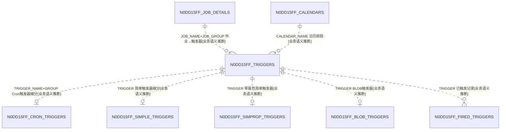
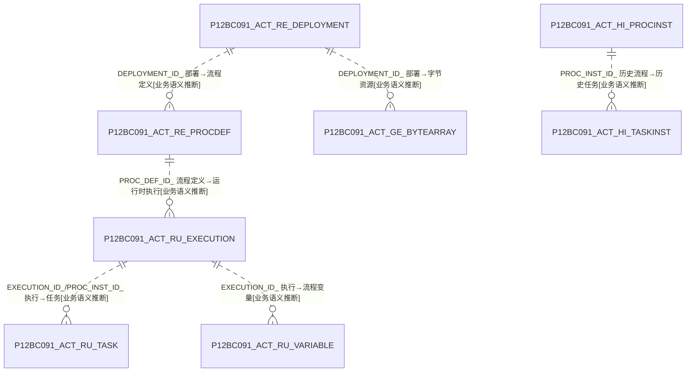
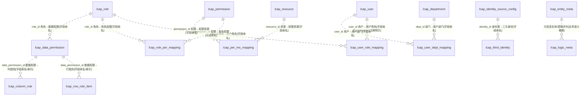

# B 级 · 平台/框架同构表 — ER 图与结构族归类

> 数据源：`test_erp.sql`（唯一事实来源）。B 级共 **853 张表**，均为结构高度同构的平台/框架表，非业务实体表。按"结构族"去重展开代表，其余归类点名（不重复绘制同构结构）。
> 三大结构族：**① Quartz 定时调度器 275（25 套 × 11）**、**② Activiti/Flowable 工作流引擎 128（4 套 × 32）**、**③ lcap 低代码平台 RBAC+元数据 450（21 基线结构 × ~25 应用副本）**。
> 全库 **0 外键**；框架表本应含外键（Activiti/Quartz 标准 DDL 有 FK），本导出脚本已将 FK 全部剥离，关系按标准框架语义 `[业务语义推断]` 标注。

## 一、同构族与"按应用隔离"设计（关键发现）

三族表名前缀一一对应，构成**每应用一套独立引擎表**的多租户/多应用隔离方案：

```
应用ID(7位hex) ─┬─ N{hex}_  = 该应用的 Quartz 调度器 11 表
               ├─ P{hex}_  = 该应用的 Activiti 工作流引擎 32 表
               └─ lcap_*_{hex6} = 该应用的低代码平台 RBAC/元数据表
```

> 例：`N12BC091_*`（Quartz）↔ `P12BC091_*`（Activiti）↔ `lcap_*_12bc09`（平台表）同属应用 `12bc09`。

## 二、族① Quartz 调度器（代表集 N0DD15FF_，×25 套）



> 11 表：`JOB_DETAILS / TRIGGERS / CRON_TRIGGERS / SIMPLE_TRIGGERS / SIMPROP_TRIGGERS / BLOB_TRIGGERS / FIRED_TRIGGERS / CALENDARS / PAUSED_TRIGGER_GRPS / SCHEDULER_STATE / LOCKS`。主键均为 `SCHED_NAME +` 业务键复合，无独立自增 id。

## 三、族② Activiti/Flowable 工作流引擎（代表集 P12BC091_，×4 套）



> 32 表按子系统分组：**GE** 通用(GENERAL: PROPERTY/BYTEARRAY)、**RE** 仓库(REPOSITORY: DEPLOYMENT/PROCDEF/MODEL/PROCDEF_INFO)、**RU** 运行时(RUNTIME: EXECUTION/TASK/VARIABLE/Job 5 类/IDENTITYLINK/EVENT_SUBSCR/ACTINST/ENTITYLINK/HistoryJob)、**HI** 历史(HISTORY: PROCINST/TASKINST/ACTINST/VARINST/IDENTITYLINK/DETAIL/COMMENT/ATTACHMENT/TSK_LOG/ENTITYLINK)、**EVT** 事件(EVENT_LOG)、**FLW** 批次(RU_BATCH/RU_BATCH_PART)。列名统一大写、`_` 后缀、`ID_` varchar(64) 主键、`REV_` 乐观锁、`TENANT_ID_` 多租户。

## 四、族③ lcap 低代码平台（RBAC + 元数据，基线 ×~25 应用副本）



## 五、跨族与业务域关系

| 平台表·字段 | 目标 | 依据 |
|---|---|---|
| lcap_department.trader_id / company_id / settlement_unit_id | D08 贸易商·公司 / D06 结算单位 | `[字段命名]` |
| lcap_user.position_id / center_id / company_id | D16 岗位 / D08 组织 | `[字段命名]` |
| lcap_user_trader_mapping.trader_id | D08 贸易商 | `[字段命名]` |
| lcap_role 等 | D16 jf_manager_role / jf_role_trader_mapping（业务侧权限映射） | `[业务语义推断]` |

## 六、建模问题清单（B 级）

- **P-B-01 按应用复制物理表（反范式设计）**：同一套 Quartz(11)/Activiti(32)/lcap(~21) 结构按应用 hex 前缀各复制一份（Quartz×25、Activiti×4、lcap×~29），库内表数量被严重放大，应改由 `TENANT_ID_`/`app_id` 行级隔离。
- **P-B-02 框架外键被剥离**：Quartz/Activiti 官方 DDL 含 FOREIGN KEY 与 ON DELETE CASCADE，本导出全部去除且无索引补齐（如 QRTZ TRIGGERS→JOB_DETAILS 无 FK），仅靠 `SCHED_NAME+业务键`语义维系，破坏引用完整性 `[业务语义推断]`。
- **P-B-03 表/列命名大小写风格割裂**：框架表全大写（`N0DD15FF_TRIGGERS`.`TRIGGER_NAME`），lcap 平台表小写驼峰混用（`appId`、`lcap_row_rule_item`.`values` 用保留字），业务表 `jf_` 小写下划线，三套命名规范并存。
- **P-B-04 保留字作列名**：lcap_app_cache.`key`、lcap_row_rule_item.`values`、lcap_resource.`type` 等使用 SQL 保留字，需反引号。
- **P-B-05 COMMENT 复制错误**：lcap_role 表注释为"用户与角色关联实体"（实为角色实体），描述与其职责不符，疑似从 user_role_mapping 模板复制。
- **P-B-06 delete_status 缺失/不一**：lcap 多数表无 delete_status，仅 role/user/user_manager 等少数有；有者类型 tinyint(1) 且默认 NULL（role）与默认 0（user）不一。
- **P-B-07 PII/凭据明文**：lcap_user 含 password（注释仅"建议加密存储"）、id_number（身份证）；lcap_identity_source_config 含 app_secret/ldap 绑定密码/wechat 密钥，均明文列。
- **P-B-08 字符集混用**：lcap 基线表 unicode_ci 与 general_ci 分表混用（department/role/user 用 general_ci，permission/resource/meta 等用 unicode_ci）。
- **P-B-09 主键无自增**：三族表 `id` 均非 AUTO_INCREMENT（应用/框架侧生成 UUID/雪花），Quartz 用复合业务主键、Activiti 用 `ID_` varchar 主键。
