# D01 销售订单域 · ER 图（数据源：test_erp.sql）

> 覆盖 18 张表。全库 **0 外键约束**，以下所有关系均为逆向**推断关系**，关系线标注依据：`[注释明示]`/`[索引佐证]`/`[命名推断]`/`[语义推断]`/`[待确认]`。带 `[跨域引用]` 的实体在他域定义，仅示意。
> `jf_sales_order_copy1`、`jf_sales_order_test`、`jf_sales_order_wide` 为 `jf_sales_order` 的副本/试验/宽表变体，结构高度重叠，单独建实体但关系并入主表族。

```mermaid
erDiagram
    jf_sales_order {
        bigint id PK "自增主键"
        varchar order_no UK "销售单编码"
        int status "单据状态1..17/-99/-98"
        int payment_status "0作废1未收2部分3已收"
        bigint customer_id FK "客户id"
        bigint trader_id FK "贸易商id"
        bigint sales_customer_id FK "销量所属客户id(返利)"
        bigint use_customer_level_id FK "实际享受等级id"
        int payment_type "1现金2额度"
        int type "1成品布2剪A4版"
        varchar cus_order_code FK "客订订单编码"
        int settlement_unit_id FK "结算单位id"
        int invoice_type "0不开1普2专"
        decimal total_goods_amount "商品总金额"
        decimal total_due_amount "应收总金额"
        int new_goods_audit "新品审批"
        int dye_lot_audit "炒雪花缸号审批"
        int trial_cut_audit "试裁优惠审核"
        varchar exchange_order_no FK "换货销售单号"
        int modify_version_no
        tinyint delete_status "注释'1启用0停用'语义反"
    }
    jf_sales_order_detail {
        bigint id PK
        bigint source_id FK "来源ID(客订明细)"
        bigint sales_order_id FK "销售单id"
        varchar sales_order_no "销售单号(冗余)"
        int type "1大货2剪板"
        bigint product_id FK "产品颜色备案id"
        varchar spu "商品编码"
        varchar sku "SKU"
        varchar color_code "色号"
        decimal quantity "数量"
        decimal budget_weight "预算重量(拣货前)"
        decimal actual_weight "实际重量(拣货后)"
        decimal base_price "标准价"
        decimal discount_price "优惠单价"
        int discount_type "1..5优惠类型"
        varchar merge_customer_id FK "主身客户id"
        bigint parent_customer_id "合并优惠父级"
        int modify_version_no
    }
    jf_sales_order_detail_fee {
        bigint id PK
        bigint sales_order_id FK "销售单ID"
        bigint fee_category_id FK "费项名称id"
        decimal fee_category_amount "费项金额"
        decimal prorate_price "均摊单价"
        tinyint is_prorate "是否均摊"
    }
    jf_sales_order_discount {
        bigint id PK
        bigint sales_order_id FK "销售单id"
        varchar sales_order_no FK "销售单编码"
        int discount_strategy "1试裁2小条3优惠券"
        varchar coupon_template_code FK "券模板编码"
        bigint discount_activity_id FK "首条优惠活动id"
        decimal discount_amount "优惠金额"
        varchar product_sn "细码(首条/小条)"
    }
    jf_sales_order_picking_detail {
        bigint id PK
        bigint sales_order_id FK "销售单id"
        bigint sales_order_detatil_id FK "销售单明细id(拼写detatil)"
        int type "1大货2剪板"
        varchar sku
        varchar dye_lot_code "成品缸号"
        varchar product_sn "细码"
        int return_status "0未退1已退"
        varchar ware_house_code "逻辑仓"
        int discount_strategy
    }
    jf_sales_order_quota_usage_record {
        bigint id PK
        bigint sales_order_id FK "销售单id"
        varchar sales_order_no "销售单号"
        bigint quota_id FK "额度id(jf_contract_quota_customer)"
        bigint assign_quota_id FK "分配额度id(jf_quota_allocation_record)"
        tinyint is_using_own "是否用自己额度"
        decimal used_amount "使用金额"
    }
    jf_sales_order_receipt {
        bigint id PK
        bigint sales_order_id FK "销售单ID"
        varchar receipt_bill_id FK "应收收款单ID"
        varchar created_by_user "创建者(命名异)"
    }
    jf_sales_order_receipt_detail {
        bigint id PK
        bigint sales_order_receipt_id FK "销售单收款明细ID"
        varchar receipt_bill_id FK "应收收款单ID"
    }
    jf_sales_order_status_record {
        bigint id PK
        bigint sales_order_id FK "销售单ID"
        varchar order_no "销售单编码"
        varchar sales_order_status "状态(与主表编码不一致!)"
    }
    jf_sales_order_change_record {
        bigint id PK
        bigint sales_order_id FK "销售单ID"
        varchar change_type "变更类型"
        varchar change_detail "变更明细"
    }
    jf_sales_order_oa_audit {
        bigint id PK
        varchar sales_order_code FK "销售单号"
        varchar approval_type "XP/CXH/SCYH/ZDG/LHYH"
        int approval_status "1无需2中3通过4不通过"
        varchar adjustment_code "优惠调价单号"
    }
    jf_sales_order_async {
        bigint id PK
        varchar type "方法名"
        json request_data "请求入参"
        varchar sales_order_code FK "销售单编码"
        tinyint async_success "1成功0失败"
        json async_data "异步结果"
    }
    jf_sales_order_cus {
        bigint id PK
        bigint sales_order_id FK "销售单ID"
        bigint cus_id FK "客户ID"
        bigint parent_cus_id FK "父级客户ID"
        bigint control_account_period_id FK "结算方式ID"
        bigint customer_level_id FK "客户等级id"
        bigint delivery_method_id FK "发货方式id(jf_delivery_method)"
        bigint delivery_id FK "收货信息id"
        bigint trader_id FK "贸易商id"
    }
    jf_sales_order_logistics_progress {
        bigint id PK "字典"
        varchar name "出行天数名称"
        tinyint status
    }
    jf_sales_type {
        bigint id PK "非自增"
        varchar name "销售类型名称"
        varchar status "状态(varchar!)"
        bigint sort_value
    }

    %% ===== 变体/副本/宽表 =====
    jf_sales_order_copy1 { bigint id PK "[副本] 销售单主表 copy1(结构≈主表,少4列)" }
    jf_sales_order_test   { bigint id PK "[试验表] 销售单主表 test(早期结构,状态码不同)" }
    jf_sales_order_wide   { bigint id PK "[宽表] 销售订单宽表(冗余大量名称字段,无外键)" }

    %% ===== 跨域引用实体 =====
    jf_customer        { bigint id PK "[跨域·D08] 客户" }
    jf_trader          { bigint id PK "[跨域·D08] 贸易商" }
    jf_customer_level  { bigint id PK "[跨域·D08] 客户等级" }
    jf_product         { bigint id PK "[跨域·D09] 产品颜色备案" }
    jf_fee_category    { bigint id PK "[跨域·D06] 费项类别" }
    jf_contract_quota_customer { bigint id PK "[跨域·D03] 合同授信额度" }
    jf_quota_allocation_record { bigint id PK "[跨域·D03] 额度分配记录" }
    jf_collection_bill { bigint id PK "[跨域·D04] 收款单" }
    jf_coupon          { bigint id PK "[跨域·D11] 优惠券模板" }
    jf_trial_cut_discount_activity { bigint id PK "[跨域·D11] 首条优惠活动" }
    jf_delivery_method { bigint id PK "[跨域·D17] 发货方式" }
    jf_settlement_unit { bigint id PK "[跨域·D06] 结算单位" }

    %% ============ 关系 ============
    jf_customer ||--o{ jf_sales_order : "1:N [命名推断] order.customer_id -> customer.id (NOT NULL)"
    jf_trader ||--o{ jf_sales_order : "1:N [命名推断] order.trader_id -> trader.id (NOT NULL)"
    jf_customer ||--o{ jf_sales_order : "销量归属 [命名推断] order.sales_customer_id (返利口径)"
    jf_customer_level ||--o{ jf_sales_order : "N:1 [命名推断] order.use_customer_level_id"
    jf_settlement_unit ||--o{ jf_sales_order : "N:1 [命名推断] order.settlement_unit_id (int)"
    jf_sales_order ||--o{ jf_sales_order : "换货自关联 [命名推断] order.exchange_order_no -> order.order_no"

    jf_sales_order ||--o{ jf_sales_order_detail : "1:N [命名推断+索引] detail.sales_order_id"
    jf_product ||--o{ jf_sales_order_detail : "N:1 [命名推断] detail.product_id -> product.id [跨域D09]"
    jf_sales_order ||--o{ jf_sales_order_detail_fee : "1:N [命名推断] fee.sales_order_id"
    jf_fee_category ||--o{ jf_sales_order_detail_fee : "N:1 [命名推断] fee.fee_category_id [跨域D06]"
    jf_sales_order ||--o{ jf_sales_order_discount : "1:N [命名推断] discount.sales_order_id / sales_order_no"
    jf_coupon ||--o{ jf_sales_order_discount : "N:1 [命名推断] discount.coupon_template_code [跨域D11]"
    jf_trial_cut_discount_activity ||--o{ jf_sales_order_discount : "N:1 [命名推断] discount.discount_activity_id [跨域D11]"
    jf_sales_order ||--o{ jf_sales_order_picking_detail : "1:N [命名推断] pick.sales_order_id"
    jf_sales_order_detail ||--o{ jf_sales_order_picking_detail : "1:N [命名推断] pick.sales_order_detatil_id(拼写)"
    jf_sales_order ||--o{ jf_sales_order_quota_usage_record : "1:N [命名推断] quota.sales_order_id"
    jf_contract_quota_customer ||--o{ jf_sales_order_quota_usage_record : "N:1 [注释明示] quota.quota_id='jf_contract_quota_customer' [跨域D03]"
    jf_quota_allocation_record ||--o{ jf_sales_order_quota_usage_record : "N:1 [注释明示] quota.assign_quota_id='jf_quota_allocation_record' [跨域D03]"
    jf_sales_order ||--o{ jf_sales_order_receipt : "1:N [命名推断] receipt.sales_order_id"
    jf_collection_bill ||--o{ jf_sales_order_receipt : "N:1 [命名推断] receipt.receipt_bill_id -> 收款单 [跨域D04]"
    jf_sales_order_receipt ||--o{ jf_sales_order_receipt_detail : "1:N [命名推断] rdetail.sales_order_receipt_id"
    jf_sales_order ||--o{ jf_sales_order_status_record : "1:N [命名推断] status.sales_order_id"
    jf_sales_order ||--o{ jf_sales_order_change_record : "1:N [命名推断] change.sales_order_id"
    jf_sales_order ||--o{ jf_sales_order_oa_audit : "1:N [命名推断] oa.sales_order_code -> order.order_no"
    jf_sales_order ||--o{ jf_sales_order_async : "1:N [命名推断] async.sales_order_code -> order.order_no"
    jf_sales_order ||--o| jf_sales_order_cus : "1:1 [命名推断] cus.sales_order_id"
    jf_customer ||--o{ jf_sales_order_cus : "N:1 [命名推断] cus.cus_id / parent_cus_id"
    jf_delivery_method ||--o{ jf_sales_order_cus : "N:1 [注释明示] cus.delivery_method_id='jf_delivery_method表' [跨域D17]"

    %% --- 变体并入主表族（结构重叠，语义推断） ---
    jf_sales_order ||--o{ jf_sales_order_copy1 : "副本 [语义推断] copy1 结构≈主表(生产副本)"
    jf_sales_order ||--o{ jf_sales_order_test : "试验 [语义推断] test 早期结构(状态码不同)"
    jf_sales_order ||--o{ jf_sales_order_wide : "宽表 [语义推断] wide 冗余大量名称,按 order_no 关联"
    jf_sales_type ||..o{ jf_sales_order_wide : "名称冗余 [待确认] wide.sales_type(varchar) 未见 sales_type_id"
```

## 关系要点与证据摘录

| # | 关系 | 基数 | 依据强度 | 证据原文 |
|---|---|---|---|---|
| 1 | 客户 → 销售单 | 1:N | 命名推断 | `customer_id bigint NOT NULL COMMENT '客户id'` |
| 2 | 贸易商 → 销售单 | 1:N | 命名推断 | `trader_id bigint NOT NULL COMMENT '贸易商id'` |
| 3 | 销售单 → 明细 | 1:N | 命名推断+索引 | `detail.sales_order_id` + `idx_sales_order` |
| 4 | 明细 → 拣货明细 | 1:N | 命名推断+索引 | `pick.sales_order_detatil_id`（**拼写 detatil**） |
| 5 | 销售单 → 额度使用记录 | 1:N | 命名推断 | `quota.sales_order_id` |
| 6 | 合同额度 → 额度使用记录 | 1:N | **注释明示** | `quota_id ... COMMENT '额度id(jf_contract_quota_customer)'` |
| 7 | 分配额度 → 额度使用记录 | 1:N | **注释明示** | `assign_quota_id ... COMMENT '分配额度id(jf_quota_allocation_record)'` |
| 8 | 销售单 → 收款明细 → 收款单 | 1:N:N | 命名推断 | `receipt.receipt_bill_id='应收收款单ID'` [跨域 D04] |
| 9 | 销售单 → OA审批/异步 | 1:N | 命名推断(按 order_no) | `oa.sales_order_code`、`async.sales_order_code` |
| 10 | 销售单 ↔ 换货单 | 自关联 | 命名推断 | `order.exchange_order_no='换货销售单号'` |

## 本域模型问题速记（详见逻辑数据模型）
1. **状态字典跨表不一致**：`jf_sales_order.status`（1..17,-99,-98）与 `jf_sales_order_status_record.sales_order_status`（1..16，含义完全不同）、`jf_sales_order_test.status`（1草稿2已提交）三套状态编码各自为政，无法直接对照。
2. **主表冗余客户/贸易商快照**：order 同时存 `customer_id/code/name`、`trader_id/name`、业务组别/经理/门店销售等大量**字符串冗余**，主数据变更后无法传播。
3. **同义字段重复**：order 同时有 `deductMode`（驼峰、无注释）与 `deduct_mode`（下划线、有注释）；`position`/`department` 与 `bill_position`/`bill_department` 重复。
4. **delete_status 语义反转**：主表/copy1/test 注释为"1=启用，0=停用"，而其余表统一为"0=否,1=是" → 逻辑删除字段含义在同域内**自相矛盾**。
5. **副本/试验/宽表混入生产**：`_copy1`（结构≈主表，缺 total_goods_original_amount 等 4 列）、`_test`（早期结构）、`_wide`（BI 宽表）均留在 A 级业务表清单，应识别为派生/历史表。
6. **外键类型不齐**：`settlement_unit_id`、`payment_way_id` 等以 `int` 引用 bigint 主键；`receipt_bill_id` 用 `varchar(255)` 存收款单ID。
7. **宽表命名不规范**：`jf_sales_order_wide` 混用 `customerName/brandName/brandParentName`（驼峰）与下划线字段，且 `is_*` 布尔位以 varchar(10) 存。
8. **明细合并优惠字段多**：`merge_customer_id`/`parent_customer_id`/`is_merge_discounts`/`merge_parent_customer_id` 等语义耦合，`discount_amount` 拣货明细中标"废弃字段"。
