# D03 合同与信用额度域 · ER 图（数据源：test_erp.sql）

> 覆盖 19 张表。全库 **0 外键约束**，关系均为逆向**推断**，标注：`[注释明示]`/`[索引佐证]`/`[命名推断]`/`[语义推断]`/`[待确认]`。带 `[跨域引用]` 实体在他域定义。
> 本域以 **客户信用额度（`jf_contract_quota_customer`）为核心主表**，围绕它展开：额度申请/调整/临时额度/使用记录 → 额度分配申请 → 合同/战略·销售协议 → 报价商品关联。多表以 `customer_quota_id`(bigint id) 强关联，但 OA/备案类以 **字符串单号（`oa_process_no`/`record_code`/`allocation_apply_code`）关联**，属编码关联反范式。分四块：**额度主线块**、**额度分配申请块**、**合同与协议块**、**客户优惠·报价关联块**。

```mermaid
erDiagram
    %% ===== 额度主线块 =====
    jf_contract_quota_customer {
        bigint id PK "自增"
        varchar customer_code "客户编号(冗余)"
        varchar customer_name "客户名称(冗余)"
        varchar trader "所属贸易商(冗余)"
        bigint customer_id FK "客户id"
        bigint sales_agreement_id FK "销售协议id(取有效期)"
        varchar oa_process_no "OA流程编号"
        varchar record_code "备案编码"
        int status "1审核中2通过3不通过4生效5过期6草稿"
        decimal apply_limit "申请额度"
        decimal temp_limit "申请临时额度"
        decimal total_quota "总额度(基本+临时+分配)"
        decimal available_quota "可用额度"
        decimal frozen_quota "冻结额度"
        decimal used_quota "已用额度"
        decimal expire_quota "即将到期额度"
        varchar credit_policy "信贷政策 NOT NULL"
        varchar pay_form "支付形式"
        date expiration_date "到期时间"
        int version_no "乐观锁版本号"
    }
    jf_contract_quota_customer_import {
        bigint id "DEFAULT 0(无主键!)"
        bigint customer_id FK "客户id"
        varchar sales_agreement_id "varchar!(主表为bigint)"
    }
    jf_contract_application_quota_record {
        bigint id PK "自增"
        varchar oa_process_no "OA流程编号"
        varchar record_code "备案编号"
        int status "1审核中2通过3不通过4生效5过期"
        decimal temp_limit "申请额度"
        bigint customer_quota_id FK "客户额度id"
        bigint settlement_unit_id FK "结算单位(签约主体)"
    }
    jf_contract_temp_quota_application_record {
        int id PK "自增"
        varchar oa_flow_no "OA流程编号"
        varchar record_code "备案编号"
        int status "1-5 同application_quota_record"
        decimal temp_limit "申请临时额度"
        bigint customer_quota_id FK "客户额度id"
    }
    jf_contract_quota_adjust_application {
        int id PK "自增"
        bigint customer_quota_id FK "客户额度id"
        bigint customer_id FK "客户id"
        decimal pre_adjust_limit "调整前额度"
        decimal post_adjust_limit "调整后额度"
        decimal adjust_difference "调整差额"
        varchar oa_no "oa编号"
        varchar recordation_no "备案编号"
        int status "1审核中2通过3不通过"
    }
    jf_contract_quota_adjust_application_import {
        int id "DEFAULT 0(无主键!)"
        bigint customer_quota_id FK "客户额度id"
        varchar status "varchar!(主表为int)"
    }
    jf_contract_quota_use_record {
        bigint id PK "自增(初值雪花量级!)"
        bigint customer_quota_id FK "客户额度id"
        varchar operation_type "1冻结2占用3释放"
        varchar operation_method "1预布单2销售单"
        decimal freeze_amount "冻结金额"
        decimal used_amount "使用金额"
        decimal release_amount "释放金额"
        varchar source_document_no "来源单据编号"
        bigint customer_id FK "客户id"
        bigint use_customer_id FK "使用客户id"
        int type "1额度2临时额度(该字段不使用!)"
        int version_no
    }

    %% ===== 额度分配申请块 =====
    jf_contract_allocation_apply {
        bigint id PK "自增"
        int apply_type "1额度2优惠券额度3等级"
        varchar applicant "申请人"
        varchar oa_no "oa编号"
        bigint customer_id FK "客户id"
        bigint customer_brand_id FK "关联品牌id"
        bigint customer_level_id FK "客户等级id"
        decimal allocated_quota "已分配额度"
        decimal can_allocate_quota "可分配额度"
        int status "审批状态"
        varchar filing_code "备案编码"
        text files "存储的文件"
    }
    jf_contract_allocation_apply_attachment {
        bigint id PK "自增"
        bigint apply_id FK "关联申请单ID"
        varchar file_name "附件名称"
        varchar file_path "附件存储路径"
    }
    jf_contract_allocation_customer_detail {
        bigint id PK "自增"
        bigint apply_id FK "关联申请单ID"
        bigint customer_id FK "客户id"
        varchar customer_code "客户编码(冗余)"
        varchar current_level "当前等级"
        bigint adjusted_level_id FK "调整后等级id"
        int type "1额度2优惠券3等级"
        decimal allocate_quota "分配额度"
    }
    jf_quota_allocation_record {
        bigint id PK "自增"
        varchar allocation_apply_code "关联申请单编码(字符串!)"
        bigint customer_quota_id FK "客户额度id"
        bigint customer_id FK "客户id"
        decimal allocate_quota "分配额度"
        int version_no
    }

    %% ===== 合同与协议块 =====
    jf_contract_information {
        bigint id PK "自增"
        varchar oa_process_no UK "OA流程编号(唯一)"
        bigint customer_id FK "客户id NOT NULL"
        varchar customer_code "客户编号(冗余)"
        varchar apply_customer_level "申请客户等级"
        date contract_start_time "合同开始"
        date contract_end_time "合同结束"
        tinyint status "1待生效2生效3过期4取消"
        tinyint strategy_or_sales "1战略2销售"
        tinyint oa_status
    }
    jf_contract_sales_agreement {
        bigint id PK "自增"
        bigint customer_id FK "客户id NOT NULL"
        varchar oa_process "关联oa流程编号"
        varchar customer_code "客户编码(冗余)"
        decimal apply_quota "申请额度"
        date agreement_start_valid_date "协议有效期开始"
        date agreement_end_valid_date "协议有效期结束"
        int status "1审核通过"
    }
    jf_contract_strategic_agreement {
        bigint id PK "自增"
        varchar record_code "备案编号"
        varchar oa_process "关联oa流程编号"
        bigint customer_id FK "客户id NOT NULL"
        int agreement_status "1终止2延期3将到期4生效5待生效6未达标7达标"
        decimal contract_tonnage "合约采购吨数"
        decimal completion_rate "已达成比例"
        int discount_method "1先优惠2后优惠"
        bigint company_id FK "所属公司id"
        bigint current_customer_level_id FK "客户当前等级id"
        bigint apply_level_id FK "申请等级id"
        int request_id "oa流程requestid"
    }
    jf_contract_postpone {
        bigint id PK "非自增"
        bigint strategic_agreement_id FK "战略协议id(注释明示)"
        varchar agreement_code "原战略协议编码"
        date original_end_date "原结束日期"
        date extend_to_date "申请延期至"
        varchar oa_code "oa流程编号"
        int status "1审核中2通过3不通过"
    }
    jf_contract_termination {
        bigint id "NULL且无PRIMARY KEY!"
        bigint strategic_agreement_id FK "战略协议id(注释明示)"
        varchar agreement_code "战略协议编码"
        date termination_date "申请终止日期"
    }

    %% ===== 客户优惠·报价关联块 =====
    jf_customer_merge_discounts_record {
        bigint id PK "非自增"
        bigint customer_id FK "客户id NOT NULL"
        int type "1合并优惠2解除合并优惠"
        datetime effect_time "生效时间"
        varchar relate_oa_code "关联OA编码"
    }
    jf_quota_goods_mapping {
        bigint id PK "自增"
        bigint quotation_application_id FK "报价申请id"
        int quota_id FK "报价申请id(int!重复)"
        bigint goods_id FK "商品id"
        int color_id FK "色号id"
        int fabric_id FK "布品id"
        varchar goods_no "商品编号"
        varchar quotation_no "计价单号"
        int quote_status "1待报价2已报价3过期"
    }
    jf_quota_goods_mapping_import {
        bigint id "DEFAULT 0(无主键!)"
        bigint quotation_application_id FK "报价申请id"
    }

    %% ===== 跨域引用实体 =====
    jf_customer        { bigint id PK "[跨域·D08] 客户" }
    jf_trader          { bigint id PK "[跨域·D08] 贸易商" }
    jf_customer_level  { bigint id PK "[跨域·D08] 客户等级" }
    jf_settlement_unit { bigint id PK "[跨域·D08/D14] 结算单位/签约主体" }
    jf_quotation_application { bigint id PK "[跨域·D02] 报价申请" }
    jf_goods           { bigint id PK "[跨域·D09] 商品" }
    jf_product_color   { bigint id PK "[跨域·D09/D14] 颜色" }
    jf_company         { bigint id PK "[跨域·D08] 公司主体" }

    %% ============ 关系 ============
    %% --- 额度主线 ---
    jf_customer ||--o{ jf_contract_quota_customer : "1:N [命名推断] qc.customer_id [跨域D08]"
    jf_contract_sales_agreement ||--o| jf_contract_quota_customer : "1:1 [命名推断] qc.sales_agreement_id -> sa.id(取有效期)"
    jf_contract_quota_customer ||--o{ jf_contract_quota_customer_import : "同构导入 [语义推断] import 无主键"
    jf_contract_quota_customer ||--o{ jf_contract_application_quota_record : "1:N [命名推断] rec.customer_quota_id -> qc.id"
    jf_contract_quota_customer ||--o{ jf_contract_temp_quota_application_record : "1:N [命名推断] rec.customer_quota_id -> qc.id"
    jf_contract_quota_customer ||--o{ jf_contract_quota_adjust_application : "1:N [命名推断] adj.customer_quota_id -> qc.id"
    jf_contract_quota_adjust_application ||--o{ jf_contract_quota_adjust_application_import : "同构导入 [语义推断] import 无主键"
    jf_contract_quota_customer ||--o{ jf_contract_quota_use_record : "1:N [命名推断] use.customer_quota_id -> qc.id"
    jf_customer ||--o{ jf_contract_quota_use_record : "N:1 [命名推断] use.customer_id/use_customer_id [跨域D08]"
    jf_settlement_unit ||--o{ jf_contract_application_quota_record : "N:1 [命名推断] rec.settlement_unit_id"

    %% --- 额度分配申请 ---
    jf_contract_allocation_apply ||--o{ jf_contract_allocation_apply_attachment : "1:N [命名推断] att.apply_id -> apply.id"
    jf_contract_allocation_apply ||--o{ jf_contract_allocation_customer_detail : "1:N [命名推断] det.apply_id -> apply.id"
    jf_customer ||--o{ jf_contract_allocation_apply : "N:1 [命名推断] apply.customer_id [跨域D08]"
    jf_customer_level ||--o{ jf_contract_allocation_apply : "N:1 [命名推断] apply.customer_level_id [跨域D08]"
    jf_customer ||--o{ jf_contract_allocation_customer_detail : "N:1 [命名推断] det.customer_id [跨域D08]"
    jf_customer_level ||--o{ jf_contract_allocation_customer_detail : "N:1 [命名推断] det.adjusted_level_id [跨域D08]"
    jf_contract_quota_customer ||--o{ jf_quota_allocation_record : "1:N [命名推断] rec.customer_quota_id -> qc.id"
    jf_contract_allocation_apply ||--o{ jf_quota_allocation_record : "1:N [命名推断] rec.allocation_apply_code -> apply(按编码串,非id)"

    %% --- 合同与协议 ---
    jf_customer ||--o{ jf_contract_information : "N:1 [注释明示] ci.customer_id='关联客户表';索引 idx_customer_id [跨域D08]"
    jf_customer ||--o{ jf_contract_sales_agreement : "N:1 [命名推断] sa.customer_id [跨域D08]"
    jf_customer ||--o{ jf_contract_strategic_agreement : "N:1 [命名推断] sg.customer_id [跨域D08]"
    jf_company ||--o{ jf_contract_strategic_agreement : "N:1 [命名推断] sg.company_id [跨域D08]"
    jf_customer_level ||--o{ jf_contract_strategic_agreement : "N:1 [命名推断] sg.current_customer_level_id/apply_level_id [跨域D08]"
    jf_contract_strategic_agreement ||--o{ jf_contract_postpone : "1:N [注释明示] post.strategic_agreement_id='jf_contract_strategic_agreement主键id'"
    jf_contract_strategic_agreement ||--o{ jf_contract_termination : "1:N [注释明示] term.strategic_agreement_id='jf_contract_strategic_agreement主键id'"

    %% --- 客户优惠·报价关联 ---
    jf_customer ||--o{ jf_customer_merge_discounts_record : "N:1 [命名推断] md.customer_id [跨域D08]"
    jf_quotation_application ||--o{ jf_quota_goods_mapping : "1:N [命名推断] gm.quotation_application_id [跨域D02]"
    jf_goods ||--o{ jf_quota_goods_mapping : "N:1 [命名推断] gm.goods_id [跨域D09]"
    jf_product_color ||--o{ jf_quota_goods_mapping : "N:1 [命名推断] gm.color_id/fabric_id [跨域D09/D14]"
    jf_quota_goods_mapping ||--o{ jf_quota_goods_mapping_import : "同构导入 [语义推断] import 无主键"
```

## 关系要点与证据摘录

| # | 关系 | 基数 | 依据强度 | 证据原文 |
|---|---|---|---|---|
| 1 | 战略协议 → 延期申请 | 1:N | **注释明示** | `strategic_agreement_id ... COMMENT 'jf_contract_strategic_agreement主键id'`（postpone/termination 两表同款注释） |
| 2 | 合同信息 → 客户 | N:1 | 注释明示+索引 | `customer_id COMMENT '客户id（关联客户表）'`；`INDEX idx_customer_id COMMENT '客户id索引，关联客户查询'` |
| 3 | 客户额度 → 各类额度记录 | 1:N | 命名推断(id) | `application_quota_record/temp_quota/quota_adjust/quota_use/quota_allocation_record`.customer_quota_id → `quota_customer.id` |
| 4 | 分配申请 → 明细/附件 | 1:N | 命名推断(id) | `attachment.apply_id`、`customer_detail.apply_id` → `allocation_apply.id` |
| 5 | 分配申请 → 分配记录 | 1:N | 命名推断(编码) | `quota_allocation_record.allocation_apply_code='关联申请单编码'`（**编码串关联，非 id**） |
| 6 | 报价商品关联 → 报价申请 | N:1 | 命名推断 | `quota_goods_mapping.quotation_application_id` [跨域 D02]；另有 `quota_id`(int) 语义重复 |
| 7 | 销售协议 → 客户额度 | 1:1 | 命名推断 | `quota_customer.sales_agreement_id='销售协议id（获取开始结束时间）'` |

## 本域模型问题速记（详见逻辑数据模型）
1. **`jf_contract_termination` 无主键且 id 可空**：`id bigint NULL DEFAULT NULL`，全表**无 PRIMARY KEY 定义**——战略协议终止申请表缺主键，无法唯一定位行（P-D03-01）。
2. **三张 `_import` 表无主键**：`quota_customer_import`、`quota_adjust_application_import`、`quota_goods_mapping_import` 均 `id ... DEFAULT 0` 且无 PK（P-D03-02）。
3. **`updated_by` 字段类型错误（存成 datetime）**：`allocation_apply.updated_by`、`allocation_customer_detail.updated_by` 声明为 **datetime** 却注释"修改人"，与全域 varchar 审计约定冲突（P-D03-03）。
4. **编码关联反范式**：额度分配记录靠 `allocation_apply_code`（字符串）、协议/记录靠 `oa_process_no`/`record_code` 关联，非 id 外键（P-D03-04）。
5. **同名字段跨表类型不一致**：`sales_agreement_id` 主表 bigint / import 表 varchar(100)；`status` 主表 int / import 表 varchar；`quota_goods_mapping` 同时有 `quotation_application_id`(bigint) 与 `quota_id`(int) 语义重复（P-D03-05）。
6. **主键自增性不统一**：`contract_postpone.id`、`customer_merge_discounts_record.id` 为 bigint **非自增**；`quota_adjust_application.id`、`temp_quota_application_record.id` 为 **int** 自增，其余 bigint（P-D03-06）。
7. **状态枚举多套且口径不一**：`quota_customer.status`(1-6)、`application_quota_record.status`(1-5)、`contract_information.status`(tinyint 1-4)、`strategic_agreement.agreement_status`(1-7)、`sales_agreement.status`(仅1) 等重叠（P-D03-07）。
8. **废弃字段保留**：`quota_use_record.type`（注释"该字段不使用"）、`strategic_agreement.purchased_tonnage/current_discount_price/apply_discount_price/pre_discount_amount/post_discount_amount`（注释"已实际为主，弃用"）（P-D03-08）。
9. **AUTO_INCREMENT 异常**：`quota_use_record` 自增初值 = **2104017801561628674**（雪花量级），与其余表量级不符（P-D03-09）。
10. **字符集混用 + 大量反范式快照**：general_ci（quota_customer/strategic_agreement）/0900_ai_ci（多数）/unicode_ci（merge_discounts）三并存；customer_code/name/trader/level 等名称在几乎每表冗余（P-D03-10）。
