# D04 应收·收款·结算域 · ER 图（数据源：test_erp.sql）

> 覆盖 33 张表。全库 **0 外键约束**，以下所有关系均为逆向**推断关系**，关系线标注依据：`[注释明示]`（字段 COMMENT 点名目标表）/ `[索引佐证]` / `[命名推断]`（xxx_id 命名）/ `[语义推断]`（字符串冗余，无 id/注释/索引）/ `[待确认]`。
> 带 `[跨域引用]` 的实体在其他域定义，此处仅示意引用、不重复计数。
> 子域划分：① 应收认领 ② 退款 ③ 核销 ④ 收款（账户/收款单/收款通知单/付款链接）⑤ 进账单 ⑥ 收票/账户匹配 ⑦ 支付请求 ⑧ 账期与支付字典 ⑨ 逾期规则 ⑩ 客户账户与授信。

```mermaid
erDiagram
    %% ===== ① 应收认领 =====
    jf_receivable_claim {
        bigint id PK "自增主键"
        varchar code UK "应收认领单号"
        int type "0应收1客订订金2预付款"
        bigint customer_id FK "客户id"
        bigint contacts_id FK "联系人id"
        bigint control_account_period_id FK "账期id"
        bigint collection_account_id FK "收款账户ID"
        int payment_method "1对公2动态码"
        varchar collection_notice_code FK "收款通知单号"
        varchar income_bill_code FK "进账单号"
        decimal write_off_amount "核销金额"
        int status "1待审2已审3不通过"
        tinyint delete_status
    }
    jf_receivable_claim_fee_item {
        bigint id PK
        bigint receivable_claim_id FK "应收认领单ID"
        bigint fee_item_id FK "费项汇总ID"
        int fee_item_type "1费项2税费"
        decimal due_amount "应收金额快照"
        decimal write_off_amount "已核销金额"
        decimal current_write_off_amount "本次核销金额"
        decimal un_write_off_amount "未核销金额"
    }
    jf_receivable_claim_fee_item_audit_log {
        bigint id PK
        varchar source_doc_type "来源单据类型"
        bigint source_doc_id FK "来源单据ID"
        bigint fee_item_id FK "费项ID(jf_fee_item.ID)"
        decimal before_amount "变更前核销金额"
        decimal change_amount "本次变更"
        decimal after_amount "变更后"
    }
    jf_receivable_claim_quota_recovery_record {
        bigint id PK
        bigint receivable_claim_id FK "应收认领单ID"
        bigint sales_order_id FK "销售单ID"
        bigint sales_order_quota_usage_record_id FK "销售单额度使用记录ID"
        bigint contract_quota_id FK "合同自有额度ID"
        bigint allocation_quota_id FK "分配额度ID"
        decimal recovery_amount "本次恢复金额"
        int version_no
    }

    %% ===== ② 退款 =====
    jf_receivable_refund_order {
        bigint id PK
        varchar refund_code UK "退款单号"
        bigint refund_category_id FK "退款类别ID(费项管理)"
        bigint customer_id FK "客户ID"
        bigint trader_id FK "贸易商ID"
        decimal refund_amount "退款金额"
        varchar currency_code FK "币种code"
        int audit_status "1待审2通过3不通过"
    }
    jf_receivable_refund_order_detail {
        bigint id PK
        bigint receivable_refund_order_id FK "应收退款单ID"
        bigint fee_item_id FK "费项ID"
        decimal fee_amount "费项金额"
        decimal refund_amount "退款金额"
    }

    %% ===== ③ 核销 =====
    jf_receivable_write_off {
        bigint id PK
        varchar write_off_code UK "核销单号"
        int write_off_type "1应收2订金3其他"
        bigint customer_id FK "客户ID"
        decimal total_write_off_amount "总核销金额"
        varchar receivable_claim_code FK "应收认领单号"
        int audit_status
        int version
    }
    jf_receivable_write_off_collection_mapping {
        bigint id PK
        bigint write_off_id FK "核销单ID"
        varchar collection_bill_code FK "收款单号"
        decimal write_off_amount "本次核销金额"
        varchar income_bill_code FK "进账单号"
    }
    jf_receivable_write_off_fee_item_mapping {
        bigint id PK
        bigint write_off_id FK "核销单ID"
        bigint fee_item_id FK "费项ID"
        bigint fee_category_id FK "费项类型id(关联jf_fee_category)"
        decimal current_write_off_amount "本次核销金额"
        varchar sales_code FK "关联销售单"
    }

    %% ===== ④ 收款 =====
    jf_collection_account {
        bigint id PK
        varchar code "账户编号"
        varchar name "收款账户名称"
        bigint trader_id FK "贸易商id"
        int pay_form_id "1对公2动态码"
        bigint currency_id FK "交易币种ID"
        tinyint is_company_account
        tinyint status
    }
    jf_collection_bill {
        bigint id PK
        varchar code UK "收款单号"
        int bill_type "1应收2定金3其它"
        bigint customer_id FK "客户ID"
        bigint receipt_account_id FK "收款账户ID"
        varchar collection_notice_code FK "收款通知单号"
        varchar income_child_bill_code FK "进账子单号"
        decimal collection_amount "收款金额"
        decimal write_off_amount "核销金额"
        int audit_status
    }
    jf_collection_notice {
        bigint id PK
        varchar code UK "收款单号"
        int type "0应收1客订订金2预付款"
        bigint customer_id FK "客户id"
        bigint collection_account_id FK "收款账户ID"
        int payment_method "1对公2动态码"
        int payment_status "1待2部分3已结清4关闭"
        decimal collection_amount "收款金额"
    }
    jf_collection_notice_fee_item {
        bigint id PK
        bigint collection_notice_id FK "收款通知单ID"
        bigint fee_item_id FK "费项池ID"
        decimal due_amount "应收金额快照"
        decimal current_write_off_amount "当前核销金额"
    }
    jf_collection_notice_link {
        bigint id PK
        varchar collection_notice_code FK "收款通知单号"
        varchar payment_link_code UK "收款链接编码"
        decimal link_amount "链接付款金额"
        int payment_status "0关闭1未2已支付"
        varchar receipt_no FK "收款单号"
        varchar income_bill_child_code FK "进账子单号"
        varchar write_off_bill_code FK "应收认领单号"
    }
    jf_collection_notice_link_fee_item {
        bigint id PK
        bigint collection_notice_link_id FK "收款通知单链接ID"
        bigint notice_fee_id FK "收款通知单费项id"
        bigint fee_item_id FK "费项池ID"
        decimal current_write_off_amount "当前核销金额"
    }

    %% ===== ⑤ 进账单 =====
    jf_income_bill {
        bigint id PK
        varchar no "进账单号"
        bigint trader_id FK "贸易商ID"
        bigint collection_account_id FK "收款账号ID"
        bigint currency_id FK "交易币种ID"
        decimal collection_total_amount "收款合计金额"
        int claim_status "1待2部分3全部认领"
        int confirm_status
    }
    jf_income_bill_collection_detail {
        bigint id PK
        bigint income_bill_id FK "进账单ID"
        varchar sublevel_code "进账子单编号"
        bigint customer_id FK "客户id"
        bigint collection_bill_id FK "收款单ID"
        bigint receivable_claim_id FK "应收认领单id"
        decimal collection_amount "收款金额"
        int claim_status
    }

    %% ===== ⑥ 收票 / 账户匹配 =====
    jf_receipt_account_match {
        bigint id PK
        varchar code "匹配编号"
        bigint trader_id FK "贸易商ID"
        bigint collection_account_id FK "收款账号ID"
        int pay_form "1对公2动态码"
        bigint pay_form_id FK "支付形式ID"
        tinyint status
    }
    jf_receipt_information {
        bigint id PK "自增主键"
        varchar recipient "收件人"
        bigint customer_id FK "客户id（关联客户表）"
    }

    %% ===== ⑦ 支付请求（第三方渠道） =====
    jf_pay_request {
        bigint id PK "unsigned 自增"
        varchar pay_channel "支付渠道"
        varchar bussiness_order_code "业务订单"
        varchar out_trade_no "给渠道的订单号"
        json request_param "请求json"
        json notify_result "中行回调json"
        tinyint sync_status "1成功0失败"
        int price "订单金额"
    }

    %% ===== ⑧ 账期 / 支付字典 =====
    jf_control_account_period {
        bigint id PK
        bigint pay_form_id FK "支付形式(1现金2额度)"
        varchar name "账期"
        tinyint status
    }
    jf_payment_form { bigint id PK "非自增"  varchar name "支付形式名称" }
    jf_payment_method { bigint id PK "非自增"  varchar name "结账方式名称" }
    jf_payment_way  { bigint id PK  varchar name "支付方式名称" }

    %% ===== ⑨ 逾期规则 =====
    jf_overdue_rules {
        bigint id PK
        int pay_form "1现金2额度"
        bigint account_period_id FK "账期id"
        bigint payment_form_id FK "支付形式"
        varchar account_period "账期(存名称)"
        int overdue_calc_method "1按单2按账单"
        int last_payment_limit "最后付款期限(天)"
    }
    jf_overdue_rules_billing {
        bigint id PK
        bigint overdue_rules_id FK "逾期规则id"
        int time_enum "1拣货2月16日3次月1日"
    }
    jf_overdue_order_allowed_tag_record {
        bigint id PK
        bigint customer_id FK "客户id"
        int type "1标记2解除3临时解除"
        varchar related_oa_process_no FK "关联OA流程编号"
        int oa_status
    }
    jf_customer_overdue_tag_record {
        bigint id PK
        bigint customer_id FK "客户id"
        bigint overdue_rules_id FK "逾期规则id"
        bigint control_account_period_id FK "账期id"
        int type "1标记2解除"
    }

    %% ===== ⑩ 客户账户 / 余额 / 授信 =====
    jf_customer_account {
        bigint id PK
        bigint customer_id FK "客户id"
        int account_status "1可用2禁用"
        decimal available_balance "可用余额"
        decimal frozen_balance "冻结余额"
        int version_no
    }
    jf_customer_account_detail {
        bigint id PK "整表作废"
        bigint customer_account_id FK "客户账号ID"
        tinyint transaction_type "0支出1进账"
        int transaction_method
        decimal amount "收支金额"
        varchar source_document "来源单据号"
    }
    jf_customer_balance_usage_record {
        bigint id PK
        bigint customer_id FK "客户id（关联客户表）"
        bigint receipt_id FK "进账单id(作废)"
        int type "1进账2支出3冻结4释放"
        int way "10种业务来源"
        decimal income_expenditure "使用金额"
        varchar source_documents "来源单据"
        int version_no
    }
    jf_customer_credit_info {
        bigint id PK
        date stat_date "统计日期"
        int erp_customer_id UK "ERP客户id 唯一"
        int trader_id FK "贸易商id"
        decimal credit_limit "信用额度"
        decimal overdue_amount "逾期金额"
        tinyint is_overdue
    }
    jf_customer_credit_line_use_log {
        bigint id PK "非自增"
        varchar type "类型"
        varchar way "方式"
        decimal release_amount "释放金额"
        decimal frozen_amount "冻结金额"
        varchar source_document "来源单据"
    }

    %% ===== 跨域引用实体（他域定义，仅示意） =====
    jf_customer             { bigint id PK "[跨域·D08] 客户" }
    jf_trader               { bigint id PK "[跨域·D08] 贸易商" }
    jf_fee_item             { bigint id PK "[跨域·D06] 费项池" }
    jf_fee_category         { bigint id PK "[跨域·D06] 费项类别" }
    jf_sales_order          { bigint id PK "[跨域·D01] 销售订单" }
    jf_currency             { bigint id PK "[跨域·D06] 币种" }
    jf_contract_quota_customer { bigint id PK "[跨域·D03] 合同授信额度" }

    %% ============ 关系 ============
    %% --- 应收认领 ---
    jf_customer ||--o{ jf_receivable_claim : "1:N [命名推断] claim.customer_id -> customer.id (NOT NULL)"
    jf_collection_account ||--o{ jf_receivable_claim : "1:N [命名推断] claim.collection_account_id [注释'收款账户ID']"
    jf_control_account_period ||--o{ jf_receivable_claim : "N:1 [命名推断] claim.control_account_period_id -> 账期"
    jf_receivable_claim ||--o{ jf_receivable_claim_fee_item : "1:N [命名推断+索引] fee.cl receivable_claim_id"
    jf_fee_item ||--o{ jf_receivable_claim_fee_item : "1:N [命名推断] fee_item_id -> jf_fee_item [跨域D06]"
    jf_fee_item ||--o{ jf_receivable_claim_fee_item_audit_log : "1:N [注释明示] log.fee_item_id='费项ID(jf_fee_item.ID)'"
    jf_receivable_claim ||--o{ jf_receivable_claim_quota_recovery_record : "1:N [命名推断] rec.receivable_claim_id -> claim.id"
    jf_sales_order ||--o{ jf_receivable_claim_quota_recovery_record : "1:N [命名推断] rec.sales_order_id -> sales_order [跨域D01]"
    jf_contract_quota_customer ||--o{ jf_receivable_claim_quota_recovery_record : "N:1 [命名推断] rec.contract_quota_id [跨域D03]"

    %% --- 退款 ---
    jf_customer ||--o{ jf_receivable_refund_order : "1:N [命名推断] refund.customer_id"
    jf_trader ||--o{ jf_receivable_refund_order : "1:N [命名推断] refund.trader_id [跨域D08]"
    jf_receivable_refund_order ||--o{ jf_receivable_refund_order_detail : "1:N [命名推断+索引] detail.receivable_refund_order_id"
    jf_fee_item ||--o{ jf_receivable_refund_order_detail : "1:N [命名推断] detail.fee_item_id [跨域D06]"

    %% --- 核销 ---
    jf_customer ||--o{ jf_receivable_write_off : "1:N [命名推断] write_off.customer_id"
    jf_receivable_write_off ||--o{ jf_receivable_write_off_collection_mapping : "1:N [命名推断] map.write_off_id"
    jf_collection_bill ||--o{ jf_receivable_write_off_collection_mapping : "1:N [命名推断] map.collection_bill_code -> bill.code"
    jf_receivable_write_off ||--o{ jf_receivable_write_off_fee_item_mapping : "1:N [命名推断] map.write_off_id"
    jf_fee_item ||--o{ jf_receivable_write_off_fee_item_mapping : "1:N [命名推断] map.fee_item_id [跨域D06]"
    jf_fee_category ||--o{ jf_receivable_write_off_fee_item_mapping : "N:1 [注释明示] map.fee_category_id='关联jf_fee_category' [跨域D06]"

    %% --- 收款 ---
    jf_trader ||--o{ jf_collection_account : "1:N [命名推断] account.trader_id [跨域D08]"
    jf_currency ||--o{ jf_collection_account : "N:1 [命名推断] account.currency_id -> jf_currency [跨域D06]"
    jf_customer ||--o{ jf_collection_bill : "1:N [命名推断] bill.customer_id"
    jf_collection_account ||--o{ jf_collection_bill : "1:N [命名推断] bill.receipt_account_id"
    jf_collection_notice ||--o{ jf_collection_bill : "1:N [命名推断] bill.collection_notice_code -> notice.code"
    jf_customer ||--o{ jf_collection_notice : "1:N [命名推断] notice.customer_id"
    jf_collection_account ||--o{ jf_collection_notice : "1:N [命名推断] notice.collection_account_id"
    jf_collection_notice ||--o{ jf_collection_notice_fee_item : "1:N [命名推断] fee.collection_notice_id"
    jf_fee_item ||--o{ jf_collection_notice_fee_item : "1:N [命名推断] fee.fee_item_id [跨域D06]"
    jf_collection_notice ||--o{ jf_collection_notice_link : "1:N [命名推断] link.collection_notice_code -> notice.code"
    jf_collection_notice_link ||--o{ jf_collection_notice_link_fee_item : "1:N [命名推断] linkfee.collection_notice_link_id"
    jf_collection_notice_fee_item ||--o{ jf_collection_notice_link_fee_item : "1:N [命名推断] linkfee.notice_fee_id -> notice_fee_item.id"

    %% --- 进账单 ---
    jf_trader ||--o{ jf_income_bill : "1:N [命名推断] income.trader_id [跨域D08]"
    jf_collection_account ||--o{ jf_income_bill : "1:N [命名推断] income.collection_account_id"
    jf_income_bill ||--o{ jf_income_bill_collection_detail : "1:N [命名推断+索引] detail.income_bill_id"
    jf_customer ||--o{ jf_income_bill_collection_detail : "1:N [命名推断] detail.customer_id"
    jf_collection_bill ||--o| jf_income_bill_collection_detail : "1:1 [命名推断] detail.collection_bill_id -> bill.id"
    jf_receivable_claim ||--o{ jf_income_bill_collection_detail : "1:N [命名推断] detail.receivable_claim_id -> claim.id"

    %% --- 账户匹配 / 收票 ---
    jf_trader ||--o{ jf_receipt_account_match : "1:N [命名推断] match.trader_id [跨域D08]"
    jf_collection_account ||--o{ jf_receipt_account_match : "1:N [命名推断] match.collection_account_id"
    jf_customer ||--o{ jf_receipt_information : "1:N [命名推断] info.customer_id"

    %% --- 支付请求：仅业务单号弱关联 ---
    jf_sales_order ||--o{ jf_pay_request : "1:N [语义推断] pay_request.bussiness_order_code -> 销售单号 [跨域D01]"

    %% --- 账期 / 支付字典 ---
    jf_payment_form ||--o{ jf_control_account_period : "1:N [命名推断] period.pay_form_id -> payment_form.id"
    jf_payment_form ||--o{ jf_overdue_rules : "1:N [命名推断] rules.payment_form_id -> payment_form.id"
    jf_control_account_period ||--o{ jf_overdue_rules : "1:N [命名推断] rules.account_period_id -> period.id"
    jf_overdue_rules ||--o{ jf_overdue_rules_billing : "1:N [命名推断+索引] billing.overdue_rules_id"
    jf_overdue_rules ||--o{ jf_customer_overdue_tag_record : "1:N [命名推断] tag.overdue_rules_id"
    jf_customer ||--o{ jf_customer_overdue_tag_record : "1:N [命名推断] tag.customer_id"
    jf_customer ||--o{ jf_overdue_order_allowed_tag_record : "1:N [命名推断] tag.customer_id"

    %% --- 客户账户 / 余额 / 授信 ---
    jf_customer ||--o| jf_customer_account : "1:1 [命名推断] account.customer_id -> customer.id"
    jf_customer_account ||--o{ jf_customer_account_detail : "1:N [命名推断] detail.customer_account_id (整表作废)"
    jf_customer ||--o{ jf_customer_balance_usage_record : "1:N [命名推断] rec.customer_id -> customer.id"
    jf_income_bill ||--o{ jf_customer_balance_usage_record : "N:1 [命名推断] rec.receipt_id -> income_bill(注释作废)"
    jf_customer ||--o| jf_customer_credit_info : "1:1 [语义推断] credit.erp_customer_id 对应 CRM 客户(非本域id)"
    jf_trader ||--o{ jf_customer_credit_info : "N:1 [命名推断] credit.trader_id [跨域D08]"

    %% --- 弱关联（字符串名称冗余，语义推断） ---
    jf_payment_way ||..o{ jf_receivable_claim : "名称冗余 [待确认] claim.payment_method(int枚举) 与本字典无 id 关联"
    jf_payment_method ||..o{ jf_collection_notice : "名称冗余 [待确认] notice 端为 payment_method(int)，未见 method_id"
```

## 关系要点与证据摘录

| # | 关系 | 基数 | 依据强度 | 证据原文 |
|---|---|---|---|---|
| 1 | 客户 → 应收认领单 | 1:N | 命名推断 | `claim.customer_id bigint NOT NULL COMMENT '客户id'` |
| 2 | 费项 → 认领费项明细 | 1:N | 命名推断+索引 | `fee_item_id ... '费项汇总ID'` + `INDEX idx_fee_item` |
| 3 | 费项 → 核销审核流水 | 1:N | **注释明示** | `fee_item_id ... COMMENT '费项ID(jf_fee_item.ID)'` |
| 4 | 应收认领单 → 额度恢复明细 | 1:N | 命名推断+唯一键 | `receivable_claim_id` + `uk_claim_usage_record` |
| 5 | 核销单 ↔ 收款单 | N:M | 命名推断（桥接） | `write_off_collection_mapping(write_off_id, collection_bill_code)` |
| 6 | 费项类别 → 核销费项映射 | N:1 | **注释明示** | `fee_category_id ... COMMENT '费项类型id（关联jf_fee_category）'` |
| 7 | 收款通知单 → 付款链接 | 1:N | 命名推断（按 code） | `link.collection_notice_code -> notice.code` |
| 8 | 进账单 → 收款明细 | 1:N | 命名推断+索引 | `detail.income_bill_id` + `idx_income_bill` |
| 9 | 账期 → 逾期规则 | 1:N | 命名推断 | `rules.account_period_id ... '账期id'` |
| 10 | 逾期规则 → 出账时间 | 1:N | 命名推断+索引 | `billing.overdue_rules_id` + `idx_overdue_rules` |
| 11 | 客户 → 账户余额使用记录 | 1:N | 命名推断 | `rec.customer_id ... COMMENT '客户id（关联客户表）'` |

## 本域模型问题速记（详见逻辑数据模型）
1. **收款域三套"单据类型"编码不一致**：`receivable_claim.type`/`collection_notice.type` 用 `0应收1客订订金2预付款`，而 `collection_bill.bill_type` 用 `1应收2定金3其它`，`write_off_type` 用 `1应收2订金3其他` —— 同义枚举跨表取值不同，映射需硬编码翻译。
2. **支付方式三张近义字典并存**：`jf_payment_form`（支付形式）、`jf_payment_method`（结账方式）、`jf_payment_way`（支付方式）语义高度重叠，且业务表多以 **int 枚举 / 名称字符串** 存值而非引用这些字典 id → 字典表实际处于半孤立状态。
3. **主键自增性不统一**：`payment_form`/`payment_method`/`credit_line_use_log` 的 `id` 为 `bigint NOT NULL`（**非自增**，应用层生成），其余多为自增；`pay_request.id` 为 `bigint UNSIGNED`。
4. **作废对象未清理**：`jf_customer_account_detail` 整表注释"作废，使用 jf_customer_balance_usage_record"；`balance_usage_record.receipt_id`、`credit_info` 多处字段注释含"作废/唯一id"混用。
5. **关联用业务编码而非 id**：`collection_notice_link`、`write_off_collection_mapping` 以 `*_code`（单号）关联，非主键 id → 跨表更新/一致性依赖应用层。
6. **审计字段命名分裂**：绝大多数表用 `created_time/created_by/updated_time/updated_by`，但 `jf_pay_request` 用 `create_time/create_by/update_time/update_by`（无 delete_status），`credit_line_use_log` 仅有 created/updated 而无 delete_status。
7. **逻辑删除字段类型不一**：`delete_status` 多为 `tinyint(1)`，但 `overdue_rules_billing`/部分平台表为 `tinyint`；语义虽统一(0/1)但精度不齐。
8. **`credit_info` 归属存疑**：以 `erp_customer_id`(int) 关联外部 CRM，字段极多且含大量统计/催收语义（律师函/结算比例），与本域交易表口径不同，疑似外部同步宽表。
