# D07 退换货与回修域 · ER 图（数据源：test_erp.sql）

> 覆盖 23 张表。全库 **0 外键约束**，关系均为逆向**推断**，标注：`[注释明示]`/`[索引佐证]`/`[命名推断]`/`[语义推断]`/`[待确认]`。带 `[跨域引用]` 实体在他域定义。
> 本域含两条业务链：**① 销售退货链**（退货申请 `jf_sales_return_request` → 退货单 `jf_sales_return` → 产品/细码/缸号/质检/扣费/OA/原销售单关联），**② 加工回修链**（回修单 `jf_return_repair_order` → 缸号/包装/质量/工艺/交货/加工/业务员库存/内部回修细码 等 7 张子表）。**核心问题：同一"加工回修单"主表被 7 张子表以三种方式（`repair_order_id` / `return_repair_order_id` / `repair_order_code` 编码）挂接，外键命名与关联方式严重不统一。**

```mermaid
erDiagram
    %% ===== 退货申请链 =====
    jf_sales_return_request {
        bigint id PK "自增"
        int order_type "1拦截退2退货"
        varchar request_order_code "退货申请单号"
        varchar return_order_code "销售退货单号"
        varchar seles_order_code "销售单号(拼写seles!)"
        bigint sales_order_id FK "销售单ID"
        int status "1草稿2待OA3通过4不通过5取消"
        bigint refund_type_id FK "退货类型id"
        varchar refund_type "退货类型(冗余)"
        bigint application_nature_id FK "申请性质id"
        bigint trader_id FK "贸易商id"
        varchar wms_frozen_code "WMS冻结单号"
        varchar exchange_order_code "整单换货销售单号"
    }
    jf_sales_return {
        bigint id PK "自增"
        bigint request_order_id FK "退货申请ID(默认1!)"
        varchar return_order_code "销售退货单号"
        int status "1待收货..9已关闭"
        int return_status "1待退款2已退款"
        int order_type "1拦截退2退货"
        tinyint business_confirm "业务确认QC结果"
        varchar notice_link_code FK "收款通知单号"
        decimal refund_amount "退款金额"
    }
    jf_sales_return_oa {
        bigint id PK "自增"
        varchar request_order_code FK "退货申请单号(编码)"
        varchar oa_flow_code "OA流程编号"
        varchar audit_status "审批状态(varchar)"
        varchar created_by_user "创建者(命名异)"
    }
    jf_sales_return_request_oa {
        bigint id PK "自增"
        bigint sales_return_request_id FK "退货申请ID"
        varchar oa_process_code "OA流程编号"
        int overall_approval_status "1审批中2通过3不通过"
        bigint approval_current_node "当前审批节点"
        bigint approval_next_node "下一审批节点"
    }
    jf_return_product {
        bigint id PK "自增"
        int order_type "1拦截退2退货"
        bigint request_order_id FK "退货申请单id"
        varchar request_order_code FK "退货申请单号(编码)"
        varchar return_order_code FK "退货单号(编码)"
        bigint sales_product_id FK "销售产品/细码id"
        int product_type "1大货2剪板"
        int sn_status "细码质检状态1-6"
        int abnormal_type "异常情况1-4"
        decimal tax_excluded_unitPrice "不含税单价(驼峰!)"
    }
    jf_sales_return_dye_tank {
        bigint id PK "自增"
        bigint return_order_id FK "销售退货ID"
        varchar return_order_code FK "退货单号(编码)"
        bigint sales_product_id FK "销售单关联产品ID"
        decimal return_quantity "退货数量"
    }
    jf_sales_return_inbound_sn {
        bigint id PK "自增"
        bigint sn_id FK "关联细码表id"
        varchar return_order_code FK "退货单号(编码)"
        varchar dye_lot_no "生产缸号"
        varchar fixed_no "疋号"
        tinyint is_quality_testing "是否需质检"
    }
    jf_sales_return_link_original {
        bigint id PK "自增"
        bigint sales_return_id FK "销售退货ID"
        bigint sales_order_id FK "销售单ID(原销售单)"
        varchar original_delivery_code "原送货单号"
    }
    jf_return_quality_result {
        bigint id PK "自增"
        bigint return_order_id FK "退货单ID"
        varchar return_order_code FK "退货单号(编码)"
        bigint inbound_sn_id FK "关联入库细码表id"
        tinyint quality_status "是否合格"
        int judge_results "0没问题1仓库加工2质量染厂3客户染厂"
        varchar repair_order_code FK "加工回修单号"
    }
    jf_return_deduction_fee {
        bigint id PK "自增"
        bigint return_order_id FK "销售退货ID"
        varchar code "扣费单号"
        varchar spu "商品编号"
        decimal deduction_amount "扣费金额"
        varchar oa_code "免返损耗费OA编号"
    }
    jf_return_frozen_sn_details {
        bigint id PK "自增"
        bigint inventory_batch_id FK "库存批次id"
        bigint inventory_id FK "库存明细ID"
        varchar order_code FK "单号(编码)"
        varchar sn "冻结细码"
        int change_type "1冻结2释放3扣除"
    }

    %% ===== 加工回修链 =====
    jf_return_repair_order {
        bigint id PK "自增"
        varchar repair_order_code "加工回修单号(主关联)"
        int status "1待确认2回修中3回修入库"
        varchar return_order_code FK "退货单号(编码)"
        varchar settlement_unit "结算单位(默认超俊针织!)"
        int repair_type "1成品加工2退货回修3内部回修"
        varchar processor "加工商(默认粤隆染厂!)"
        bigint quality_standard_id FK "质量标准id"
        varchar picking_order_code "拣货单号(内部回修)"
    }
    jf_return_repair_dye {
        bigint id PK "自增"
        varchar repair_order_code FK "回修单号(编码)"
        bigint original_spu_id FK "原商品id"
        bigint spu_id FK "商品id"
        bigint color_id FK "色号id"
        int dye_type "合染类型1收小缸费2不收"
        varchar ware_house_code "逻辑仓"
    }
    jf_return_repair_packaging {
        bigint id PK "自增"
        bigint repair_order_id FK "回修单ID"
        bigint packaging_carton_id FK "包装纸筒id"
        bigint packaging_bag_id FK "包装胶袋id"
        int tag_label_rule "码卡标签1-14(超长枚举)"
    }
    jf_return_repair_quality {
        bigint id PK "自增"
        bigint repair_order_id FK "回修单ID"
        varchar name "项目名称"
        varchar value "值"
    }
    jf_repair_craft_require {
        bigint id PK "自增"
        bigint return_repair_order_id FK "回修单ID(命名异!)"
        varchar item_name "项目名称"
        varchar value "值"
    }
    jf_repair_delivery_info {
        bigint id PK "自增"
        bigint return_repair_order_id FK "回修单ID(命名异!)"
        varchar receipt_unit "收货单位"
        varchar judgment_conclusion FK "判定结论"
    }
    jf_repair_process_info {
        bigint id PK "自增"
        bigint return_repair_order_id FK "回修单ID(命名异!)"
        varchar processor "加工商"
        date delivery_date "交货日期"
    }
    jf_repair_salesman_inventory {
        bigint id PK "自增"
        bigint return_repair_order_id FK "回修单ID(命名异!)"
        varchar salesman_inventory_id FK "业务员库存ID(varchar存id!)"
        int frozen_strip_count "冻结条数"
    }
    jf_repair_inside_sn {
        bigint id PK "自增"
        varchar repair_order_code FK "回修单号(仅编码无id FK!)"
        bigint spu_id FK "商品id"
        bigint color_id FK "色号id"
        varchar actual_product_sn "实际细码"
    }

    %% ===== 退货字典 =====
    jf_refund_type { bigint id PK "自增" varchar name "退货类型名称" }
    jf_refund_category { bigint id PK "自增" varchar name "退款类别名称" }
    jf_reduct_requirement { bigint id PK "非自增" varchar name "缩水要求名称" bigint sort "排序(类型不当)" }

    %% ===== 跨域引用实体 =====
    jf_sales_order   { bigint id PK "[跨域·D01] 销售订单" }
    jf_customer      { bigint id PK "[跨域·D08] 客户" }
    jf_trader        { bigint id PK "[跨域·D08] 贸易商" }
    jf_quality_standard { bigint id PK "[跨域·D15] 质量标准" }
    jf_judgment_conclusion { bigint id PK "[跨域·D15] 判定结论" }
    jf_product_inventory { bigint id PK "[跨域·D10] 库存/业务库存" }
    jf_goods         { bigint id PK "[跨域·D09] 商品SPU" }
    jf_product_color { bigint id PK "[跨域·D09/D14] 颜色" }
    jf_collection_notice { bigint id PK "[跨域·D04] 收款通知单" }
    jf_application_nature { bigint id PK "[跨域·D14] 申请性质" }
    jf_package_paper_tube { bigint id PK "[跨域·D14] 包装纸筒" }
    jf_package_plastic_bag { bigint id PK "[跨域·D14] 包装胶袋" }

    %% ============ 关系 ============
    %% --- 退货申请链 ---
    jf_sales_order ||--o{ jf_sales_return_request : "1:N [命名推断+索引佐证] srr.sales_order_id;idx_sales_order [跨域D01]"
    jf_trader ||--o{ jf_sales_return_request : "N:1 [命名推断] srr.trader_id [跨域D08]"
    jf_refund_type ||--o{ jf_sales_return_request : "N:1 [命名推断] srr.refund_type_id"
    jf_application_nature ||--o{ jf_sales_return_request : "N:1 [命名推断] srr.application_nature_id [跨域D14]"
    jf_sales_return_request ||--o{ jf_sales_return : "1:N [命名推断+索引佐证] sr.request_order_id;idx_sales_return_request"
    jf_sales_return_request ||--o{ jf_sales_return_request_oa : "1:N [命名推断+索引佐证] roa.sales_return_request_id;idx_sales_return_request"
    jf_sales_return_request ||--o{ jf_sales_return_oa : "1:N [命名推断·编码] soa.request_order_code;idx_sales_return [编码关联]"
    jf_sales_return ||--o{ jf_return_product : "1:N [命名推断·编码] rp.return_order_code [亦挂 request]"
    jf_sales_return ||--o{ jf_sales_return_dye_tank : "1:N [命名推断+索引佐证] dt.return_order_id;idx_sales_return"
    jf_sales_return ||--o{ jf_sales_return_link_original : "1:N [命名推断+索引佐证] lo.sales_return_id;idx_sales_return"
    jf_sales_order ||--o{ jf_sales_return_link_original : "N:1 [命名推断+索引佐证] lo.sales_order_id [跨域D01]"
    jf_sales_return ||--o{ jf_return_quality_result : "1:N [命名推断+索引佐证] qr.return_order_id;idx_sales_return_request"
    jf_sales_return_inbound_sn ||--o{ jf_return_quality_result : "1:N [命名推断] qr.inbound_sn_id -> sn.id"
    jf_sales_return ||--o{ jf_return_deduction_fee : "1:N [命名推断+索引佐证] df.return_order_id;idx_sales_return"
    jf_sales_return ||--o{ jf_sales_return_inbound_sn : "1:N [命名推断·编码] sn.return_order_code;idx_sales_return"
    jf_sales_order ||--o{ jf_return_product : "N:1 [命名推断] rp.sales_product_id -> 销售产品/细码 [跨域D01]"
    jf_collection_notice ||--o{ jf_sales_return : "1:1 [命名推断·编码] sr.notice_link_code [跨域D04]"

    %% --- 库存冻结 ---
    jf_product_inventory ||--o{ jf_return_frozen_sn_details : "N:1 [命名推断+索引佐证] fsd.inventory_id/inventory_batch_id [跨域D10]"
    jf_sales_return ||--o{ jf_return_frozen_sn_details : "1:N [命名推断·编码] fsd.order_code [编码关联]"

    %% --- 加工回修链(三套外键命名/方式) ---
    jf_return_repair_order ||--o{ jf_return_repair_dye : "1:N [命名推断·编码] dye.repair_order_code;idx_return_repair_order"
    jf_return_repair_order ||--o{ jf_return_repair_packaging : "1:N [命名推断+索引佐证] pk.repair_order_id;idx_return_repair_order"
    jf_return_repair_order ||--o{ jf_return_repair_quality : "1:N [命名推断+索引佐证] q.repair_order_id"
    jf_return_repair_order ||--o{ jf_repair_craft_require : "1:N [命名推断+索引佐证] cr.return_repair_order_id(命名异!)"
    jf_return_repair_order ||--o{ jf_repair_delivery_info : "1:N [命名推断+索引佐证] di.return_repair_order_id(命名异!)"
    jf_return_repair_order ||--o{ jf_repair_process_info : "1:N [命名推断+索引佐证] pi.return_repair_order_id(命名异!)"
    jf_return_repair_order ||--o{ jf_repair_salesman_inventory : "1:N [命名推断+索引佐证] si.return_repair_order_id(命名异!)"
    jf_return_repair_order ||--o{ jf_repair_inside_sn : "1:N [命名推断·编码] ins.repair_order_code(仅编码,无id FK!)"
    jf_sales_return ||--o{ jf_return_repair_order : "1:N [命名推断·编码] rro.return_order_code"
    jf_return_quality_result ||--o{ jf_return_repair_order : "生成 [语义推断] qr.repair_order_code -> rro(质检触发生成回修单)"
    jf_quality_standard ||--o{ jf_return_repair_order : "N:1 [命名推断] rro.quality_standard_id [跨域D15]"
    jf_judgment_conclusion ||--o{ jf_repair_delivery_info : "N:1 [语义推断] di.judgment_conclusion [跨域D15]"
    jf_goods ||--o{ jf_return_repair_dye : "N:1 [命名推断] dye.spu_id/original_spu_id [跨域D09]"
    jf_product_color ||--o{ jf_return_repair_dye : "N:1 [命名推断] dye.color_id [跨域D09/D14]"
    jf_package_paper_tube ||--o{ jf_return_repair_packaging : "N:1 [命名推断] pk.packaging_carton_id [跨域D14]"
    jf_package_plastic_bag ||--o{ jf_return_repair_packaging : "N:1 [命名推断] pk.packaging_bag_id [跨域D14]"
    jf_product_inventory ||--o{ jf_repair_salesman_inventory : "N:1 [命名推断·varchar id] si.salesman_inventory_id [跨域D10]"
```

## 关系要点与证据摘录

| # | 关系 | 基数 | 依据强度 | 证据原文 |
|---|---|---|---|---|
| 1 | 退货申请 → 退货单 | 1:N | 命名推断+索引 | `sales_return.request_order_id COMMENT '销售退货申请ID'`；`idx_sales_return_request` |
| 2 | 退货单 → 质检结果 | 1:N | 命名推断+索引 | `return_quality_result.return_order_id='退货单ID'`；`idx_sales_return_request` |
| 3 | 回修单 → 缸号明细 | 1:N | 命名推断(编码) | `return_repair_dye.repair_order_code='加工回修单号'`（**编码，非 id**） |
| 4 | 回修单 → 包装/质量/工艺/交货/加工/业务员库存 | 1:N | 命名推断(id) | `repair_order_id`（packaging/quality）与 `return_repair_order_id`（craft/delivery/process/salesman）**两种命名并存** |
| 5 | 回修单 → 内部回修细码 | 1:N | 命名推断(仅编码) | `jf_repair_inside_sn` **无 repair_order_id**，仅 `repair_order_code` |
| 6 | 质检 → 回修单 | 触发 | 语义推断 | `return_quality_result.repair_order_code` + `judge_results`(1/2/3 转加工) 生成回修单 |
| 7 | 退货单 → 库存冻结细码 | 1:N | 命名推断(id+编码混用) | `return_frozen_sn_details.inventory_id`(id) + `order_code`(编码) |

## 本域模型问题速记（详见逻辑数据模型）
1. **回修单子表外键三套并存**：同一 `jf_return_repair_order` 被 8 张子表以 **`repair_order_id`（packaging/quality）/ `return_repair_order_id`（craft_require/delivery_info/process_info/salesman_inventory）/ `repair_order_code`（dye/inside_sn 编码关联，其中 `jf_repair_inside_sn` 完全无 id 外键）** 三种方式挂接，命名与关联方式严重不统一（P-D07-01）。
2. **拼写/命名缺陷**：`jf_sales_return_request.seles_order_code`（应为 sales，缺字母）、`jf_return_product.tax_excluded_unitPrice`（**驼峰命名**，违反全域 snake_case）、`jf_repair_delivery_info.judgment_conclusion`（judgment，域内他处用 judgement/judge_results）。
3. **外键默认值反模式**：`jf_sales_return.request_order_id bigint NOT NULL DEFAULT 1`——外键默认给常量 1（隐指 id=1 的申请单），易产生脏关联（P-D07-03）。
4. **硬编码业务默认值写入 DDL**：`jf_return_repair_order` 多列默认中文实体名：`settlement_unit='超俊针织'`、`processor/receiving_unit='粤隆染厂'`、`urgency_status/quality_standard='一般'`——主数据写死进表结构（P-D07-04）。
5. **超长内联枚举**：`repair_packaging.tag_label_rule` 注释塞入 1-14 十四种码卡标签；status/return_status/sn_status/abnormal_type/judge_results/repair_type/dye_type 状态枚举多套不统一（P-D07-05）。
6. **主键/类型问题**：`reduct_requirement.id` 非自增、`sort` 为 bigint；`salesman_inventory_id` 用 varchar 存 id；`inbound_sn.delete_status` 为 tinyint（非 tinyint(1)）；`return_deduction_fee.created_by` varchar(50) 异于域内 255（P-D07-06）。
7. **审计字段命名不齐**：`sales_return_oa`/`sales_return_request_oa` 用 `created_by_user`（非 `created_by`）、`submit_by_id`；违反全域 created_by/updated_by 约定（P-D07-07）。
8. **编码关联反范式**：退货链大量以 `return_order_code`/`request_order_code`/`order_code`（字符串）关联，而非 id；缸号/入库细码/产品均靠单号串联（P-D07-08）。
9. **归属存疑**：`jf_reduct_requirement`（缩水要求）语义近 D14 商品属性字典、`jf_refund_category`（退款单据类别）近 D04/D06，现按既定分组保留 D07（P-D07-09）。
10. **字符集**：域内统一 `general_ci`，唯 `reduct_requirement` 整表及列 `unicode_ci`（P-D07-10）。
