# D09 商品与产品主数据域 · ER 图（数据源：test_erp.sql）

> 覆盖 31 张表。全库 **0 外键约束**，关系均为逆向**推断**，标注：`[注释明示]`/`[索引佐证]`/`[命名推断]`/`[语义推断]`/`[待确认]`。带 `[跨域引用]` 实体在他域定义。
> 本域有**两个主数据核心**：**① 商品 SPU `jf_goods`**（60+ 列巨型宽表，挂 15 张 `goods_*` 子表：工艺/详情/成品/市场/调价/价格/质量/坯布/要求/规格/系统/标签），**② 产品颜色 SKU `jf_product`**（表注释"产品颜色"，挂 4 张 `product_*` 子表：颜色价格/详情/计价/特殊工艺）。另有商品/产品维度的**品类·类别·属性·风格·品类字典**若干与**打色批办 `jf_printing_approve`、开发立项 `jf_developmen_approval`、加工项 `jf_process_item`、品牌 `jf_brand`**。**核心问题：`jf_goods_system` / `jf_goods_detail` / `jf_goods_marketing` 三表字段高度重叠（疑似新旧重构并存）；`goods_id`/`product_id` 关联子表方式与命名不统一；SPU 主表大量内联字典外键（跨 D14）。**

```mermaid
erDiagram
    %% ===== 商品 SPU 核心 =====
    jf_goods {
        bigint id PK "自增"
        varchar spu UK "编码(key_spu+delete)"
        varchar name "名称"
        varchar prod_code "开发编码"
        varchar record_code "备案编码"
        int type "1主身2罗纹"
        bigint spu_category_id FK "销售类型"
        bigint product_type_id FK "产品类别id"
        bigint fabric_composition_id FK "面料种类id"
        bigint product_property_id FK "布类id(jf_fabric_category明示)"
        bigint dyeing_method_id FK "染色类别Id"
        bigint application_scope_id FK "应用范围id"
        bigint application_season_id FK "适用季节id"
        bigint package_paper_tube_id FK "包装纸筒id"
        bigint package_plastic_bag_id FK "包装胶袋id"
        bigint goods_category_id FK "商品品类ID"
        varchar quality_standard_name "质量标准(名称冗余)"
        decimal factory_price "出厂价"
        decimal sales_price "销售价"
        tinyint status "1上架0下架"
        varchar fabric_id "旧erp系统商品Id(名为id实varchar!)"
    }
    jf_goods_bak { bigint id PK "自增" varchar spu "编码" bigint fabric_id "旧erp商品Id" }
    jf_goods_category { bigint id PK "自增" varchar name "商品品类名称" int sort "排序" }
    jf_goods_status_descr { bigint id PK "自增" varchar name "状态说明名称" int sort "排序" }
    jf_goods_craft {
        bigint id PK "自增"
        bigint goods_id FK "商品id"
        varchar spu "编码(冗余)"
        varchar craft_code "工艺编号"
        bigint special_craft_id FK "特殊工艺[D14]"
        decimal dyeing_wastage_ratio "染整总损%"
    }
    jf_goods_detail {
        bigint id PK "自增"
        bigint goods_id FK "商品Id"
        bigint composition_type_id FK "成分类型Id"
        bigint package_paper_tube_id FK "包装纸筒id"
        bigint package_plastic_bag_id FK "包装胶袋id"
        bigint trader_id FK "货主单位(贸易商ID)"
        tinyint audit_status "审核1已0未"
    }
    jf_goods_system {
        bigint id PK "自增"
        bigint goods_id FK "商品id"
        bigint application_scope_id FK "应用范围"
        bigint application_season_id FK "适用季节"
        varchar fabric_structure_name "主推布种(名为name)"
        bigint trader_id FK "货主单位(贸易商ID)"
        tinyint is_audit "审核"
    }
    jf_goods_marketing {
        bigint id PK "自增"
        bigint goods_id FK "商品id"
        bigint fabric_structure_id FK "主推布种(名id注释布种!)"
        bigint application_scope_id FK "应用范围"
        bigint application_season_id FK "适用季节"
        bigint sales_category_id FK "销售类型"
    }
    jf_goods_finish_product {
        bigint id PK "自增"
        bigint goods_id FK "商品id"
        bigint staining_category_id FK "染色类型id[D14]"
        tinyint is_default "是否默认"
    }
    jf_goods_raw_fabric {
        bigint id PK "自增"
        bigint goods_id FK "商品id"
        varchar code "坯布编号"
        tinyint is_default "是否默认"
        tinyint is_stock_plan "是否备货计划"
    }
    jf_goods_specs { bigint id PK "自增" bigint goods_id FK "商品id" varchar spu "编码" decimal shrinkage_length "缩水要求L" }
    jf_goods_require { bigint id PK "自增" bigint goods_id FK "商品id" varchar item "项目" varchar content "要求" }
    jf_goods_quality_standard { bigint id PK "自增" bigint goods_id FK "商品id" varchar test_project_name "测试项目" }
    jf_goods_price_adjustments { bigint id PK "自增" bigint goods_id FK "商品id" decimal latest_factory_price "最新出厂价" date effective_date "应用日期" }
    jf_goods_price_mapping { bigint id PK "自增" bigint goods_id FK "商品id" decimal discount_amount "折扣减价" }
    jf_goods_tag_mapping { bigint id PK "自增(雪花起点!)" bigint goods_id FK "商品id" bigint tag_id FK "标签id[D14]" }

    %% ===== 产品颜色 SKU 核心 =====
    jf_product {
        bigint id PK "自增"
        varchar sku "SKU"
        bigint goods_id FK "商品id"
        varchar spu "商品编号(冗余)"
        varchar goods_name "商品名称(冗余)"
        int goods_type "1主身2罗纹"
        bigint dyeing_method_id FK "染色类别id"
        bigint color_id FK "色号id[D09/D14]"
        varchar color_code "色号"
        varchar printing_code "打色编码"
        decimal min_sales_price "最低售价"
        decimal net_weight_unit_price "净重单价"
        tinyint status "1启用0停用"
    }
    jf_product_detail {
        bigint id PK "自增"
        bigint product_id FK "产品id"
        bigint printing_id FK "打色批办id"
        bigint trader_id FK "贸易商id"
        bigint primary_color_id FK "主色信息"
        bigint brand_colors_id FK "主色信息(重复!)"
    }
    jf_product_color_price { bigint id PK "自增" bigint product_id FK "产品id" tinyint status "状态(表注释:弃用!)" }
    jf_product_pricing { bigint id PK "非自增" varchar quotation_number "计价单号" decimal color_fabric_average_price "订单色布均价" }
    jf_product_special_craft_mapping { bigint id PK "自增" bigint product_id FK "产品id" bigint special_craft_id FK "特殊工艺id[D14]" }
    jf_product_color_coordina_mapping { bigint id PK "自增" varchar sku "SKU主身" varchar mixing_sku "配比SKU罗纹" tinyint is_default "是否默认" }

    %% ===== 产品/商品维度字典 =====
    jf_product_attribute { bigint id PK "非自增" varchar name "产品属性名称" bigint sort "排序(类型不当)" }
    jf_product_category { bigint id PK "非自增" varchar name "产品种类名称" bigint sort "排序" }
    jf_product_segments { bigint id PK "自增" varchar name "品类名称" int sort "排序" }
    jf_product_type { bigint id PK "非自增" varchar name "产品品类名称" bigint sort "排序" }
    jf_product_style { bigint id PK "非自增" varchar name "产品风格名称" }

    %% ===== 打色/立项/加工/品牌 =====
    jf_printing_approve { bigint id PK "非自增" varchar registration_number "打色编号(注释明示关联proofing)" varchar goods_code "商品编号" bigint color_id FK "颜色id" bigint manufacturer_id FK "加工商id" bigint dyeing_method_id FK "染色类别id" }
    jf_developmen_approval { bigint id PK "非自增" varchar name "开发立项名称(表名拼写缺t!)" bigint sort "排序" }
    jf_process_item { bigint id PK "自增" varchar name "加工项名称" varchar process_price "加工单价(varchar存价!)" }
    jf_brand { bigint id PK "自增(雪花起点!)" varchar name "品牌名称" varchar crm_id "crm系统id" }

    %% ===== 跨域引用实体 =====
    jf_fabric_category { bigint id PK "[跨域·D14] 面料类别/布类" }
    jf_fabric_composition { bigint id PK "[跨域·D14] 面料成分" }
    jf_dyeing_method { bigint id PK "[跨域·D14] 染色类别" }
    jf_staining_category { bigint id PK "[跨域·D14] 染色类型" }
    jf_application_scope { bigint id PK "[跨域·D14] 应用范围" }
    jf_application_season { bigint id PK "[跨域·D14] 适用季节" }
    jf_package_paper_tube { bigint id PK "[跨域·D14] 包装纸筒" }
    jf_package_plastic_bag { bigint id PK "[跨域·D14] 包装胶袋" }
    jf_special_craft { bigint id PK "[跨域·D14] 特殊工艺" }
    jf_marketing_tag { bigint id PK "[跨域·D14] 市场推广标签" }
    jf_sales_category { bigint id PK "[跨域·D14] 销售类型" }
    jf_spu_sales_category { bigint id PK "[跨域·D14] spu销售类型" }
    jf_primary_color { bigint id PK "[跨域·D14] 主色/颜色" }
    jf_quality_standard { bigint id PK "[跨域·D15] 质量标准" }
    jf_trader { bigint id PK "[跨域·D08] 贸易商/货主" }
    jf_proofing_number { bigint id PK "[跨域·D18] 打样编号" }

    %% ============ 商品 SPU 子表关系 ============
    jf_goods_category ||--o{ jf_goods : "N:1 [命名推断] goods.goods_category_id"
    jf_fabric_category ||--o{ jf_goods : "N:1 [注释明示] goods.product_property_id->jf_fabric_category [跨域D14]"
    jf_fabric_composition ||--o{ jf_goods : "N:1 [命名推断] goods.fabric_composition_id [跨域D14]"
    jf_product_type ||--o{ jf_goods : "N:1 [命名推断] goods.product_type_id [本域字典]"
    jf_dyeing_method ||--o{ jf_goods : "N:1 [命名推断] goods.dyeing_method_id [跨域D14]"
    jf_application_scope ||--o{ jf_goods : "N:1 [命名推断+索引佐证] goods.application_scope_id;idx_application_scope [跨域D14]"
    jf_application_season ||--o{ jf_goods : "N:1 [命名推断+索引佐证] goods.application_season_id;idx_application_season [跨域D14]"
    jf_package_paper_tube ||--o{ jf_goods : "N:1 [命名推断] goods.package_paper_tube_id [跨域D14]"
    jf_package_plastic_bag ||--o{ jf_goods : "N:1 [命名推断] goods.package_plastic_bag_id [跨域D14]"
    jf_sales_category ||--o{ jf_goods : "N:1 [命名推断+索引佐证] goods.spu_category_id;idx_type [跨域D14]"
    jf_goods ||--o{ jf_goods_craft : "1:N [命名推断+索引佐证] craft.goods_id;idx_special_craft"
    jf_goods ||--o{ jf_goods_detail : "1:N [命名推断+索引佐证] detail.goods_id;idx_goods"
    jf_goods ||--o{ jf_goods_system : "1:N [命名推断+索引佐证] system.goods_id;idx_goods [与detail/marketing重叠]"
    jf_goods ||--o{ jf_goods_marketing : "1:N [命名推断+索引佐证] marketing.goods_id;idx_goods [与detail/system重叠]"
    jf_goods ||--o{ jf_goods_finish_product : "1:N [命名推断+索引佐证] fp.goods_id;idx_goods"
    jf_goods ||--o{ jf_goods_raw_fabric : "1:N [命名推断+索引佐证] rf.goods_id;idx_goods"
    jf_goods ||--o{ jf_goods_specs : "1:N [命名推断+索引佐证] specs.goods_id;idx_goods"
    jf_goods ||--o{ jf_goods_require : "1:N [命名推断+索引佐证] req.goods_id;idx_goods (EAV:item/content)"
    jf_goods ||--o{ jf_goods_quality_standard : "1:N [命名推断+索引佐证] qs.goods_id;idx_goods"
    jf_goods ||--o{ jf_goods_price_adjustments : "1:N [命名推断+索引佐证] pa.goods_id;idx_goods"
    jf_goods ||--o{ jf_goods_price_mapping : "1:N [命名推断+索引佐证] pm.goods_id;idx_goods"
    jf_goods ||--o{ jf_goods_tag_mapping : "M:N [命名推断] tag_mapping.goods_id/tag_id -> jf_marketing_tag [跨域D14]"
    jf_special_craft ||--o{ jf_goods_craft : "N:1 [命名推断+索引佐证] craft.special_craft_id [跨域D14]"
    jf_staining_category ||--o{ jf_goods_finish_product : "N:1 [命名推断] fp.staining_category_id [跨域D14]"
    jf_trader ||--o{ jf_goods_detail : "N:1 [命名推断] detail.trader_id [跨域D08]"
    jf_trader ||--o{ jf_goods_system : "N:1 [命名推断] system.trader_id [跨域D08]"

    %% ============ 产品颜色 SKU 关系 ============
    jf_goods ||--o{ jf_product : "1:N [命名推断+索引佐证] product.goods_id;idx_goods;spu冗余"
    jf_product ||--o{ jf_product_detail : "1:N [命名推断+索引佐证] pd.product_id;idx_product"
    jf_product ||--o{ jf_product_color_price : "1:N [命名推断+索引佐证] cp.product_id;idx_product [表注释弃用]"
    jf_product ||--o{ jf_product_pricing : "1:1 [语义推断] pricing 无 product_id,靠 quotation_number 关联 [待确认]"
    jf_product ||--o{ jf_product_special_craft_mapping : "M:N [命名推断+索引佐证] scm.product_id/special_craft_id [跨域D14]"
    jf_product_color_coordina_mapping }o--o{ jf_product : "M:N [命名推断·编码] pccm.sku/mixing_sku -> product.sku [颜色互配,编码关联]"
    jf_primary_color ||--o{ jf_product : "N:1 [命名推断] product.color_id [跨域D14]"
    jf_primary_color ||--o{ jf_product_detail : "N:1 [命名推断] pd.primary_color_id/brand_colors_id [跨域D14]"
    jf_dyeing_method ||--o{ jf_product : "N:1 [命名推断] product.dyeing_method_id [跨域D14]"
    jf_trader ||--o{ jf_product_detail : "N:1 [命名推断+索引佐证] pd.trader_id;idx_trader [跨域D08]"
    jf_printing_approve ||--o{ jf_product_detail : "1:N [命名推断+索引佐证] pd.printing_id->approve;idx_color_samples"
    jf_proofing_number ||--o{ jf_printing_approve : "1:N [注释明示] approve.registration_number=proofing.id_color_code [跨域D18,编码关联]"

    %% ============ 字典(本域内聚,无显式子表外键) ============
    jf_product_type ||..o{ jf_product : "N:1 [语义推断] 品类归属(无id外键,待确认)"
    jf_product_category ||..o{ jf_product : "N:1 [语义推断] 类别归属(无id外键,待确认)"
    jf_product_attribute ||..o{ jf_goods : "N:1 [语义推断] 属性归属(无id外键,待确认)"
    jf_product_style ||..o{ jf_product : "N:1 [语义推断] 风格归属(无id外键,待确认)"
    jf_process_item ||..o{ jf_goods_craft : "N:1 [语义推断] 加工项(无id外键,待确认)"
    jf_brand ||..o{ jf_goods : "N:1 [语义推断] 品牌归属(无brand_id外键,待确认)"
```

## 关系要点与证据摘录

| # | 关系 | 基数 | 依据强度 | 证据原文 |
|---|---|---|---|---|
| 1 | 商品 SPU → 各 goods_* 子表 | 1:N | 命名推断+索引 | 子表统一 `goods_id COMMENT '商品id'` + `idx_goods`（craft 无 idx_goods 仅 idx_special_craft） |
| 2 | 商品 SPU → 产品颜色 SKU | 1:N | 命名推断+索引 | `jf_product.goods_id='商品id'`；`idx_goods`；`spu`/`goods_name` 冗余 |
| 3 | 产品 SKU → product_* 子表 | 1:N | 命名推断+索引 | `product_id COMMENT '产品id'` + `idx_product`（pricing 例外，无 product_id） |
| 4 | 商品 SPU → 布类 | N:1 | **注释明示** | `product_property_id COMMENT '布类Id（产品属性）对应表jf_fabric_category'`（全库罕见显式点名目标表） |
| 5 | 打色批办 → 打样编号 | 1:N | **注释明示** | `registration_number COMMENT '打色编号（jf_proofing_number.id_color_code=...）'`（明示跨表编码关联式） |
| 6 | 颜色互配 | M:N | 命名推断·编码 | `pccm.sku(主身)`/`mixing_sku(罗纹)` 以 SKU 字符串关联，非 id |
| 7 | 商品→标签 | M:N | 命名推断 | `tag_mapping.goods_id` + `tag_id`（纯映射表，无 idx，goods_id/tag_id 裸列） |

## 本域模型问题速记（详见逻辑数据模型）
1. **同构重叠三表疑重构遗留**：`jf_goods_system` / `jf_goods_detail` / `jf_goods_marketing` 字段高度重叠（现货规格 prompt_goods_spec、主推布种、应用范围/季节、审核 audit_status/is_audit、货主 trader_id、状态说明 status_descr、吊牌…），疑新旧版本并存未清理（P-D09-01）。
2. **SPU 巨型宽表 + 字典外键内联**：`jf_goods` 60+ 列，混装主数据属性、价格（factory_price/sales_price/scatter_addition）、库存上下限与十余个跨 D14 字典外键，违反单一职责（P-D09-02）。
3. **概念重复字典**：`goods_category`(商品品类)/`product_category`(产品类别)/`product_segments`(产品品类)/`product_type`(产品品类)/`product_attribute`(产品属性)/`product_style`(产品风格) 六个近义"类别/品类"字典并存，职责边界不清（P-D09-03）。
4. **命名/拼写缺陷**：表名 `jf_developmen_approval`（应为 development 缺 t）、`jf_product_color_coordina_mapping`（coordination 缺 te）；`fabric_id` 名为 id 实为 `varchar(64)` 存"旧erp商品Id"（P-D09-04）。
5. **字段名与注释语义冲突**：`goods_marketing.fabric_structure_id` 注释"主推布种"却为 id 列；`goods_system.fabric_structure_name` 注释亦"主推布种"却为 varchar——同义字段两处名/型不一致；`jf_product_detail.primary_color_id` 与 `brand_colors_id` 注释均为"主色信息"（重复，P-D09-05）。
6. **主键生成不一致**：`product_attribute/category/type/style`、`product_pricing`、`developmen_approval`、`printing_approve` 的 `id` 为 `bigint NOT NULL`（**无 AUTO_INCREMENT**，依赖应用/雪花）；`goods_tag_mapping`/`brand` AUTO_INCREMENT 起点为雪花量级（3.4e15）（P-D09-06）。
7. **类型/长度问题**：`process_item.process_price varchar(100)` 存加工单价；`sort` 在 product_attribute/category/type/developmen 为 bigint 而 goods_category/status_descr/segments 为 int；`jf_product` 价格列 decimal(20,4)/(20,6) 精度不一（P-D09-07）。
8. **弃用/备份表混入 A 级**：`jf_product_color_price` 表注释"（弃用）"、`jf_goods_bak`（3 列备份表，本应属 C 级）仍在 D09 分组内（P-D09-08）。
9. **字符集列级/表级混用**：`brand`/`product_pricing`/`product_style`/`product_type`/`developmen_approval`/`printing_approve`/`goods_tag_mapping`/`goods_price_mapping` 整表或列 `unicode_ci`，与本域多数 `general_ci` 混用（P-D09-09）。
10. **表名与注释错位**：`jf_product` 表注释"产品颜色"（实为 SKU 维度）、`jf_goods`/`jf_goods_bak` 注释均为"商品"（P-D09-10）。
11. **冗余反范式**：子表普遍冗余 `spu`；`jf_product` 冗余 `goods_name`/`spu`/`color_name` 等；质量表以 `quality_standard_name`/`test_project_name` 存名称而非 id 关联（P-D09-11）。
12. **逻辑删除可空性/默认值不齐**：字典表 delete_status 有的 `NOT NULL DEFAULT 0`、有的 `NULL DEFAULT 0`（product_attribute/category/type/style/developmen/printing_approve）（P-D09-12）。
