# D10 库存与仓储域 · ER 图（数据源：test_erp.sql）

> 覆盖 24 张表。全库 **0 外键约束**，关系均为逆向**推断**，标注：`[注释明示]`/`[索引佐证]`/`[命名推断]`/`[语义推断]`/`[待确认]`。带 `[跨域引用]` 实体在他域定义。
> 本域以 **明细库存 `jf_product_inventory`（商品库存）** 与 **业务员库存 `jf_business_inventory`** 为双核心，围绕其有一批 **变动/冻结/寄售/调拨/货权转移 记录表**（多以 `inventory_id`「库存明细ID」回指），另有 **逻辑仓 `jf_logical_inventory`、库存组织 `jf_inventory_organization`、缸号库存 `jf_dye_inventory`、批次记录 `jf_inventory_batch_record`**，以及 **幂等去重 `jf_inventory_movement_idempotent`、WMS 请求 `jf_wms_request_record`、缺货登记、收货单、MES 库存播报**。**核心问题：本域含 3 张快照/备份表（`_20251230`/`business_inventory1`/`_bak`）与 2 张无主键表（`business_inventory_import`/`inventory_organization`），`inventory_id` 目标表不统一、AUTO_INCREMENT 出现雪花量级、字符集 4 套混用（general/unicode/0900_ai）。**

```mermaid
erDiagram
    %% ===== 双核心库存 =====
    jf_product_inventory {
        bigint id PK "自增"
        varchar sku "sku"
        varchar spu "商品编号"
        varchar color_code "色号"
        varchar inventory_org "库存组织"
        int business_available_count "业务可用条数"
        int trader_available_count "贸易商可用"
        int group_available_count "集团可用"
        int total_available_count "总可用"
        int business_inventory_count "业务库存"
        int total_inventory_count "总库存"
        int total_frozen_count "总冻结"
    }
    jf_business_inventory {
        bigint id PK "自增"
        bigint product_id FK "产品ID"
        varchar sku "sku"
        int inventory_category "1销售员2贸易商3集团4客户"
        varchar cus_order_code "客订备货单号"
        bigint trader_id FK "贸易商ID"
        varchar business_group "业务组别"
        varchar inventory_org "库存组织"
        int inventory_count "库存条数"
        int available_count "可用条数"
        int frozen_count "冻结条数"
        int consignment_status "1未2寄售中3完成"
        int version_no "版本号(乐观锁)"
    }
    jf_logical_inventory {
        bigint id PK "非自增"
        varchar name "逻辑仓名称"
        varchar code "仓库代号"
        int type "1大货2剪板"
        tinyint is_discount "是否折扣仓"
        decimal discount_amount "单价优惠"
    }
    jf_inventory_organization {
        int recno "记录编号(无PK!)"
        int id "组织ID"
        varchar code "组织编码"
        varchar name "组织名称"
        int home_id "上级ID"
        varchar property_name "属性名称(成品/胚布/原料)"
    }
    jf_dye_inventory {
        bigint id PK "自增"
        bigint product_id FK "产品ID"
        varchar sku "sku"
        varchar dye "缸号"
        bigint color_id FK "色号id"
        int inventory_count "库存条数"
    }
    jf_inventory_batch_record {
        bigint id PK "自增"
        bigint inventory_id FK "库存明细ID"
        varchar sku "sku"
        bigint trader_id FK "贸易商ID"
        int frozen_count "冻结条数"
        tinyint is_3day "是否超3天"
        varchar order_code "单号"
        int type "1现货"
        int version_no "版本号"
    }

    %% ===== 变动/冻结/寄售 记录 =====
    jf_business_inventory_record {
        bigint id PK "自增"
        bigint inventory_id FK "关联库存明细ID"
        varchar sku "sku"
        bigint trader_id FK "贸易商ID"
        int pre_change_count "变动前"
        tinyint change_type "0扣减1增加"
        int change_count "变动条数"
        varchar related_business_code "关联业务单据"
        varchar op_type "操作类型(尾部追加)"
    }
    jf_consignment_inventory_record {
        bigint id PK "UNSIGNED自增"
        bigint inventory_id FK "关联库存明细ID"
        varchar cus_order_code "客订备货单号"
        tinyint change_type "0扣减1增加"
        int pre_change_count "变动前寄售"
    }
    jf_consignment_record {
        bigint id PK "自增"
        bigint inventory_id FK "关联库存明细ID"
        varchar cus_order_code "客订备货单号"
        int consigned_count "寄售条数"
    }
    jf_inventory_frozen_record {
        bigint id PK "自增(雪花量级!)"
        bigint inventory_id FK "库存明细ID"
        bigint sales_order_id FK "销售单ID"
        int modify_version_no "销售单版本号"
        int inventory_type "1寄售2可用"
        tinyint change_type "0冻结1释放"
    }
    jf_inventory_transfer_frozen {
        bigint id PK "自增(雪花量级!)"
        bigint inventory_batch_id FK "库存批次id"
        bigint inventory_id FK "库存明细ID"
        varchar order_code "单号/WMS冻结单号"
        int type "1调拨2货权3寄售4可用5减少6售后"
        int change_type "1冻结2释放3使用"
        varchar dye_lot_no "缸号"
    }

    %% ===== 调拨 / 货权转移 =====
    jf_business_inventory_transfer {
        bigint id PK "自增"
        varchar order_code "调拨单号"
        bigint out_trader_id FK "调出贸易商ID"
        bigint enter_trader_id FK "调入贸易商ID"
        int data_source "1新erp0旧erp"
        int audit_status "1待2通过3不通过"
    }
    jf_business_inventory_transfer_product {
        bigint id PK "自增"
        varchar order_code FK "单号(编码)"
        int type "1调拨2转移"
        bigint inventory_id FK "库存明细ID"
        bigint product_id FK "产品ID"
        int transfer_count "调拨条数"
    }
    jf_ownership_transfer_application {
        bigint id PK "自增"
        varchar order_code "单号"
        bigint original_trader_id FK "原贸易商ID"
        bigint original_cus_id FK "原客户id"
        bigint tansfer_cus_id FK "转移后客户id(拼写tansfer!)"
        bigint transfer_trader_id FK "转移后贸易商ID"
        int audit_status "1待2通过3全成功4部分5不成6不通过"
    }
    jf_ownership_transfer_application_product_bak {
        bigint id PK "自增(_bak!)"
        varchar order_code FK "货权转移申请单号(编码)"
        bigint inventory_id FK "库存明细ID"
        int transfer_count "转移条数"
    }

    %% ===== 幂等 / 接口 / 登记 / 收货 / 播报 =====
    jf_inventory_movement_idempotent {
        bigint id PK "自增"
        varchar idempotency_key UK "幂等键(主体|ID|变动|单号|事件)"
        varchar subject_type "BUSINESS/CONSIGNMENT/BATCH"
        bigint subject_id FK "库存/批次主键"
        varchar movement_type "FREEZE/RELEASE/USE"
        varchar related_business_code "关联业务单号"
    }
    jf_wms_request_record {
        bigint id PK "UNSIGNED自增"
        varchar request_id UK "请求标识"
        json request_data "请求数据"
        json response_data "返回数据"
        tinyint status "状态"
    }
    jf_stock_allocation_record {
        bigint id PK "自增"
        int type "1现货2客订"
        varchar vat_no "缸号(命名vat!)"
        varchar order_code FK "关联备货单"
        varchar customer_id FK "客户id(varchar存id!)"
        bigint trader_id FK "贸易商id"
        int allocated_qty "分配条数"
    }
    jf_stockout_register_record {
        bigint id PK "自增"
        varchar code "记录编号"
        varchar sku "sku"
        bigint cus_id FK "客户id"
        bigint trader_id FK "贸易商id"
        int status "1待分配2完成"
        decimal sales_5d_weight "5天销量"
    }
    jf_warehouse_receipt {
        bigint id PK "自增"
        bigint sales_return_request_id FK "销售退货申请ID[D07]"
        varchar receipt_unit "收货单位"
        varchar warehouse_name "收货仓库"
        varchar business_confirm_result "业务确认"
    }
    jf_mes_main_prod_inv_rpt {
        bigint id PK "非自增"
        varchar goods_code "商品编号"
        int color_cloth_inv_sub "色布库存小计"
        int inventory_total "总库存合计"
    }

    %% ===== 快照/导入(与主表同构) =====
    jf_business_inventory1 { bigint id PK "自增(1414096!)" bigint product_id FK "产品ID" int inventory_count "库存条数" }
    jf_business_inventory_20251230 { bigint id PK "自增" bigint product_id FK "产品ID" varchar cus_stock_order "客订备货单号(异名!)" tinyint ban_cut "禁止剪板" }
    jf_business_inventory_import { bigint id "无PK(默认0!)" bigint product_id FK "产品ID" int inventory_count "库存条数" }

    %% ===== 跨域引用实体 =====
    jf_product { bigint id PK "[跨域·D09] 产品SKU" }
    jf_trader { bigint id PK "[跨域·D08] 贸易商" }
    jf_customer { bigint id PK "[跨域·D08] 客户" }
    jf_sales_order { bigint id PK "[跨域·D01] 销售订单" }
    jf_sales_return_request { bigint id PK "[跨域·D07] 销售退货申请" }
    jf_primary_color { bigint id PK "[跨域·D14] 颜色" }

    %% ============ 关系 ============
    jf_product ||--o{ jf_business_inventory : "1:N [命名推断] bi.product_id [跨域D09]"
    jf_product ||--o{ jf_dye_inventory : "1:N [命名推断] dye.product_id [跨域D09]"
    jf_product ||--o{ jf_business_inventory1 : "1:N [命名推断] bi1.product_id [快照]"
    jf_product ||--o{ jf_business_inventory_20251230 : "1:N [命名推断] b20.product_id [快照]"
    jf_product ||--o{ jf_business_inventory_import : "1:N [命名推断] bii.product_id [导入,无PK]"
    jf_trader ||--o{ jf_business_inventory : "N:1 [命名推断] bi.trader_id [跨域D08]"
    jf_primary_color ||--o{ jf_dye_inventory : "N:1 [命名推断] dye.color_id [跨域D14]"
    jf_logical_inventory ||..o{ jf_product_inventory : "N:1 [语义推断] pi.inventory_org(名称关联,非id,待确认)"
    jf_inventory_organization ||..o{ jf_business_inventory : "N:1 [语义推断] bi.inventory_org(名称关联,待确认)"

    %% --- 变动记录 -> 库存 ---
    jf_product_inventory ||--o{ jf_business_inventory_record : "1:N [命名推断+索引佐证] bir.inventory_id;idx_product_inventory [目标亦可能business,待确认]"
    jf_product_inventory ||--o{ jf_consignment_inventory_record : "1:N [命名推断+索引佐证] cir.inventory_id;idx_product_inventory"
    jf_product_inventory ||--o{ jf_consignment_record : "1:N [命名推断+索引佐证] cr.inventory_id;idx_product_inventory"
    jf_product_inventory ||--o{ jf_inventory_batch_record : "1:N [命名推断+索引佐证] ibr.inventory_id;idx_inventory"
    jf_product_inventory ||--o{ jf_inventory_frozen_record : "1:N [命名推断+索引佐证] ifr.inventory_id;idx_inventory"
    jf_product_inventory ||--o{ jf_inventory_transfer_frozen : "1:N [命名推断+索引佐证] itf.inventory_id;idx_inventory"
    jf_sales_order ||--o{ jf_inventory_frozen_record : "N:1 [命名推断+索引佐证] ifr.sales_order_id;idx_sales_order [跨域D01]"
    jf_inventory_batch_record ||--o{ jf_inventory_transfer_frozen : "1:N [命名推断] itf.inventory_batch_id -> ibr.id"

    %% --- 调拨 ---
    jf_business_inventory_transfer ||--o{ jf_business_inventory_transfer_product : "1:N [命名推断·编码] tp.order_code=t.order_code"
    jf_product_inventory ||--o{ jf_business_inventory_transfer_product : "N:1 [命名推断+索引佐证] tp.inventory_id;idx_product_inventory"
    jf_trader ||--o{ jf_business_inventory_transfer : "N:1 [命名推断+索引佐证] t.out_trader_id/enter_trader_id [跨域D08]"

    %% --- 货权转移 ---
    jf_ownership_transfer_application ||--o{ jf_ownership_transfer_application_product_bak : "1:N [命名推断·编码] p.order_code=a.order_code [_bak]"
    jf_product_inventory ||--o{ jf_ownership_transfer_application_product_bak : "N:1 [命名推断+索引佐证] p.inventory_id;idx_product_inventory"
    jf_trader ||--o{ jf_ownership_transfer_application : "N:1 [命名推断+索引佐证] a.original_trader_id/transfer_trader_id [跨域D08]"
    jf_customer ||--o{ jf_ownership_transfer_application : "N:1 [命名推断] a.original_cus_id/tansfer_cus_id [跨域D08]"

    %% --- 幂等/接口 ---
    jf_business_inventory ||..o{ jf_inventory_movement_idempotent : "1:N [注释明示] imi.subject_id(BUSINESS)+related_business_code"
    jf_consignment_record ||..o{ jf_inventory_movement_idempotent : "1:N [注释明示] imi.subject_id(CONSIGNMENT) [语义]"
    jf_inventory_batch_record ||..o{ jf_inventory_movement_idempotent : "1:N [注释明示] imi.subject_id(BATCH) [语义]"
    jf_inventory_movement_idempotent ||..o| jf_wms_request_record : "关联 [注释明示] imi.request_id(use的WMS请求号)=wrr.request_id"

    %% --- 收货(跨D07) ---
    jf_sales_return_request ||--o{ jf_warehouse_receipt : "1:1 [命名推断+索引佐证] wr.sales_return_request_id;idx_sales_return_request [跨域D07]"

    %% --- 分配/缺货/播报 ---
    jf_customer ||--o{ jf_stock_allocation_record : "N:1 [命名推断·varchar id] sar.customer_id [跨域D08]"
    jf_trader ||--o{ jf_stock_allocation_record : "N:1 [命名推断] sar.trader_id [跨域D08]"
    jf_customer ||--o{ jf_stockout_register_record : "N:1 [命名推断] sor.cus_id [跨域D08]"
    jf_product ||..o{ jf_mes_main_prod_inv_rpt : "N:1 [命名推断·编码] rpt.goods_code -> product.spu [跨域D09,待确认]"
```

## 关系要点与证据摘录

| # | 关系 | 基数 | 依据强度 | 证据原文 |
|---|---|---|---|---|
| 1 | 库存记录 → 明细库存 | N:1 | 命名推断+索引 | `xxx_record.inventory_id COMMENT '库存明细ID/关联库存明细ID'` + `idx_product_inventory`/`idx_inventory`（目标表 business vs product **不唯一**） |
| 2 | 幂等表 → 三类主体 | 1:N | **注释明示** | `subject_id COMMENT '库存/批次主键'` + `subject_type IN(BUSINESS/CONSIGNMENT/BATCH)`，随类型指向不同库存表 |
| 3 | 幂等 → WMS 请求 | 关联 | **注释明示** | `request_id COMMENT '...use=WMS出库请求号'` 指向 `jf_wms_request_record.request_id` |
| 4 | 调拨单 → 调拨产品 | 1:N | 命名推断·编码 | `transfer_product.order_code='单号'` = `transfer.order_code`（**编码关联非 id**） |
| 5 | 收货单 → 退货申请 | 1:1 | 命名推断+索引 | `warehouse_receipt.sales_return_request_id='销售退货申请ID'`；`idx_sales_return_request` [跨域D07] |
| 6 | 逻辑仓/库存组织 → 库存 | 名称 | 语义推断 | 各库存表 `inventory_org varchar`（存组织**名称**非 id），与 `logical_inventory.code`/`organization.name` 关联方式待确认 |

## 本域模型问题速记（详见逻辑数据模型）
1. **inventory_id 目标表不统一**：`business_inventory_record`/`consignment_*`/`inventory_frozen_record`/`inventory_transfer_frozen`/`*_product` 均以 `inventory_id COMMENT '库存明细ID'` 回指，但目标可能是 `jf_product_inventory` 或 `jf_business_inventory`，无 id 命名区分（P-D10-01）。
2. **快照/备份表混入 A 级**：`jf_business_inventory_20251230`（日期快照）、`jf_business_inventory1`（副本，AUTO_INCREMENT=1414096）、`jf_ownership_transfer_application_product_bak`（`_bak`）应属 C 级却在 D10（P-D10-02）。
3. **无主键表**：`jf_business_inventory_import`（id 默认 0，无 PRIMARY KEY）、`jf_inventory_organization`（全列可空、无 PK、含 `id int`/`recno int`）——违反主键约束（P-D10-03）。
4. **字符集 4 套混用**：`general_ci`（多数）/`unicode_ci`（inventory_organization/logical_inventory/mes/allocation 整表或列）/`utf8mb4_0900_ai_ci`（wms_request_record）；`stock_allocation_record` 表级 unicode 但多数列 general（P-D10-04）。
5. **AUTO_INCREMENT 异常**：`inventory_frozen_record`=2104017800915705859、`inventory_transfer_frozen`=2104015922735734787（雪花量级写入自增起点）；`id` 有的 `bigint UNSIGNED`（consignment_inventory_record/wms_request_record）（P-D10-05）。
6. **主键非自增**：`logical_inventory.id`、`mes_main_prod_inv_rpt.id` 为 `bigint NOT NULL` 无 AUTO_INCREMENT（P-D10-06）。
7. **命名/拼写缺陷**：`tansfer_cus_id`（应 transfer 缺 r）、`vat_no`（缸号却命名 vat）、`cus_order_code` vs `cus_stock_order`（20251230 同义异名）、`op_type` 追加在审计字段之后（列序异常）（P-D10-07）。
8. **varchar 存 id/编码关联**：`stock_allocation_record.customer_id varchar(50)`、调拨/货权转移子表靠 `order_code` 编码关联主表而非 id（P-D10-08）。
9. **审计字段类型/长度不齐**：`created_by` 有 varchar(50)/(52)/(64)/(32)/(255)；`delete_status` 有 tinyint(1)/tinyint/（logical/allocation 为可空 tinyint）；wms 表 `created_time DEFAULT CURRENT_TIMESTAMP` 且无 delete_status 语义（有但异）（P-D10-09）。
10. **JSON 列 & 新排序规则**：仅 `jf_wms_request_record` 用 `json` 类型与 `utf8mb4_0900_ai_ci`，疑后期独立引入的接口留痕表（P-D10-10）。
11. **归属存疑**：`jf_warehouse_receipt`（收货信息，实为退货收货）语义近 D07/D17；`jf_mes_main_prod_inv_rpt`（MES 播报，注释"字段待补充"）近 D13 统计（P-D10-11）。
