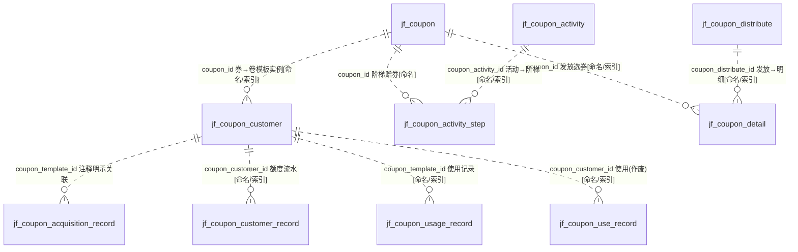
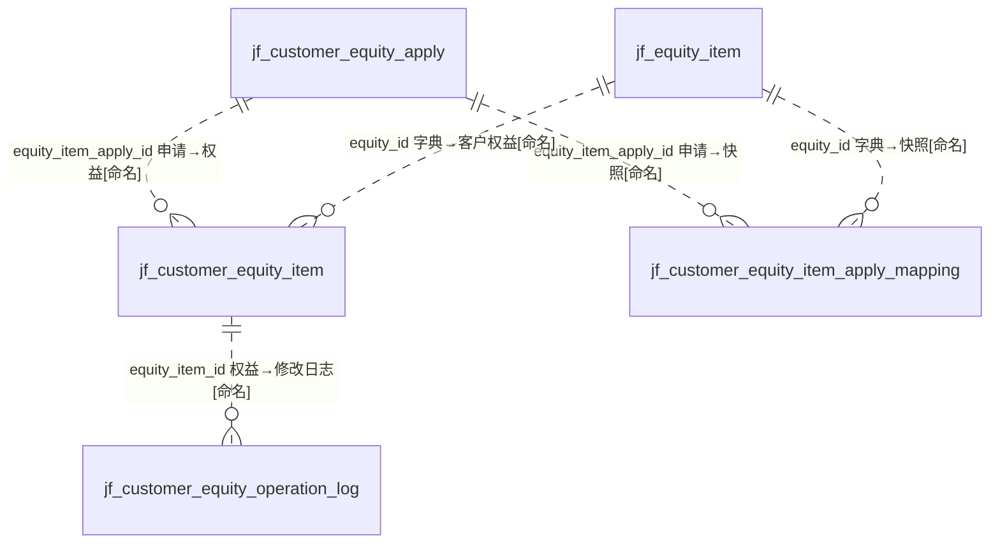
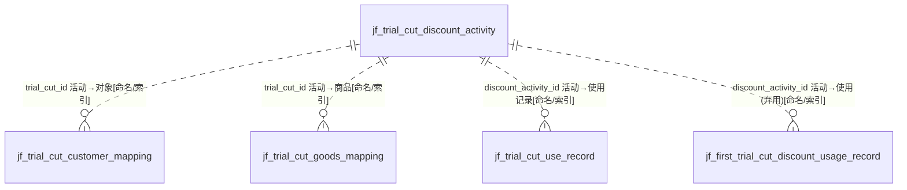

# D11 优惠券与权益域 — ER 图

> 数据源：`test_erp.sql`（唯一事实来源）。本域共 **21 张表**，含三个子系统：**优惠券（coupon）**、**客户权益（equity）**、**首条试裁折扣（trial_cut）**。
> 全库 **0 条显式外键约束**，下列所有关系均为**推断**，并按证据分级标注：`[注释明示]` / `[索引佐证]` / `[字段命名]` / `[COMMENT注释明示]` / `[业务语义推断]`。
> Mermaid `erDiagram` 仅示意实体与关系基数，字段明细见《03-逻辑数据模型/D11-优惠券与权益域.md》。

## 一、域内实体分组

| 子系统 | 表 | 角色 |
|---|---|---|
| 优惠券 | jf_coupon | 券模板（制作） |
| 优惠券 | jf_coupon_customer | 卷模板-客户关联（额度实例，含版本/校验码/作废） |
| 优惠券 | jf_coupon_acquisition_record | 券获取记录（唯一 coupon_id） |
| 优惠券 | jf_coupon_activity + _step | 条件触发活动 + 阶梯规则 |
| 优惠券 | jf_coupon_distribute + _detail | 直接发放活动 + 发放明细 |
| 优惠券 | jf_coupon_customer_record | 额度资金变动流水 |
| 优惠券 | jf_coupon_usage_record | 券使用记录（现行） |
| 优惠券 | jf_coupon_use_record | 券使用记录（**作废**） |
| 客户权益 | jf_customer_equity_apply | 权益申请（审核流） |
| 客户权益 | jf_customer_equity_item | 客户已获权益 |
| 客户权益 | jf_customer_equity_item_apply_mapping | 申请-权益项快照 |
| 客户权益 | jf_customer_equity_operation_log | 权益修改记录 |
| 客户权益 | jf_equity_item | 权益项字典 |
| 试裁折扣 | jf_trial_cut_discount_activity | 折扣活动配置 |
| 试裁折扣 | jf_trial_cut_customer_mapping | 活动-对象（等级/客户）关联 |
| 试裁折扣 | jf_trial_cut_goods_mapping | 活动-商品(SPU)关联 |
| 试裁折扣 | jf_trial_cut_use_record | 试裁优惠使用记录（现行） |
| 试裁折扣 | jf_first_trial_cut_discount_usage_record | 试裁使用记录（**弃用**） |
| 试裁折扣 | jf_small_discount | 小条优惠方案（重量区间减重） |

## 二、优惠券子系统 ER 图

> `jf_coupon_acquisition_record.coupon_template_id` 的 COMMENT 明确写"券模板ID（关联 jf_coupon_customer）"，故以 `jf_coupon_customer` 为该外键目标 `[COMMENT注释明示]`；但 acquisition_record 与 customer_record 均含 `coupon_id`/`coupon_code` 冗余，实际归属存在歧义，标 `[待确认]`。

## 三、客户权益子系统 ER 图

> `jf_customer_equity_apply.id`、`jf_customer_equity_item_apply_mapping.id`、`jf_customer_equity_operation_log.id` 均**非自增**（无 AUTO_INCREMENT），推测由应用侧雪花/UUID 生成 `[待确认]`。`jf_customer_equity_item` 的 AUTO_INCREMENT=3421881381648642 为雪花量级。

## 四、首条试裁折扣子系统 ER 图

> `jf_small_discount`（小条优惠方案）为独立的重量区间减重配置表，无域内外键字段，与试裁/优惠券均属"促销优惠"语义族但结构独立，关联标 `[业务语义推断]`。

## 五、跨域关系（指向其他 A 级域）

| 本域字段 | 目标（他域） | 依据 |
|---|---|---|
| coupon_customer.customer_id / equity_apply.customer_id / trial_cut_use_record.customer_id | D08 `jf_customer` | `[业务语义推断]`（本域无 customer 表） |
| trial_cut_goods_mapping.spu / trial_cut_use_record.spu | D09 商品 SPU 主数据 | `[字段命名]` |
| customer_equity_apply.customer_level_id | D08/D14 客户等级 | `[字段命名]` |
| coupon_usage_record.sales_order_no / trial_cut_use_record.sales_order_code | D01 销售订单 | `[业务语义推断]` |
| coupon_use_record.delivery_order_id | D10/D17 出货单 | `[字段命名]` |

## 六、建模问题清单（本域）

- **P-D11-01 三套字符集混用**：`general_ci`（coupon 主表）/`unicode_ci`（equity 全部）/`0900_ai_ci`（customer_record、small_discount）；甚至 `jf_customer_equity_apply` 表级 unicode_ci 但 abbreviation/company/business_manager 等列为 0900_ai_ci，跨表 JOIN 存在隐式转换风险。
- **P-D11-02 重复/废弃表**：`jf_coupon_use_record`（COMMENT"作废"）、`jf_first_trial_cut_discount_usage_record`（COMMENT"弃用"）与现行使用记录表功能重叠，疑重构遗留。
- **P-D11-03 主键策略不一致**：equity_apply / apply_mapping / operation_log 的 `id` 无 AUTO_INCREMENT，而 equity_item AUTO_INCREMENT 达 3.4e15 雪花量级，同域混用。
- **P-D11-04 反范式冗余**：`coupon_customer.acquire_remark` COMMENT 明示"防止连表查询"；coupon_code/amount 等在多张记录表重复存储，存在更新异常风险。
- **P-D11-05 状态语义冲突**：`coupon.delete_status` COMMENT 写"1=启用，0=停用"，但字段名为"是否已删除"，命名与语义矛盾（全域通用反模式）。
- **P-D11-06 归属歧义**：acquisition_record.coupon_template_id 注释指向 jf_coupon_customer，与 usage_record 同名异义，模板/实例边界不清。
