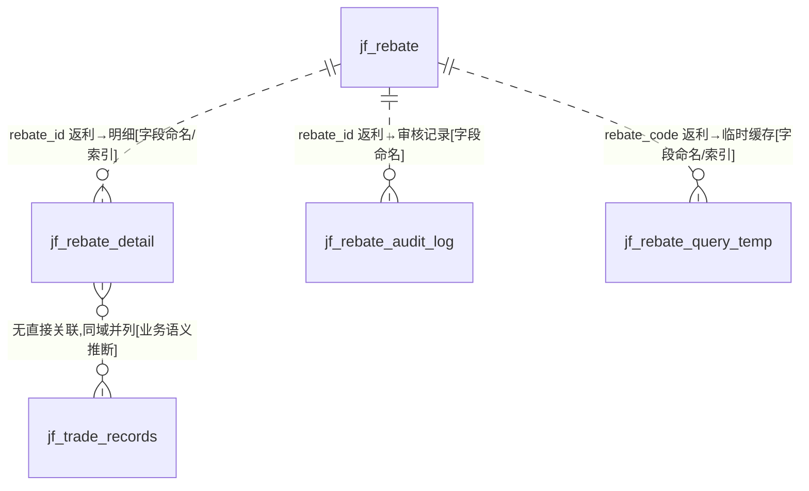
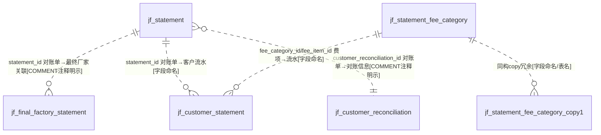

# D12 返利·对账·账单域 — ER 图

> 数据源：`test_erp.sql`（唯一事实来源）。本域共 **11 张表**，含三个功能簇：**年底返利（rebate）**、**对账单（statement）**、**客户对账信息/交易记录**。
> 全库 **0 条显式外键约束**，所有关系均为**推断**，按证据分级：`[注释明示]` / `[索引佐证]` / `[字段命名]` / `[COMMENT注释明示]` / `[业务语义推断]`。

## 一、域内实体分组

| 功能簇 | 表 | 角色 |
|---|---|---|
| 年底返利 | jf_rebate | 返利结算主表（极宽，含客户主数据快照） |
| 年底返利 | jf_rebate_detail | 返利商品明细 |
| 年底返利 | jf_rebate_audit_log | 返利审核记录 |
| 年底返利 | jf_rebate_query_temp | 返利结算客户信息（**临时表**） |
| 对账单 | jf_statement | 对账单主表 |
| 对账单 | jf_final_factory_statement | 最终厂家-对账单关联 |
| 对账单 | jf_customer_statement | 客户对账单（借贷流水） |
| 对账单 | jf_statement_fee_category | 对账单费项字典（≈jf_fee_category） |
| 对账单 | jf_statement_fee_category_copy1 | 费项字典（**copy 冗余表**） |
| 对账信息 | jf_customer_reconciliation | 客户对账联系信息 |
| 交易记录 | jf_trade_records | 银行静态码交易记录 |

## 二、年底返利簇 ER 图

> `jf_rebate_detail` 通过 `sales_order_id`/`sales_order_detail_id`/`sales_order_code` 指向 D01 销售订单，通过 `spu`/`sku`/`color_code` 指向 D09 商品，通过 `return_order_code_list`（varchar(1000) 存"退货销售单列表"）指向 D07 退换货 `[字段命名/业务语义推断]`。

## 三、对账单簇 ER 图

## 四、跨域关系（指向其他 A 级域）

| 本域字段 | 目标（他域） | 依据 |
|---|---|---|
| rebate.customer_id / statement.customer_id / customer_statement.customer_id / reconciliation.customer_id / query_temp.customer_id | D08 `jf_customer` | `[业务语义推断]` |
| rebate.trader_short_name / statement.trader_id / customer_statement.trader_id | D08 贸易商 | `[字段命名]` |
| rebate.current_level_id / updated_level_id | D08/D14 客户等级 | `[字段命名]` |
| rebate_detail.sales_order_id / sales_order_code / sales_order_detail_id | D01 销售订单 | `[字段命名/索引佐证]` |
| rebate_detail.spu/sku/color_code | D09 商品主数据 | `[字段命名]` |
| rebate_detail.return_order_code_list | D07 退换货单 | `[COMMENT注释明示]` |
| statement_fee_category | D06 `jf_fee_category`（COMMENT 明示数据等同） | `[COMMENT注释明示]` |
| customer_statement.fee_item_id | D06 费用项 | `[字段命名]` |
| trade_records.mer_id / pay_type_id | 支付/商户配置（归属待确认） | `[字段命名]` |
| final_factory_statement.address_delivery_id | D08 最终厂家/收货地址 | `[字段命名]`（COMMENT 写"最终厂家id"但列名 address_delivery_id，**命名冲突**） |

## 五、建模问题清单（本域）

- **P-D12-01 三套字符集并存**：general_ci（rebate/statement）/unicode_ci（reconciliation）/0900_ai_ci（trade_records）。
- **P-D12-02 冗余/临时/copy 表混入 A 级**：`jf_rebate_query_temp`（注释"临时表"）、`jf_statement_fee_category_copy1`（与主表逐字段完全相同的 copy1）应属 C 级，暂按既定分组保留，终验核对。
- **P-D12-03 主键非自增**：`jf_rebate`、`jf_rebate_audit_log`、`jf_rebate_query_temp`、`jf_customer_reconciliation` 的 `id` 无 AUTO_INCREMENT，应用侧生成 `[待确认]`。
- **P-D12-04 命名与注释冲突**：`final_factory_statement.address_delivery_id` COMMENT 为"最终厂家id"；`trade_records.caseier_no`（应为 cashier，拼写错误）COMMENT 仅为"i"（无效注释），`reference_no` 无注释。
- **P-D12-05 反范式宽表**：`jf_rebate` 50+ 列，内嵌大量客户/贸易商/等级快照与"当前 vs 更新后"两套等级字段，返利算法与主数据耦合。
- **P-D12-06 JSON 列孤立**：`trade_records.notify_result` 为 json，本域唯一。
- **P-D12-07 费项字典双写**：statement_fee_category COMMENT 明示"数据等同于 jf_fee_category，新增需同步"——跨表冗余且靠人工约束一致性，无外键。
- **P-D12-08 varchar 存列表**：rebate_detail.return_order_code_list 用 varchar(1000) 存"退货销售单列表"，违反第一范式。
