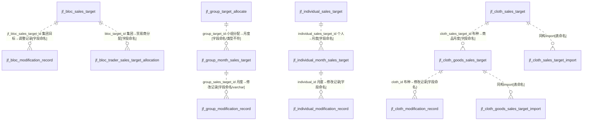

# D13 销售目标与统计域 — ER 图

> 数据源：`test_erp.sql`（唯一事实来源）。本域共 **16 张表**，为**五级销售目标体系**：集团(bloc) → 贸易商(trader) → 小组(group) → 个人(individual) → 布种/商品(cloth/goods)，每级配"目标主表 + 月度分配宽表 + 修改记录表"。
> 全库 **0 条显式外键约束**，所有关系均为**推断**，按证据分级标注。

## 一、实体分层

| 层级 | 目标主表 | 月度分配宽表 | 修改记录表 |
|---|---|---|---|
| 集团 bloc | jf_bloc_sales_target | —（仅年度） | jf_bloc_modification_record |
| 贸易商 trader | —（隐含于分配） | jf_trader_month_sales（"可要可不要"） | jf_trader_sales_target_modification_record |
| 集团↔贸易商分配 | jf_bloc_trader_sales_target_allocation | — | — |
| 小组 group | jf_group_target_allocate | jf_group_month_sales_target | jf_group_modification_record |
| 个人 individual | jf_individual_sales_target | jf_individual_month_sales_target | jf_individual_modification_record |
| 布种/商品 cloth/goods | jf_cloth_sales_target | jf_cloth_goods_sales_target | jf_cloth_modification_record |
| 导入 import | — | jf_cloth_sales_target_import / jf_cloth_goods_sales_target_import | — |

## 二、目标层级 ER 图

> `group_target_id`、`group_sales_target_id`、`sales_target_id`、`cloth_id`(在 cloth_sales_target)、`individual_target_id` 等"目标 id"字段大量以 **varchar(50)/varchar(255)** 存储，与被引用表 `id`（bigint）类型不一致，关联存在隐式转换风险 `[字段命名]`+`[待确认]`。

## 三、跨域关系（指向其他 A 级域）

| 本域字段 | 目标（他域） | 依据 |
|---|---|---|
| trader_id（allocation/cloth/group/individual/trader_month） | D08 贸易商 | `[字段命名]` |
| goods_id / cloth_id（goods 层） | D09 商品主数据 | `[字段命名]` |
| customer_id（individual_month） | D08 客户 | `[字段命名]` |
| dept_id（多表，注释"不是id/组织标识"） | D16 组织/部门（外部系统） | `[COMMENT注释明示]` |
| employee_no / sales_name（individual） | 人事/用户（外部） | `[字段命名]` |

## 四、建模问题清单（本域）

- **P-D13-01 年度月度矩阵反范式**：4 张月度宽表（cloth_goods/group_month/individual_month/trader_month）各含 12 月 ×（target/actual/completion_rate）≈ 36+ 列，应竖表化为"年月+指标"，现结构难扩展、跨月统计需列运算。
- **P-D13-02 导入表无主键**：`jf_cloth_sales_target_import`、`jf_cloth_goods_sales_target_import` **无 PRIMARY KEY**，且 import 表 id 分别 `DEFAULT 0`/非自增，疑临时导入落地表混入 A 级。
- **P-D13-03 id 用 varchar 存**：多张表的"目标 id"关联列用 varchar(50/255)，与被引表 bigint 主键类型不匹配。
- **P-D13-04 修改记录表同构但命名各异**：5 张 modification_record 结构相似，外键列名分别为 `jf_bloc_sales_target_id`（带表名前缀，反常）、`group_sales_target_id`、`individual_id`、`cloth_id`、`trader_id`，命名不统一。
- **P-D13-05 字符集混用**：unicode_ci（bloc/cloth 系）与 general_ci（group/individual/trader 系）并存。
- **P-D13-06 超长覆盖索引**：`jf_individual_month_sales_target.idx_year_ds_cover` 含 14 列（year+delete_status+12 月 actual_sales），索引过宽。
- **P-D13-07 归属存疑**：`jf_trader_month_sales` COMMENT 明示"该表可要可不要"，是否落地待确认。
- **P-D13-08 UNSIGNED 主键孤立**：`jf_group_target_allocate.id` 为 bigint UNSIGNED，本域唯一。
- **P-D13-09 字段名与注释矛盾**：`jf_cloth_goods_sales_target.goods_id` 存在但同表另有 `sales_target_id`(varchar)；`dept_id` 注释"不是id"。
