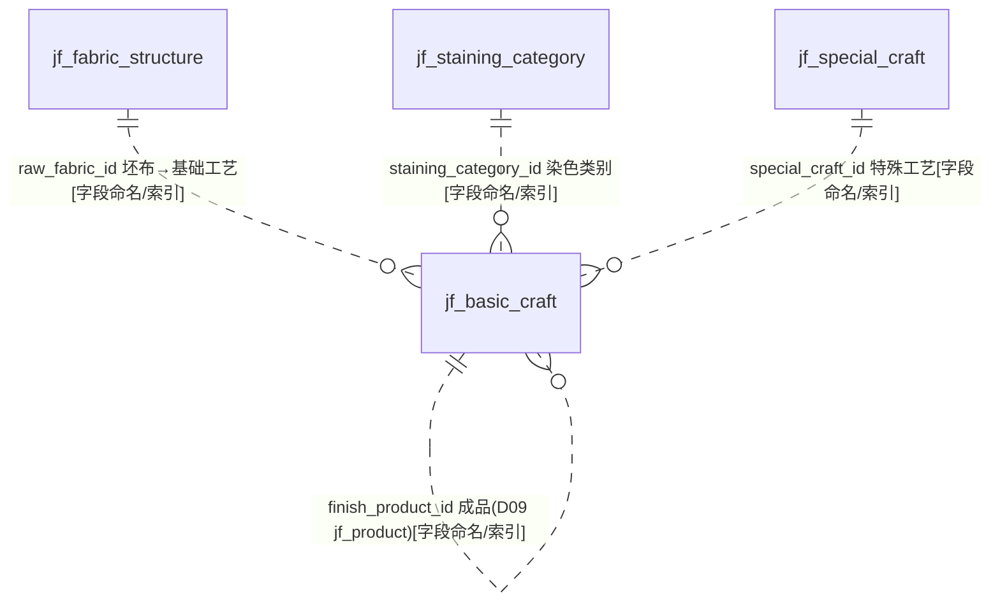
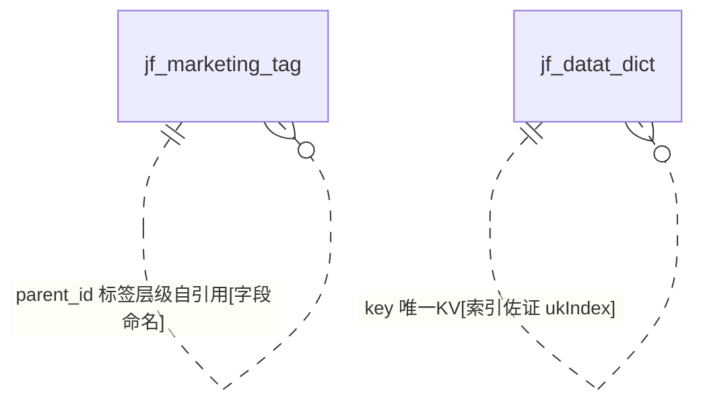

# D14 商品属性与基础字典域 — ER 图

> 数据源：`test_erp.sql`（唯一事实来源）。本域共 **34 张表**，绝大多数为**基础数据字典（code表）**：结构高度同构（`id` + `name` + `status` + `sort` + 审计四字段 + `delete_status`），供 D09 商品、D08 客户等主数据引用。
> 全库 **0 条显式外键约束**，关系均为**推断**，按证据分级标注。

## 一、字典表分类清单（34 表）

| 类别 | 表 | 说明 |
|---|---|---|
| 客户/贸易商属性字典 | jf_attributes、jf_category、jf_catregory | 客户属性、客户/贸易商类别、贸易商类别（**表名拼写错误**） |
| 应用/申请字典 | jf_application_nature、jf_application_scope、jf_application_season | 申请性质、应用范围、适用季节 |
| 面料布种字典 | jf_fabric_category（布类）、jf_fabric_structure（布种）、jf_fabric_composition（面料）、jf_fabric_material（面料用料）、jf_fabric_specs（布料规格）、jf_ingredient_category（成分类别） | D09 商品核心引用 |
| 颜色字典 | jf_color_depth（颜色深浅）、jf_primary_color（主色）、jf_embroidered_yarn_depth（用坯/纱深浅）、jf_color_sales_category（颜色销售类型） | — |
| 销售类别字典 | jf_sales_category、jf_sku_sales_category、jf_spu_sales_category | 三个并存的销售类别 |
| 工艺字典 | jf_basic_craft（基础工艺）、jf_special_craft（特殊工艺）、jf_processing_technology（加工工艺）、jf_craft_wastage（工艺损耗） | jf_basic_craft 有丰富外键 |
| 染色字典 | jf_dyeing_method（染色类别）、jf_staining_category（染色类别-**弃用**）、jf_color_dyeing_task（打色任务同步表） | 前二者语义重复 |
| 单位/包装字典 | jf_measurement_unit（计价单位）、jf_package_paper_tube（包装纸筒）、jf_package_plastic_bag（包装胶袋） | — |
| 其他 | jf_country（国家）、jf_emergency_situation（紧急状态）、jf_marketing_tag（市场推广标签-自引用）、jf_datat_dict（数据字典-**表名拼写错误**）、jf_basic_data_table（基础数据表名注册表） | — |

## 二、核心结构：jf_basic_craft 的外键枢纽

> `quality_standard_id` 指向 D15 质量管理域（质量标准），`raw_fabric_id`/`finish_product_id` 指向 D09 商品/产品主数据 `[字段命名/索引佐证]`。本域仅 `jf_basic_craft` 拥有多列外键与索引群，其余字典表均无域内关联。

## 三、自引用与通用字典

## 四、被跨域引用（作为字典目标）

| 字典表 | 被引用处（他域） | 依据 |
|---|---|---|
| jf_fabric_structure / jf_fabric_category | D09 商品 SPU 的布种/布类列 | `[业务语义推断]` |
| jf_color_depth / jf_primary_color | D09/D14 颜色相关 | `[业务语义推断]` |
| jf_measurement_unit | D09/D01 计价单位 | `[业务语义推断]` |
| jf_sales_category / jf_sku_sales_category / jf_spu_sales_category | D09 SKU/SPU 销售类别 | `[业务语义推断]` |
| jf_special_craft | D07 退换货/回修工艺、D10 库存工艺 | `[字段命名]`（special_craft_id 在他域出现） |
| jf_country | D08 客户国家、OT country | `[业务语义推断]` |
| jf_datat_dict | 全域通用键值 | `[业务语义推断]` |

## 五、建模问题清单（本域）

- **P-D14-01 表名拼写错误**：`jf_catregory`（应 category）、`jf_datat_dict`（应 data_dict）、`jf_staining_category`（疑 staining/dyeing）、`jf_embroidered_yarn_depth`（embroidered 语义存疑）。
- **P-D14-02 语义重复字典**：`jf_category`（客户/贸易商类别）与 `jf_catregory`（贸易商类别）重叠；`jf_dyeing_method` 与 `jf_staining_category`（已标"弃用"）同义；销售类别有三套（sales/sku/spu）。
- **P-D14-03 同构但主键策略分裂**：一部分字典 `id` AUTO_INCREMENT（application_season/fabric_*/package_*/primary_color/special_craft/craft_wastage/sku/spu_sales_category），另一部分 `id` 非自增（application_scope/attributes/category/catregory/color_depth/country/basic_craft 等），无统一约定。
- **P-D14-04 雪花量级 AUTO_INCREMENT**：package_paper_tube(3.409e15)、package_plastic_bag(3.409e15)、sku_sales_category(3.384e15)、spu_sales_category(3.400e15) 异常偏高。
- **P-D14-05 列类型不一致**：`sort` 在部分表为 int、部分为 bigint、`jf_catregory.sort` 竟为 varchar；`status` 多为 tinyint，但 `jf_country.status` 为 varchar('0'/'1')。
- **P-D14-06 怪异类型**：`jf_basic_data_table.is_navigate` 为 `tinyint(1) UNSIGNED ZEROFILL`；`unit_price/weight` 用 `decimal(31,2)` 超宽精度。
- **P-D14-07 字符集混用**：general_ci（application_season/fabric_category/ingredient_category/primary_color/special_craft）/ unicode_ci（多数）/ 0900_ai_ci（color_dyeing_task）。
- **P-D14-08 color_dyeing_task 无审计**：仅 `create_time`，无 created_by/updated_* / delete_status，为外部同步表（AUTO_INCREMENT=28828，量级正常），与本域字典风格迥异，疑应归 D15/D18。
- **P-D14-09 大字段**：`jf_marketing_tag.image` 为 mediumtext（图片存库）。
- **P-D14-10 basic_data_table 元数据表**：`jf_basic_data_table.table_name` 注册其他表名，属框架级元数据，混入业务字典域。
