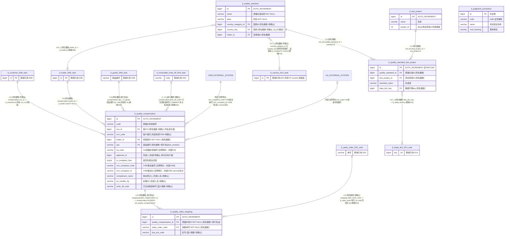

# D15 质量管理域 — ER 图（复核修订版）

> 数据源：`test_erp.sql`（唯一事实来源），逐表精读行段：`jf_judgment_conclusion` L12815–12827、`jf_quality_compensation` L13963–13994、`jf_quality_sales_mapping` L14000–14016、`jf_quality_standard` L14022–14041、`jf_quality_standard_test_project` L14047–14062、`jf_test_project` L17143–17155。
> 本域 **6 张表**，与 `00-总览与分组清单.md` D15 分组成员完全一致（零遗漏、零重复；桩实体不计入）。
> 全库 **0 条显式外键约束**，所有关系均为**推断**，按五级证据分级标注；`[注释明示]` 仅用于 COMMENT 点名目标（含点名外部系统）。
> 修订记录：① 原图 `jf_quality_standard` 自关联画法有误（`country_key`/`country_category_id` 实为指向国家字典的外键字段，非父子自关联），已改为指向 D14 桩；② `write_off_code` 复核 SQL 原文后确认 COMMENT 仅写"已生成核销单号"、**未点名目标表**，由"→ D04/D06（推断）"细化为 `[语义推断·待确认]`；③ `crm_complaint_code`/`crm_complaint_id`/`oa_code` 由 `[业务语义推断]` **升级**为 `[注释明示→外部系统]`（COMMENT 原文点名 CRM/OA），明确为非本库表关系；④ 补全实体块与关系证据摘录表。

## 一、实体分组

| 功能簇 | 表 | 角色 |
|---|---|---|
| 质量标准 | jf_quality_standard | 质量标准主表 |
| 质量标准 | jf_quality_standard_test_project | 标准-测试项目关联（含标准值） |
| 质量标准 | jf_test_project | 测试项目字典 |
| 质量判定 | jf_judgment_conclusion | 判断结论字典（含费用承担） |
| 质量补损 | jf_quality_compensation | 质量补损信息表（客诉/OA/CRM 字段所在地） |
| 质量补损 | jf_quality_sales_mapping | 补损-销售单关联 |

## 二、ER 图（6 实体 + 7 桩）

> 域外反向引用：D14 `jf_basic_craft.quality_standard_id` 引用本域 `jf_quality_standard.id` `[命名推断]`；D02 `jf_stock_quality_standard`、D09 `jf_goods_quality_standard` 与本域 `quality_standard` 同名异表（非同一实体，勿混淆）。

## 三、关系证据摘录表（引用 SQL 原文，可核验）

| 关系/字段 | 依据等级 | SQL 原文证据（行号） |
|---|---|---|
| compensation→customer | `[命名推断·待确认]` | L13966 `` `cus_id` bigint NULL DEFAULT NULL COMMENT '客户id' ``（注释未点名表；目标 jf_customer 存在，列名非标准 customer_id） |
| compensation.crm_code | `[语义推断·待确认]`（外部来源） | L13967 `COMMENT '客户编号'`——前缀 crm_ 提示 CRM 侧编号，非本库列 |
| compensation→trader | `[命名推断]` | L13968 `` `trader_id` bigint NOT NULL COMMENT '贸易商ID' ``（目标 jf_trader 存在 L17205） |
| compensation→goods | `[命名推断]+[索引佐证]` | L13969 `spu ... COMMENT '商品编号'`；L13993 `INDEX idx_product(spu)`（以编号匹配，非 id） |
| compensation.oa_code | `[注释明示→外部OA]` | L13974 `COMMENT 'OA质量补损编号'`（点名 OA，非本库表） |
| compensation.applicant_id | `[待确认]`（外部人员） | L13975 `` `applicant_id` bigint COMMENT '申请人' ``——库内无用户主表；不臆造内部关联 |
| compensation.crm_complaint_code/id | `[注释明示→外部CRM]` | L13978–13979 `COMMENT 'CRM客诉编号'`/`'CRM客诉id'`（点名 CRM 系统；id 为 varchar(255) 存 id，类型问题见 P-D15-03） |
| compensation.complainant_name | `[待确认]`（人名文本） | L13982 `COMMENT '客诉登记人'` varchar(50)，无 id 对应 |
| compensation.qc_handler_by | `[待确认]`（人名文本） | L13984 `COMMENT '处理QC'` varchar(50) |
| compensation.write_off_code | `[语义推断·待确认]` | L13986 `COMMENT '已生成核销单号'`——**未点名目标表**；D04 存在 jf_receivable_write_off（核销）为唯一语义近邻，无索引佐证，禁止升级 |
| mapping→compensation | `[命名推断]+[索引佐证]` | L14002 `quality_compensation_id bigint NOT NULL COMMENT '质量补损ID'`；L14015 `INDEX idx_quality_compensation(quality_compensation_id)` |
| mapping.sales_order_code | `[命名推断·待确认]` | L14003 `COMMENT '销售单号'` NOT NULL，以单号字符串匹配 D01 订单（非 id） |
| mapping.dye_pot_code | `[语义推断·待确认]` | L14007 `COMMENT '缸号'`——库内无独立缸号主数据表，仅库存/退货类表含同名字段 |
| std_test→standard | `[命名推断]` | L14053 `quality_standard_id ... COMMENT '质量标准id'`（无索引） |
| std_test→test_project | `[命名推断]` | L14056 `test_project_id ... COMMENT '测试项目ID'`（无索引） |
| std_test.data_dict_key | `[命名推断]` | L14060 `COMMENT '数据字典key'`（目标 D14 jf_datat_dict 存在 L10989） |
| standard→country | `[命名推断·待确认]` | L14033 `country_category_id COMMENT '国家id'` 与 L14039 `country_key COMMENT '国家'` 双列并存；候选目标 D14 `jf_country` 与 OT `country` 两张，指向不明 |
| standard→trader | `[命名推断]` | L14035 `trader_id COMMENT '贸易商id'` |
| test_project.project_id | `[注释明示→外部(旧ERP)]` | L17153 `COMMENT '旧erp测试项目id'`（迁移遗留，非本库关系） |
| judgment_conclusion（字典） | 无出入库关系 | L12815–12827 全表 10 列均为自身属性，未见指向他表字段 |

## 四、建模问题清单（本域，复核后）

- **P-D15-01 国家字段三重冗余**：`jf_quality_standard` 同时有 `country_category_id`(bigint)、`country_category`(varchar 国家名)、`country_key`(bigint)，三个字段表达"国家"，且候选目标表有两张（D14 `jf_country` / OT `country`），指向 `[待确认]`。
- **P-D15-02 AUTO_INCREMENT 异常**：`jf_quality_standard_test_project` 达 75871343（7 千万量级），远超字典表常规值。
- **P-D15-03 命名与类型不一致**：客户列用 `cus_id`（他域通用 `customer_id`）；`crm_complaint_id` 以 varchar(255) 存外部系统 id（同表 `applicant_id` 却是 bigint，人员标识类型策略不统一）；`write_off_code`/`sales_order_code`/`spu` 均以业务单号/编号字符串关联而非 id（无强约束能力）。
- **P-D15-04 遗留字段**：`jf_test_project.project_id` COMMENT"旧erp测试项目id"，为迁移遗留。
- **P-D15-05 字符集混用**：unicode_ci（standard 系 + judgment_conclusion）vs general_ci（compensation 系 + test_project）。
- **P-D15-06 主键策略不一**：`jf_judgment_conclusion.id` 非自增，其余 5 表 AUTO_INCREMENT。
- **P-D15-07 外部系统强耦合**：compensation 内嵌 oa_code / crm_complaint_code / crm_complaint_id / crm_code / is_complaint_flow 与 OA/CRM 对接，本地无任何约束与回写校验字段；`write_off_code` 声称"已生成核销单号"但无核销表 id 回链，跨域一致性依赖应用层。
- **P-D15-08 人员字段不可关联**：`applicant_id`（bigint 但库内无用户表）、`complainant_name`、`qc_handler_by`（人名文本）三者并存的表达策略不一致，均为外部/待确认。
- **附注**：本域 `jf_judgment_conclusion` 存在同名备份 `jf_judgment_conclusion_bak_20251122110927`（L12833，属 C 级，已在第 4 批点名）。
