# D15 质量管理域 — ER 图（复核修订版②）

> 数据源：`test_erp.sql`（唯一事实来源），逐表精读行段：`jf_judgment_conclusion` L12815–12827、`jf_quality_compensation` L13963–13994、`jf_quality_sales_mapping` L14000–14016、`jf_quality_standard` L14022–14041、`jf_quality_standard_test_project` L14047–14062、`jf_test_project` L17143–17155。
> 本域 **6 张表**，与 `00-总览与分组清单.md` D15 分组成员完全一致（零遗漏、零重复；桩实体不计入）。
> 全库 **0 条显式外键约束**，所有关系均为**推断**，按五级证据分级标注；`[注释明示]` 仅用于 COMMENT 点名目标（含点名外部系统）。
> 修订记录：① 原图 `jf_quality_standard` 自关联画法有误（`country_key`/`country_category_id` 实为指向国家字典的外键字段，非父子自关联），已改为指向 D14 桩；② `write_off_code` 复核 SQL 原文后确认 COMMENT 仅写"已生成核销单号"、**未点名目标表**，由"→ D04/D06（推断）"细化为 `[语义推断·待确认]`；③ `crm_complaint_code`/`crm_complaint_id`/`oa_code` 由 `[业务语义推断]` **升级**为 `[注释明示→外部系统]`（COMMENT 原文点名 CRM/OA），明确为非本库表关系；④ 补全实体块与关系证据摘录表；⑤ **（本批·复核批②）人员字段记载纠偏**：实测库内**存在**人员表——D16 `jf_personnel`（L13337–13356，表 COMMENT='人员表'）、OT `personnel`（L27229–27248，同构遗留）、B 级平台 `lcap_user`（L25208–25244，其表 COMMENT 首行亦为"人员表"），故 `applicant_id`/`complainant_name`/`qc_handler_by` 原"库内无用户主表→指向库外"表述不实，更正为**库内双候选目标·[待确认]**（仍不升级：COMMENT 未点名、无索引佐证、applicant 与 personnel 词根不对应）；⑥ 证据摘录表增设"修订与升降级理由"列；12 个重点字段逐一回读原文（L13975–L13986），**列名与任务书所列完全一致，无单复数/`_by`/`_name` 差异需要改名**。

## 一、实体分组

| 功能簇 | 表 | 角色 |
|---|---|---|
| 质量标准 | jf_quality_standard | 质量标准主表 |
| 质量标准 | jf_quality_standard_test_project | 标准-测试项目关联（含标准值） |
| 质量标准 | jf_test_project | 测试项目字典 |
| 质量判定 | jf_judgment_conclusion | 判断结论字典（含费用承担） |
| 质量补损 | jf_quality_compensation | 质量补损信息表（客诉/OA/CRM 字段所在地） |
| 质量补损 | jf_quality_sales_mapping | 补损-销售单关联 |

## 二、ER 图（6 实体 + 9 桩 + 2 外部系统桩，桩均不计入本域表数）

```mermaid
erDiagram
    jf_quality_standard {
        bigint id PK "AUTO_INCREMENT"
        varchar name "质量标准名称 NOT NULL"
        varchar alias "别名 NOT NULL"
        bigint country_category_id FK "国家id [命名推断·待确认]"
        bigint country_key FK "国家 [命名推断·待确认 与上行重复]"
        bigint trader_id FK "贸易商id [命名推断]"
    }
    jf_quality_standard_test_project {
        bigint id PK "AUTO_INCREMENT 达75871343"
        bigint quality_standard_id FK "质量标准id [命名推断]"
        bigint test_project_id FK "测试项目ID [命名推断]"
        varchar standard_value "标准值"
        bigint data_dict_key FK "数据字典key [命名推断]"
    }
    jf_test_project {
        bigint id PK "AUTO_INCREMENT"
        varchar name "名称"
        int project_id "旧erp测试项目id 外部遗留"
    }
    jf_judgment_conclusion {
        bigint id PK "非自增"
        varchar code "code 业务编码"
        varchar name "判定结论名称"
        varchar cost_bearing "费用承担"
    }
    jf_quality_compensation {
        bigint id PK "AUTO_INCREMENT"
        varchar code "质量补损单编号"
        bigint cus_id FK "客户id [命名推断·待确认 列名非标准]"
        varchar crm_code "客户编号 [外部来源CRM·待确认]"
        bigint trader_id FK "贸易商ID NOT NULL [命名推断]"
        varchar spu FK "商品编号 [命名推断+索引佐证idx_product]"
        varchar oa_code "OA质量补损编号 [注释明示→外部OA]"
        bigint applicant_id FK "申请人 [命名推断·待确认 库内双候选 jf_personnel(D16)/lcap_user(B级)]"
        date apply_date "申请日期"
        tinyint is_complaint_flow "是否有客诉流程"
        varchar crm_complaint_code "CRM客诉编号 [注释明示→外部CRM]"
        varchar crm_complaint_id "CRM客诉id [注释明示→外部CRM varchar存id]"
        varchar complainant_name "客诉登记人 [人名文本·语义推断·待确认 疑为人员表name冗余]"
        varchar qc_handler_by "处理QC [人名文本·语义推断·待确认 疑为人员表name冗余]"
        varchar write_off_code "已生成核销单号 [语义推断·待确认]"
    }
    jf_quality_sales_mapping {
        bigint id PK "AUTO_INCREMENT"
        bigint quality_compensation_id FK "质量补损ID NOT NULL [命名推断+索引佐证]"
        varchar sales_order_code FK "销售单号 NOT NULL [命名推断]"
        varchar dye_pot_code "缸号 [语义推断·待确认]"
    }
    jf_customer_D08_stub {
        bigint id PK "跨域引用·D08"
    }
    jf_trader_D08_stub {
        bigint id PK "跨域引用·D08"
    }
    jf_goods_D09_stub {
        varchar 商品编号 "跨域引用·D09"
    }
    jf_sales_order_D01_stub {
        varchar 单号 "跨域引用·D01"
    }
    jf_receivable_write_off_D04_stub {
        varchar code "跨域引用·D04"
    }
    jf_country_D14_stub {
        bigint id PK "跨域引用·D14 另有OT country 双候选"
    }
    jf_datat_dict_D14_stub {
        bigint key UK "跨域引用·D14"
    }
    jf_personnel_D16_stub {
        bigint id PK "跨域引用·D16 人员表 L13337"
    }
    lcap_user_B_stub {
        bigint id PK "B级平台 用户/人员表 L25208"
    }

    %% —— 簇 A：质量标准体系（域内） ——
    jf_quality_standard ||--o{ jf_quality_standard_test_project : "1:N [命名推断] std_test.quality_standard_id -> standard.id"
    jf_test_project ||--o{ jf_quality_standard_test_project : "1:N [命名推断] std_test.test_project_id -> test_project.id"
    jf_quality_standard_test_project }o--o| jf_datat_dict_D14_stub : "N:0..1 [命名推断] data_dict_key -> jf_datat_dict.key [跨域D14]"
    jf_quality_standard }o--o| jf_country_D14_stub : "N:0..1 [命名推断·待确认] country_category_id 与 country_key 两列均称'国家'，双候选 jf_country/OT country [跨域D14]"
    jf_quality_standard }o--o| jf_trader_D08_stub : "N:0..1 [命名推断] trader_id -> jf_trader.id [跨域D08]"

    %% —— 簇 B：质量补损/客诉体系 ——
    jf_quality_compensation ||--o{ jf_quality_sales_mapping : "1:N [命名推断+索引佐证] mapping.quality_compensation_id -> compensation.id (INDEX idx_quality_compensation)"
    jf_customer_D08_stub ||--o{ jf_quality_compensation : "1:N [命名推断·待确认] compensation.cus_id -> jf_customer.id (列名 cus_id 非标准)"
    jf_trader_D08_stub ||--o{ jf_quality_compensation : "1:N [命名推断] compensation.trader_id -> jf_trader.id (NOT NULL)"
    jf_goods_D09_stub ||--o{ jf_quality_compensation : "1:N [命名推断+索引佐证] compensation.spu -> jf_goods 商品编号 (以 code 匹配非 id) [跨域D09]"
    jf_sales_order_D01_stub ||--o{ jf_quality_sales_mapping : "1:N [命名推断·待确认] mapping.sales_order_code -> jf_sales_order 单号 (以 code 匹配非 id) [跨域D01]"
    jf_receivable_write_off_D04_stub |o--o{ jf_quality_compensation : "0..1:N [语义推断·待确认] compensation.write_off_code='已生成核销单号' COMMENT 未点名目标表 [跨域D04]"
    jf_personnel_D16_stub |o--o{ jf_quality_compensation : "0..1:N [命名推断·待确认] applicant_id 双候选 jf_personnel.id / lcap_user.id，无注释点名无索引佐证 [跨域D16/B级]"

    %% —— 外部系统关联（非本库表关系，桩表示） ——
    CRM_EXTERNAL_SYSTEM ||--o{ jf_quality_compensation : "外部 [注释明示] crm_complaint_code='CRM客诉编号' crm_complaint_id='CRM客诉id' varchar存id"
    OA_EXTERNAL_SYSTEM |o--o{ jf_quality_compensation : "外部 [注释明示] oa_code='OA质量补损编号'"
```

> 域外反向引用：D14 `jf_basic_craft.quality_standard_id` 引用本域 `jf_quality_standard.id` `[命名推断]`；D02 `jf_stock_quality_standard`、D09 `jf_goods_quality_standard` 与本域 `quality_standard` 同名异表（非同一实体，勿混淆）。

## 三、关系证据摘录表（引用 SQL 原文，可核验）

| 关系/字段 | SQL 原文证据（行号 + 引文） | 最终采用证据等级 | 修订与升降级理由 |
|---|---|---|---|
| compensation→customer | L13966 `` `cus_id` bigint NULL COMMENT '客户id' ``（目标 jf_customer 存在 L10338） | `[命名推断·待确认]` | 与上批一致；注释未点名表、列名非标准 customer_id，维持不升级 |
| compensation.crm_code | L13967 `COMMENT '客户编号'` | `[语义推断·待确认]`（疑外部） | 与上批一致；COMMENT 仅"客户编号"未点名 CRM，仅凭 crm_ 前缀推测，维持弱证据 |
| compensation→trader | L13968 `` `trader_id` bigint NOT NULL COMMENT '贸易商ID' ``（目标 jf_trader 存在 L17205） | `[命名推断]` | 与上批一致，无升降级 |
| compensation→goods | L13969 `spu ... COMMENT '商品编号'`；L13993 `INDEX idx_product(spu)`（目标 jf_goods L11685） | `[命名推断]+[索引佐证]` | 与上批一致；以编号匹配非 id，维持 |
| compensation.oa_code | L13974 `COMMENT 'OA质量补损编号'` | `[注释明示→外部OA]` | 复核批①升级维持：COMMENT 点名 OA 系统，非本库表关系 |
| compensation.applicant_id | L13975 `` `applicant_id` bigint NULL COMMENT '申请人' `` | `[命名推断·待确认]`（库内双候选） | **本批修订**：原记"库内无用户主表→外部"与实测不符——库内存在 jf_personnel(L13337)/lcap_user(L25208) 两候选；但 COMMENT 未点名、无索引、词根不对应，不得升级，仍[待确认] |
| compensation.apply_date | L13976 `` `apply_date` date NULL COMMENT '申请日期' `` | 无关联（普通日期列） | 本批逐列复核确认存在 |
| compensation.is_complaint_flow | L13977 `` `is_complaint_flow` tinyint DEFAULT 0 COMMENT '是否有客诉流程' `` | 无关联（布尔标记） | 本批逐列复核确认存在；注释未枚举语义细节 |
| compensation.crm_complaint_code/id | L13978 `COMMENT 'CRM客诉编号'`；L13979 `varchar(255) COMMENT 'CRM客诉id'` | `[注释明示→外部CRM]` | 复核批①升级维持：COMMENT 点名 CRM；id 以 varchar 存（见 P-D15-03） |
| compensation.issue_category | L13980 `varchar(100) COMMENT '问题分类'` | 文本列，`[待确认]`是否应接字典 | 与上批一致 |
| compensation.defect_point | L13981 `varchar(200) COMMENT '疵点描述'` | 自由文本，无关联 | 本批逐列复核确认存在 |
| compensation.complainant_name | L13982 `varchar(50) COMMENT '客诉登记人'` | `[语义推断·待确认]`（人名文本） | **本批修订**：原记"外部/待确认"；实测库内有人员表，更可能为其 name 字段冗余，但仍存名字无 id，不能建立可靠关联 |
| compensation.investigation_process | L13983 `text COMMENT '调查过程'` | 自由文本，无关联 | 本批逐列复核确认存在 |
| compensation.qc_handler_by | L13984 `varchar(50) COMMENT '处理QC'` | `[语义推断·待确认]`（人名文本） | **本批修订**同 complainant_name：库内存在人员表，但存名不存 id，维持待确认 |
| compensation.handling_opinion | L13985 `text COMMENT '处理意见'` | 自由文本，无关联 | 本批逐列复核确认存在 |
| compensation.write_off_code | L13986 `varchar(100) COMMENT '已生成核销单号'` | `[语义推断·待确认]` | 复核批①维持并本批再证实：COMMENT **未点名目标表**；语义近邻 D04 jf_receivable_write_off(L14663)，无索引/id 佐证，禁止升级；D06 费用流仅为次级候选，不再并列书写 |
| mapping→compensation | L14002 `quality_compensation_id bigint NOT NULL COMMENT '质量补损ID'`；L14015 `INDEX idx_quality_compensation(...)` | `[命名推断]+[索引佐证]` | 与上批一致，无升降级 |
| mapping.sales_order_code | L14003 `varchar(50) NOT NULL COMMENT '销售单号'`（目标 jf_sales_order L15469） | `[命名推断·待确认]` | 与上批一致；以单号字符串匹配非 id、无索引 |
| mapping.dye_pot_code | L14007 `COMMENT '缸号'` | `[语义推断·待确认]` | 与上批一致；库内无独立缸号主数据表 |
| std_test→standard | L14053 `quality_standard_id COMMENT '质量标准id'` | `[命名推断]` | 与上批一致（域内，无索引） |
| std_test→test_project | L14056 `test_project_id COMMENT '测试项目ID'` | `[命名推断]` | 与上批一致（域内，无索引） |
| std_test.data_dict_key | L14060 `COMMENT '数据字典key'`（目标 jf_datat_dict L10989） | `[命名推断]` | 与上批一致（跨域 D14） |
| standard→country | L14033 `country_category_id COMMENT '国家id'`；L14039 `country_key COMMENT '国家'` | `[命名推断·待确认]` | 与上批一致；双候选目标 jf_country(L10029) / OT country(L7972)，指向不明 |
| standard→trader | L14035 `trader_id COMMENT '贸易商id'` | `[命名推断]` | 与上批一致（跨域 D08） |
| test_project.project_id | L17153 `COMMENT '旧erp测试项目id'` | `[注释明示→外部(旧ERP)]` | 与上批一致；迁移遗留非本库关系 |
| judgment_conclusion（字典） | L12815–12827 全表 10 列均自身属性 | 无出入关系 | 与上批一致，无反向引用列 |

## 四、建模问题清单（本域，复核后）

- **P-D15-01 国家字段三重冗余**：`jf_quality_standard` 同时有 `country_category_id`(bigint)、`country_category`(varchar 国家名)、`country_key`(bigint)，三个字段表达"国家"，且候选目标表有两张（D14 `jf_country` / OT `country`），指向 `[待确认]`。
- **P-D15-02 AUTO_INCREMENT 异常**：`jf_quality_standard_test_project` 达 75871343（7 千万量级），远超字典表常规值。
- **P-D15-03 命名与类型不一致**：客户列用 `cus_id`（他域通用 `customer_id`）；`crm_complaint_id` 以 varchar(255) 存外部系统 id（同表 `applicant_id` 却是 bigint，人员标识类型策略不统一）；`write_off_code`/`sales_order_code`/`spu` 均以业务单号/编号字符串关联而非 id（无强约束能力）。
- **P-D15-04 遗留字段**：`jf_test_project.project_id` COMMENT"旧erp测试项目id"，为迁移遗留。
- **P-D15-05 字符集混用**：unicode_ci（standard 系 + judgment_conclusion）vs general_ci（compensation 系 + test_project）。
- **P-D15-06 主键策略不一**：`jf_judgment_conclusion.id` 非自增，其余 5 表 AUTO_INCREMENT。
- **P-D15-07 外部系统强耦合**：compensation 内嵌 oa_code / crm_complaint_code / crm_complaint_id / crm_code / is_complaint_flow 与 OA/CRM 对接，本地无任何约束与回写校验字段；`write_off_code` 声称"已生成核销单号"但无核销表 id 回链，跨域一致性依赖应用层。
- **P-D15-08 人员字段表达策略不一致（本批校正表述）**：`applicant_id`（bigint）、`complainant_name`、`qc_handler_by`（人名文本）三种表达并存。实测库内**存在**人员表：D16 `jf_personnel`（L13337）、B 级 `lcap_user`（L25208）、OT `personnel`（L27229），原"库内无用户表"记载与事实不符已纠正；`applicant_id` 指向库内双候选之一，但无注释/索引佐证且词根不对应（applicant≠personnel），最终仍 `[待确认]`；两个文本字段存名不存 id，无法建立可靠关联。
- **附注**：本域 `jf_judgment_conclusion` 存在同名备份 `jf_judgment_conclusion_bak_20251122110927`（L12833，属 C 级，已在第 4 批点名）。
