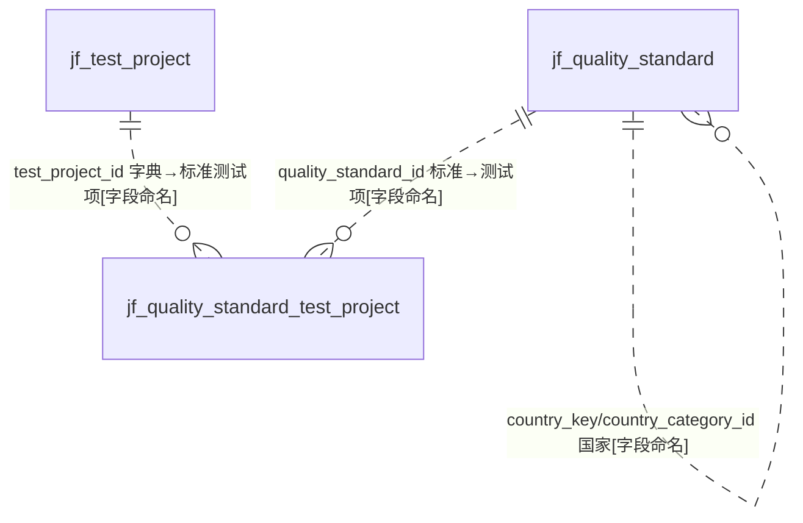
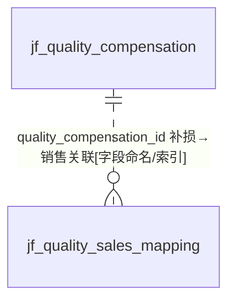

# D15 质量管理域 — ER 图

> 数据源：`test_erp.sql`（唯一事实来源）。本域共 **6 张表**，含两个功能簇：**质量标准体系**（standard → test_project 三级）与 **质量补损/客诉体系**（compensation → sales 关联）。
> 全库 **0 条显式外键约束**，所有关系均为**推断**，按证据分级标注。

## 一、实体分组

| 功能簇 | 表 | 角色 |
|---|---|---|
| 质量标准 | jf_quality_standard | 质量标准主表 |
| 质量标准 | jf_quality_standard_test_project | 标准-测试项目关联（含标准值） |
| 质量标准 | jf_test_project | 测试项目字典 |
| 质量判定 | jf_judgment_conclusion | 判断结论字典（含费用承担） |
| 质量补损 | jf_quality_compensation | 质量补损信息表（客诉/OA/CRM） |
| 质量补损 | jf_quality_sales_mapping | 补损-销售单关联 |

## 二、质量标准簇 ER 图

> 被 D14 `jf_basic_craft.quality_standard_id` 反向引用（基础工艺关联质量标准）`[字段命名]`。`data_dict_key` 指向 D14 `jf_datat_dict` `[字段命名]`。

## 三、质量补损簇 ER 图

## 四、跨域关系（指向其他 A 级域）

| 本域字段 | 目标（他域） | 依据 |
|---|---|---|
| quality_compensation.cus_id / crm_code | D08 客户（列名 cus_id 非标准 customer_id） | `[字段命名]` |
| quality_compensation.trader_id | D08 贸易商 | `[字段命名]` |
| quality_compensation.spu | D09 商品 | `[字段命名/索引佐证]`（idx_product） |
| quality_sales_mapping.sales_order_code | D01 销售订单 | `[字段命名]` |
| quality_standard.country_category_id / country_key | D14 `jf_country` | `[字段命名]` |
| quality_standard.trader_id | D08 贸易商 | `[字段命名]` |
| quality_standard_test_project.data_dict_key | D14 `jf_datat_dict` | `[字段命名]` |
| quality_compensation.oa_code / crm_complaint_code/id | OA / CRM 外部系统 | `[业务语义推断]`（外部单号，待确认） |

## 五、建模问题清单（本域）

- **P-D15-01 国家字段三重冗余**：`jf_quality_standard` 同时有 `country_category_id`(bigint)、`country_category`(varchar 国家名)、`country_key`(bigint 国家)——三个字段表达"国家"，语义重复且二 id 并存。
- **P-D15-02 AUTO_INCREMENT 异常**：`jf_quality_standard_test_project` 达 75871343（7 千万量级），远超字典表常规值。
- **P-D15-03 命名不一致**：质量补损用 `cus_id`（他域通用 `customer_id`）；`crm_complaint_id` 为 varchar 存 id。
- **P-D15-04 遗留字段**：`jf_test_project.project_id` COMMENT"旧erp测试项目id"，为迁移遗留。
- **P-D15-05 字符集混用**：unicode_ci（standard 系 + judgment_conclusion）vs general_ci（compensation 系 + test_project）。
- **P-D15-06 主键策略不一**：`jf_judgment_conclusion.id` 非自增，其余 5 表 AUTO_INCREMENT。
- **P-D15-07 外部系统耦合**：compensation 内嵌 oa_code/crm_complaint_code/crm_complaint_id/is_complaint_flow，与 OA/CRM 强耦合且无本地约束。
- **附注**：本域 `jf_judgment_conclusion` 存在同名 bak 备份表 `jf_judgment_conclusion_bak_20251122110927`（属 C 级，第 4 批点名）。
