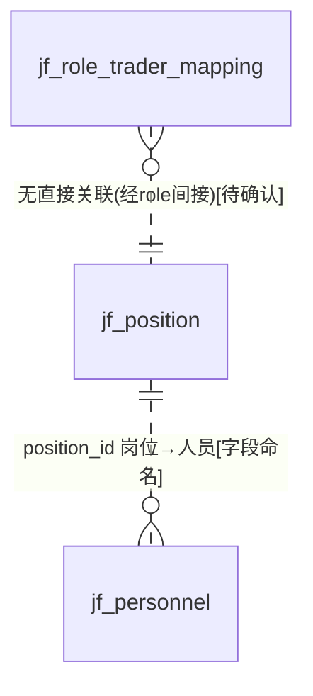
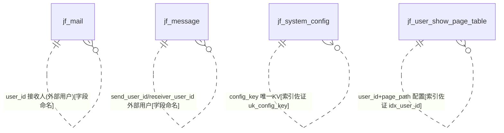

# D16 系统与协作配置域 — ER 图

> 数据源：`test_erp.sql`（唯一事实来源）。本域共 **10 张表**，含三类：**协作消息**（mail/message）、**系统配置**（node_app/oa_workflow_config/system_config/user_show_page_table）、**组织人事与权限**（personnel/position/manager_role/role_trader_mapping）。
> 全库 **0 条显式外键约束**，所有关系均为**推断**，按证据分级标注。

## 一、实体分组

| 类别 | 表 | 角色 |
|---|---|---|
| 协作消息 | jf_mail | 站内信（含跳转路由/模块类型） |
| 协作消息 | jf_message | 消息（发送方/接收方，**无表注释**） |
| 系统配置 | jf_node_app | 应用表（应用入口/图标） |
| 系统配置 | jf_oa_workflow_config | OA 流程配置（外部 OA workflow_id） |
| 系统配置 | jf_system_config | 系统配置表（KV，config_key 唯一） |
| 系统配置 | jf_user_show_page_table | 用户页面列显示配置 |
| 组织人事 | jf_personnel | 人员表（含身份证号等敏感字段） |
| 组织人事 | jf_position | 岗位表 |
| 权限 | jf_manager_role | 跟单权限（**COMMENT"跟单权限测试"**，测试表） |
| 权限 | jf_role_trader_mapping | 角色与贸易商绑定 |

## 二、组织人事与权限 ER 图

> `department_id`（personnel/position，varchar 存部门 id）与 `job_activityid`（position，"职务id"）指向外部人事/组织系统 `[字段命名]`+`[待确认]`。`role_trader_mapping.role_id` 指向角色表（本域及本库未见对应表，疑外部/待确认）。

## 三、协作消息与系统配置 ER 图

> 消息/配置类表的用户均为外部 user_id（varchar），本域无独立用户主表 `[业务语义推断]`。`oa_workflow_config.workflow_id` 指向外部 OA 系统 `[业务语义推断]`。

## 四、跨域关系（指向其他 A 级域）

| 本域字段 | 目标（他域） | 依据 |
|---|---|---|
| role_trader_mapping.trader_id / manager_role.trader | D08 贸易商 | `[字段命名]` |
| mail.module_type（1打样~7系统） | 全业务模块（D02/D18打样、D01销售、D10库存、D04财务…） | `[COMMENT注释明示]`（枚举含他模块） |
| user_show_page_table.page_path | 前端页面（外部） | `[业务语义推断]` |

## 五、建模问题清单（本域）

- **P-D16-01 测试表混入 A 级**：`jf_manager_role` COMMENT 明示"跟单权限测试"，且无 `delete_status`，应属 C 级，暂按分组保留、终验核对。
- **P-D16-02 拼写错误列名**：`bussiness_manager`/`bussiness_group`（应 business，manager_role）、`worflow_name`（应 workflow，oa_workflow_config）、`job_activityid`（职务 id，命名晦涩）。
- **P-D16-03 created_by 类型不一致**：多数表为 varchar(255/50/32)，但 `role_trader_mapping.created_by/updated_by` 为 **bigint**；`mail.created_by` 为 varchar(**52**)（异常长度）。
- **P-D16-04 审计字段命名分裂**：`oa_workflow_config` 用 create_time/update_time/create_by/update_by，其余用 created_time/… ；三套字符集并存（general/unicode/0900_ai）。
- **P-D16-05 敏感数据无保护**：`jf_personnel.id_number`（身份证号）、`contact_information`、`picture` 明文存储，无脱敏/加密标记。
- **P-D16-06 主键策略不一**：`oa_workflow_config`/`role_trader_mapping` 为 bigint **UNSIGNED** 自增；`user_show_page_table` 为 int 自增；manager_role/message/node_app/personnel/position 的 `id` **非自增**；`mail` AUTO_INCREMENT 达 3.4e15（雪花）。
- **P-D16-07 逻辑删除字段缺失**：manager_role、oa_workflow_config、user_show_page_table **无 delete_status**（与全域约定不一致）。
- **P-D16-08 表注释缺失**：`jf_message` 无 COMMENT。
- **P-D16-09 状态语义冲突**：`system_config.delete_status` COMMENT 又写"1=启用，0=停用"（与"是否已删除"命名矛盾，全域通病）。
