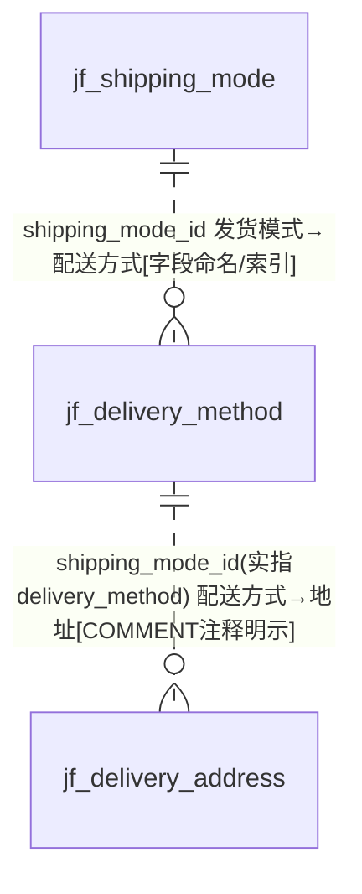
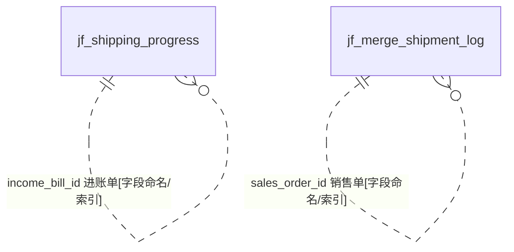

# D17 物流与发货域 — ER 图

> 数据源：`test_erp.sql`（唯一事实来源）。本域共 **6 张表**：**发货模式/配送方式**（shipping_mode → delivery_method → delivery_address 三级）、**物流进度与合单**（shipping_progress/merge_shipment_log）、**物流信息字典**（logistics_information）。
> 全库 **0 条显式外键约束**，所有关系均为**推断**，按证据分级标注。

## 一、实体分组

| 类别 | 表 | 角色 |
|---|---|---|
| 发货模式 | jf_shipping_mode | 发货模式（含中转点1/2） |
| 配送方式 | jf_delivery_method | 配送方式（末端配送） |
| 收货地址 | jf_delivery_address | 送货(交货)地址表（客户维度） |
| 物流进度 | jf_shipping_progress | 物流进度（拣货/装车/发货/签收节点） |
| 合单 | jf_merge_shipment_log | 合单发货记录 |
| 物流字典 | jf_logistics_information | 物流信息（简单字典） |

## 二、发货配置链 ER 图

> **重大命名歧义**：`jf_delivery_address.shipping_mode_id` 列名叫 shipping_mode_id，但其 COMMENT 明示"关联 **jf_delivery_method** 表 id!!"——即该列实际指向 `jf_delivery_method.id` 而非 `jf_shipping_mode.id`。而 `jf_delivery_method.shipping_mode_id` 才真正指向 `jf_shipping_mode.id`。同名列在不同表指向不同目标 `[COMMENT注释明示]`+`[待确认]`。

## 三、物流执行 ER 图（跨域枢纽）

## 四、跨域关系（指向其他 A 级域）

| 本域字段 | 目标（他域） | 依据 |
|---|---|---|
| delivery_address.cus_id / cus_code | D08 客户（列名 cus_id 非标准） | `[字段命名]` |
| delivery_address.ultimately | D08/D12 最终厂家 | `[字段命名]` |
| shipping_progress.sales_order_id | D01 销售订单 | `[字段命名/索引佐证]` |
| shipping_progress.income_bill_id | D04 进账单/收款 | `[字段命名/索引佐证]` |
| merge_shipment_log.sales_order_id / order_no | D01 销售订单 | `[字段命名/索引佐证]` |

## 五、建模问题清单（本域）

- **P-D17-01 同名列异指向（高危）**：`shipping_mode_id` 在 delivery_address（→delivery_method）与 delivery_method（→shipping_mode）中指向不同父表，极易误连接。
- **P-D17-02 注释非正式**：delivery_address.shipping_mode_id 注释含"!!"感叹号，为开发临时标注混入正式 DDL。
- **P-D17-03 命名不一致**：`cus_id`（应 customer_id）、`created_by_user`（shipping_progress，应 created_by）。
- **P-D17-04 三套字符集并存**：0900_ai_ci（delivery_address）/unicode_ci（delivery_method/logistics_information/shipping_mode）/general_ci（merge_shipment_log/shipping_progress）。
- **P-D17-05 主键策略不一**：logistics_information、shipping_mode 的 `id` 非自增；其余 AUTO_INCREMENT。
- **P-D17-06 反范式拼接**：delivery_address.shipping_mode COMMENT"发货模式（拼接了末端配送方式）"，将两值拼入一列。
- **P-D17-07 语义相近三表**：shipping_mode（发货模式）/delivery_method（配送方式）/logistics_information（物流信息）职责边界模糊，易混用。
