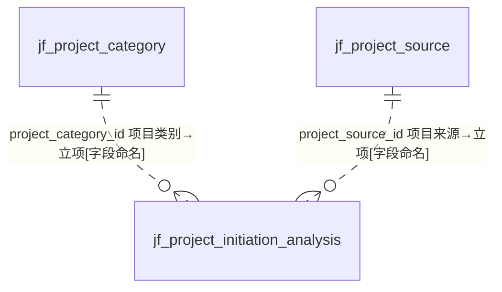
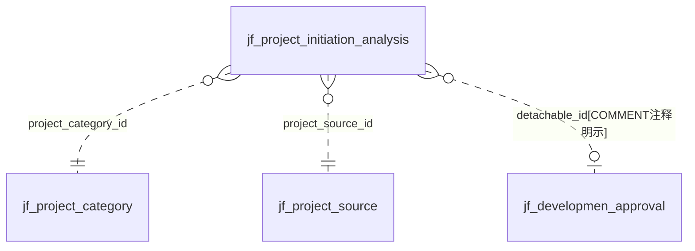

# D18 项目与打样域 — ER 图

> 数据源：`test_erp.sql`（唯一事实来源）。本域共 **4 张表**：**项目主数据/配置**（project_category 项目类别、project_source 项目来源）、**立项分析**（project_initiation_analysis，50+ 列宽表，核心交易入口）、**打样**（proofing_number 打色编号，数据来源旧 ERP）。
> 全库 **0 条显式外键约束**，所有关系均为**推断**，按证据分级标注。

## 一、实体分组

| 类别 | 表 | 角色 |
|---|---|---|
| 项目字典 | jf_project_category | 项目类别（简单字典，id 非自增） |
| 项目字典 | jf_project_source | 项目来源（简单字典，id 非自增） |
| 立项交易 | jf_project_initiation_analysis | 立项分析（宽表：项目信息+报价信息，核心） |
| 打样 | jf_proofing_number | 打色编号表（数据来源旧 ERP，id 非自增） |

## 二、域内 ER 图

## 三、立项分析跨域引用（宽表外键扇出）

## 四、跨域关系（指向其他 A 级域）

| 本域字段 | 目标（他域） | 依据 |
|---|---|---|
| initiation_analysis.trader_id | D08 贸易商 | `[字段命名]` |
| initiation_analysis.customer_id / customer | D08 客户 | `[字段命名]` |
| initiation_analysis.quality_standard_id | D15 质量标准 | `[字段命名]` |
| initiation_analysis.product_category_id / product_property_id | D09/D14 产品·属性字典 | `[字段命名]` |
| initiation_analysis.emergency_situation_id / application_area_id / shrinkage_req_id | D14 基础字典 | `[字段命名]` |
| initiation_analysis.detachable_id | jf_developmen_approval（OA 审批，D16/跨域） | `[COMMENT注释明示]` |
| proofing_number.trade_id | D08 贸易商 | `[字段命名]` |
| proofing_number.id_color_code | jf_printing_approve.registration_number | `[COMMENT注释明示]` |
| proofing_number.goods_code / goods_name | D09 商品主数据 | `[字段命名]` |
| proofing_number.dye_category_id / color_id | D14 染色类别·颜色字典 | `[字段命名]` |

## 五、建模问题清单（本域）

- **P-D18-01 全非自增主键**：4 表 `id` 均 **非 AUTO_INCREMENT**（业务/雪花生成），与库内多数表策略不一。
- **P-D18-02 立项宽表反范式**：initiation_analysis 单表 50+ 列，混装"项目信息 + 报价信息 + 地址(省市区街) + 联系人"，多类 id 与文本双写（如 customer_id + customer、dye_category_id + dyeing_method）。
- **P-D18-03 拼写错误**：`referenc_number`（应 reference）、`yarn_color_deth`/`blank_varies_deth`（应 depth）。
- **P-D18-04 delete_status 类型不一**：多数 tinyint(1)，initiation_analysis 用 `tinyint NOT NULL`（宽度/约束不一致）。
- **P-D18-05 字符集混用**：主体 unicode_ci，initiation_analysis.version 列却为 general_ci（列级混用）。
- **P-D18-06 注释含控制字符**：initiation_analysis 表 COMMENT='立项分析\r\n'，带换行符。
- **P-D18-07 数据来源混杂**：proofing_number COMMENT 明示"数据来源旧 erp"，含 erp_color_id 旧系统字段，迁移遗留。
