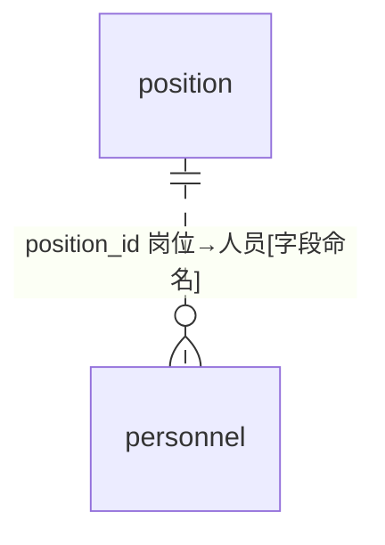
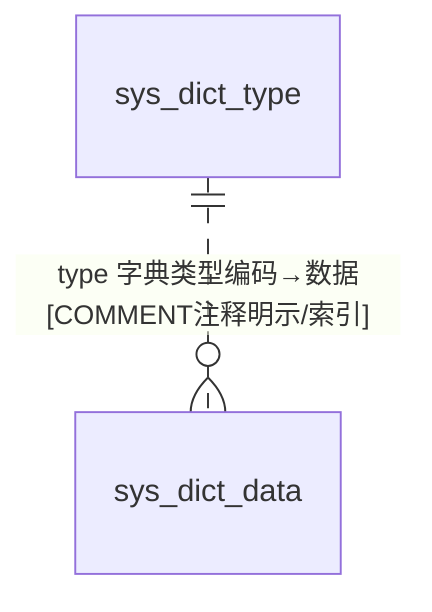
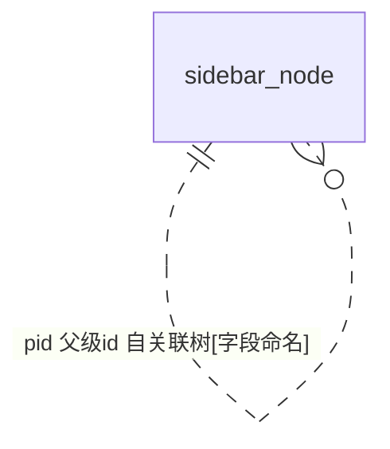

# OT 无前缀遗留表 — ER 图

> 数据源：`test_erp.sql`（唯一事实来源）。本组共 **17 张表**，均为**无 `jf_` 前缀**的遗留/平台/测试表，按性质归为 6 类：
> **业务配置**（country 国家、sale_type 销售类型）、**组织人事**（personnel 人员、position 岗位）、**信用额度审计**（flow_change_record 流水变更记录）、**销售统计**（sales_daily_stats/sales_monthly_stats）、**系统字典**（sys_dict_type/sys_dict_data）、**平台/低代码框架与测试遗留**（node_app/sidebar_node/structure_table/seq_10/entity1/entity12345/sheet1/temp）。
> 全库 **0 条显式外键约束**，所有关系均为**推断**。

## 一、实体分类清单

| 类别 | 表 | 角色 |
|---|---|---|
| 业务配置 | country | 国家表（id 非自增） |
| 业务配置 | sale_type | 销售类型（id 非自增） |
| 组织人事 | personnel | 人员表（含身份证明文，id 非自增） |
| 组织人事 | position | 岗位表（id 非自增） |
| 额度审计 | flow_change_record | 贸易商额度流水变更记录（AUTO_INCREMENT） |
| 销售统计 | sales_daily_stats | 日销售统计（id 非自增） |
| 销售统计 | sales_monthly_stats | 月销售统计（id 非自增） |
| 系统字典 | sys_dict_type | 字典类型表（雪花 AUTO_INCREMENT） |
| 系统字典 | sys_dict_data | 字典数据表（雪花 AUTO_INCREMENT） |
| 平台框架 | node_app | 节点应用表（app_id UNIQUE，id 非自增） |
| 平台框架 | sidebar_node | 侧边栏节点（自关联 pid，id 非自增） |
| 平台框架 | structure_table | 数据结构共享表（v1~v50 泛化列） |
| 平台辅助 | seq_10 | 数字序列辅助表（仅 n 列） |
| 测试遗留 | entity1 | 空壳测试表（id/title） |
| 测试遗留 | entity12345 | 空壳测试表（id/name/type） |
| 测试遗留 | sheet1 | Excel 导入临时表（property1~5） |
| 测试遗留 | temp | 临时表（id/color_id） |

## 二、组织人事 ER 图

## 三、系统字典 ER 图

## 四、侧边栏自关联 ER 图

## 五、跨域关系（指向其他 A 级域）

| 本组字段 | 目标（他域） | 依据 |
|---|---|---|
| flow_change_record.trader_id | D08 贸易商 / D03 信用额度 | `[字段命名/COMMENT注释明示]` |
| flow_change_record.related_order_id | D01/D04/D06 各类单据（order_type 区分） | `[COMMENT注释明示]`（多态，待确认） |
| personnel.department_id / position.department_id | D16 部门（varchar 存 id） | `[字段命名]` |
| sales_daily_stats/sales_monthly_stats.org_id | D16 组织（集团/子公司/小组） | `[字段命名/COMMENT注释明示]` |
| country | D08 客户/贸易商的国家级主数据 | `[业务语义推断]` |
| sale_type | D01 销售订单的销售类型来源 | `[业务语义推断]` |
| temp.color_id | D14 颜色字典 | `[字段命名]` |

## 六、建模问题清单（本组）

- **P-OT-01 归属混乱（表归属不明）**：17 表无统一前缀，混杂业务配置、平台低代码框架产物（node_app/sidebar_node/structure_table/seq_10）、测试遗留（entity1/entity12345/sheet1/temp），应与 `jf_` 业务表隔离。
- **P-OT-02 测试/空壳表混入正式库**：entity1、entity12345（无表注释、无 delete_status）、sheet1（Excel 导入结构 property1~5）、temp（id/color_id）、seq_10（仅 n 列）均为开发/导入临时产物。
- **P-OT-03 PII 明文风险**：personnel.id_number（身份证号）、contact_information 明文存储，无脱敏/加密标注。
- **P-OT-04 varchar 存 id**：personnel.department_id、position.department_id 用 varchar 存部门 id；node_app.app_id 亦 varchar。
- **P-OT-05 逻辑删除字段不一致**：多数 `delete_status`，唯 sidebar_node 用 `del_flag`；entity*/sheet1/temp/seq_10/personnel/position 无删除字段。
- **P-OT-06 status 类型不一**：country/sale_type 的 `status` 用 varchar('0')，其余多为 tinyint(1)。
- **P-OT-07 泛化列 EAV 反模式**：structure_table 用 v1~v50（text/bigint/varchar 混合）承载"数据结构共享"，语义完全丧失。
- **P-OT-08 主键策略不一**：多数 id 非自增；flow_change_record 常规 AUTO_INCREMENT；sys_dict_type/sys_dict_data 的 AUTO_INCREMENT 已达雪花量级（2.1e18）。
- **P-OT-09 字符集混用**：unicode_ci（country/personnel/position/sale_type/flow_change_record）与 general_ci（node_app/sidebar_node/structure_table/stats/entity*/sheet1/temp/sys_dict*）并存。
- **P-OT-10 多态外键**：flow_change_record.related_order_id 依 order_type 指向采购/销售/退款/调账等不同表，无外键约束、需运行时判别 `[COMMENT注释明示]`+`[待确认]`。
