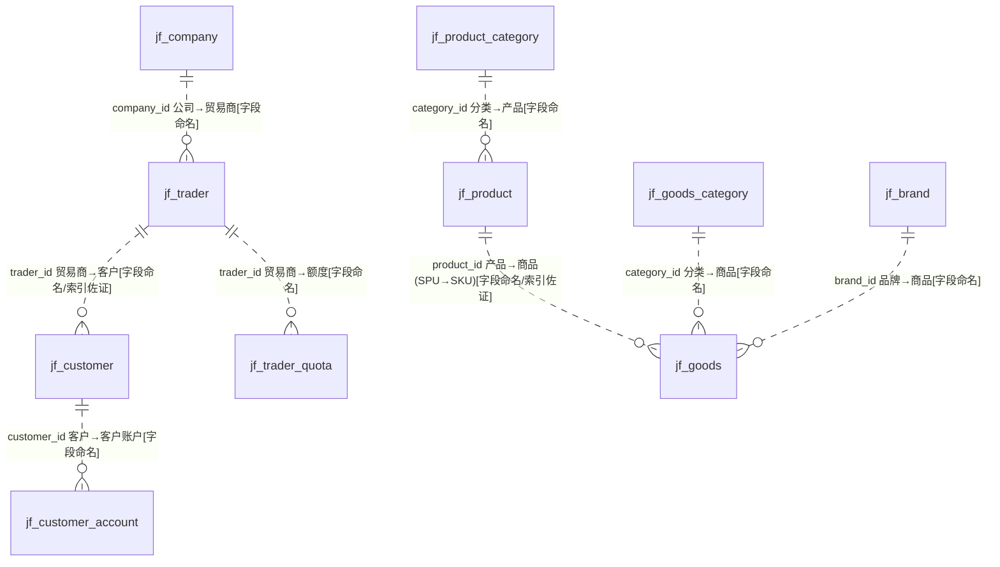
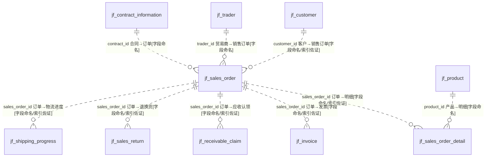
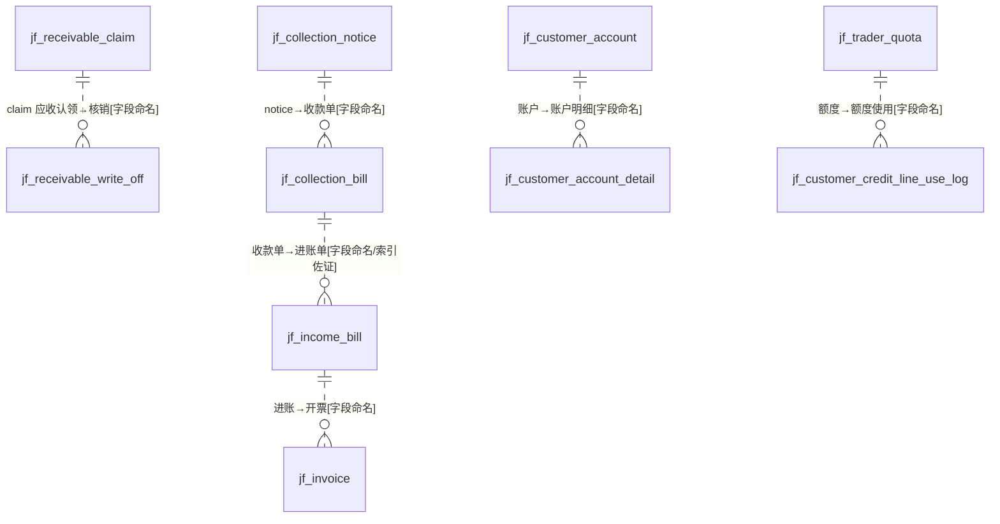
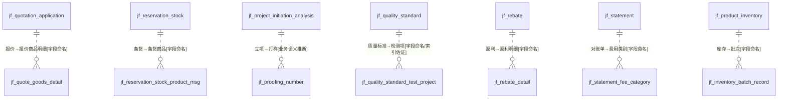
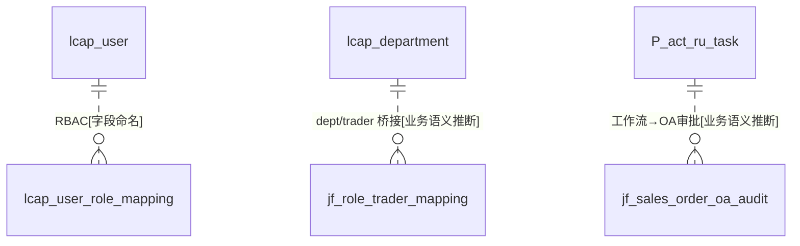

# 跨域核心关系总览 · 核心实体清单 · 模型问题清单（第 5 批）

> 数据源：`test_erp.sql`（唯一事实来源），基于 18 个 A 级业务域 + OT + B/C 级的逐表实测汇总。
> **全库 0 条显式外键约束**，下列所有关系均为**推断**（`[注释明示]`/`[索引佐证]`/`[字段命名]`/`[业务语义推断]`）。本文件总览图**只画核心实体与关系，不展开字段**。

---

## 一、跨域核心关系总览图

### 1.1 主数据骨干（客户—贸易商—商品—产品）

### 1.2 交易主干（订单为中心的销售闭环）

### 1.3 资金链路（应收→收款→进账→核销）

### 1.4 备货·报价·打样·质量·返利

### 1.5 平台/框架与业务耦合（B 级）

---

## 二、核心实体清单（三分类）

### 2.1 主数据 / 基础实体（Master Data）

| 实体 | 域 | 说明 |
|---|---|---|
| jf_trader（贸易商） | D08 | 核心组织主体，下游挂额度/客户/订单 |
| jf_customer（客户） | D08 | 交易对手，归属贸易商 |
| jf_company / jf_first_party | D08 | 公司主体/签约甲方 |
| jf_product（产品 SPU） | D09 | 产品主数据 |
| jf_goods（商品 SKU） | D09 | 商品主数据，产品+颜色+规格派生 |
| jf_brand / jf_product_category / jf_goods_category | D09/D14 | 品牌与分类主数据 |
| jf_warehouse（库位/仓） | D10 | 仓储主数据 |
| country / sale_type | OT | 国家、销售类型基础数据 |
| 颜色/工艺/布种/成分等 34 字典 | D14 | 商品属性基础字典域（被 D09/D02/D18 广泛引用） |
| lcap_department / lcap_user / lcap_role | B级 | 组织与账号主数据（平台） |

### 2.2 交易 / 事务实体（Transactional）

| 实体 | 域 | 说明 |
|---|---|---|
| **jf_sales_order / _detail** | D01 | 销售订单主表+明细，**全库交易枢纽** |
| jf_quotation_application | D02 | 报价申请 |
| jf_reservation_stock | D02 | 备货/订仓 |
| jf_contract_information | D03 | 合同 |
| jf_trader_quota / 额度调整类 | D03/D08 | 信用额度 |
| jf_invoice / jf_tax_bill | D05 | 发票/税务 |
| jf_receivable_claim / jf_collection_bill / jf_income_bill / jf_receivable_write_off | D04 | 应收/收款/进账/核销 |
| jf_fee_bill / jf_expense_subject | D06 | 费用/结算 |
| jf_sales_return / jf_return_repair_order | D07 | 退换货/回修 |
| jf_product_inventory / jf_business_inventory | D10 | 库存 |
| jf_coupon / jf_customer_equity_item | D11 | 优惠券/权益 |
| jf_rebate / jf_statement | D12 | 返利/对账 |
| jf_bloc/group/individual_sales_target | D13 | 销售目标 |
| jf_quality_standard / jf_quality_compensation | D15 | 质量标准/补损 |
| jf_shipping_progress / jf_delivery_address | D17 | 发货/物流 |
| jf_project_initiation_analysis / jf_proofing_number | D18 | 立项/打样 |

### 2.3 配置 / 字典实体（Config & Dictionary）

| 实体 | 域 | 说明 |
|---|---|---|
| jf_payment_method / jf_payment_way / jf_payment_form | D04 | 付款方式/方式/表单（三表语义相近） |
| jf_fee_category / jf_fee_item / jf_expense_type | D06 | 费用类别/项目/类型 |
| jf_currency | D06 | 币种 |
| jf_overdue_rules / jf_control_account_period | D04 | 逾期规则/账期 |
| jf_refund_category / jf_refund_type | D07 | 退款类别/类型 |
| jf_invoice_type / jf_invoice_information | D05 | 发票类型/抬头 |
| jf_delivery_method / jf_shipping_mode / jf_logistics_information | D17 | 配送/发货模式/物流（三表职责模糊） |
| jf_system_config / jf_message / jf_mail / jf_oa_workflow_config | D16 | 系统/消息/OA 配置 |
| sys_dict_type / sys_dict_data | OT | 全局数据字典（键值） |
| node_app / sidebar_node / structure_table | OT | 平台框架配置 |

---

## 三、模型问题清单（全库汇总·按类别）

### A. 引用完整性
- **A-1 全库 0 外键**：1322 表无一条 FOREIGN KEY/CONSTRAINT，所有关联仅靠 `xxx_id` 命名维系，库级引用完整性完全缺位，脏数据无法在 DB 层拦截。
- **A-2 框架外键被剥离**：Quartz/Activiti 官方 DDL 的 FK+CASCADE 在导出中被去除且未补索引（见 P-B-02）。
- **A-3 多态外键无判别约束**：flow_change_record.related_order_id（按 order_type 指向多表）、权益 other_id 等，无 CHECK/枚举约束（P-OT-10、D11）。

### B. 冗余与反范式
- **B-1 id 与文本双写**：大量表同时存 `xxx_id` 与 `xxx`（名称/编码）快照（D18 proofing、D12、D17）。
- **B-2 拼接列**：jf_delivery_address.shipping_mode 将两值拼入一列（P-D17-06）。
- **B-3 超宽表 + 月度展开**：jf_rebate（50+ 列）、D13 目标表 12 月×指标横向展开成数十列、structure_table v1~v50（EAV）。
- **B-4 同名列异指向（高危）**：shipping_mode_id 在 delivery_address→delivery_method、在 delivery_method→shipping_mode（P-D17-01）。

### C. 命名一致性
- **C-1 前缀割裂**：`jf_` 业务 / `lcap_` 平台 / `N{hex}_` Quartz / `P{hex}_` Activiti / 无前缀遗留，五套命名并存。
- **C-2 主键/审计列命名漂移**：`cus_id`(应 customer_id)、`created_by_user`(应 created_by)、`sort_value` vs `sort`。
- **C-3 拼写错误固化入库表/列名**：`catregory`、`datat_dict`、`staining`(clean?)、`developmen_approval`、`bussiness`、`worflow`、`referenc_number`、`_deth`(depth)、`caseier_no`、`extentions_info`、`hove_img`。
- **C-4 保留字/大小写**：lcap `key`/`values`/`type`、框架全大写列名、`appId` 驼峰。

### D. 类型与取值
- **D-1 字符集三套混用**：utf8mb4_general_ci / utf8mb4_unicode_ci / utf8mb4_0900_ai_ci，甚至同表列级混用（D13/D17/D18/OT）。
- **D-2 主键策略不一**：AUTO_INCREMENT（常规/雪花 2.1e18/3.4e15 量级并存）与非自增 id 混用；temp.id 用 int、其余 bigint。
- **D-3 外键列类型宽度不一**：id 多为 bigint，但 proofing 的 *_id、temp.color_id 用 int；varchar 存 id（department_id、app_id、D13 目标 id）。
- **D-4 status/type 类型漂移**：同义字段有 tinyint(1)/int/varchar('0'/'Normal') 多种表达（country/sale_type/OT）。
- **D-5 怪异类型**：UNSIGNED/ZEROFILL、decimal(31,2)、json 混用。

### E. 逻辑删除与审计
- **E-1 逻辑删除字段不一致**：delete_status vs del_flag（sidebar_node）vs 无删除字段（personnel/position/entity*/部分 lcap）；`delete_status` 名称（status）与语义（flag/0-1）矛盾，默认值 NULL 与 0 并存。
- **E-2 缺审计字段**：12 张月销售/目标/临时表、D14 color_dyeing_task、OT 多表无 created/updated 或无 delete_status。
- **E-3 无主键表**：初判 Quartz 标准表，另发现 jf_business_inventory_import、jf_inventory_organization 等 jf_ 表亦无 PRIMARY KEY（11 张，见终验）。

### F. 语义与归属
- **F-1 状态语义不清**：大量 `status`/`type` 无枚举注释或注释与取值不符（P-D 各域）。
- **F-2 注释缺失/冲突**：空壳表 entity1/entity12345 无表注释；lcap_role 表注释误写为"用户与角色关联"（P-B-05）；delivery_address 列注释含"!!"非正式（P-D17-02）。
- **F-3 表归属不明**：OT 17 表混杂业务/平台/测试；remark_information、trace_quota 源表归属待确认（C 级）。
- **F-4 职责边界模糊**：D17 shipping_mode/delivery_method/logistics_information 三表、D04 payment_method/way/form 三表语义重叠。

### G. 数据治理与安全
- **G-1 PII/凭据明文**：lcap_user.password/id_number、personnel.id_number、identity_source_config 的 app_secret/ldap 密码/wechat 密钥均明文列（P-B-07、P-OT-03）。
- **G-2 备份/测试表混居生产库**：117 备份 + 3 测试 + entity*/sheet1/temp/seq_10 未隔离（C 级第五节）。
- **G-3 按应用复制物理表**：Quartz×25、Activiti×4、lcap×~25 使表数膨胀至 1322，真实业务表仅约 332（P-B-01）。
- **G-4 迁移遗留**：proofing_number 含 erp_color_id 等旧 ERP 字段与"数据来源旧 erp"注释（P-D18-07）。

---

## 四、总体研判

1. **这是一套"低代码平台(明道云/lcap 类) + 多框架引擎 + 纺织外贸 ERP 业务"三层叠加的库**：业务表（jf_）约 332 张，被 900+ 张平台/引擎/备份表放大。
2. **建模质量整体偏弱**：0 外键、命名与类型规范不统一、反范式宽表与快照冗余普遍、逻辑删除与审计字段不一致、PII 明文——需在应用层强约束与治理专项整改。
3. **核心可用性以"销售订单 jf_sales_order 为枢纽"的推断关系为准**，跨域分析/数仓建模时应显式重建外键与字典代理键，勿依赖库内约束。
